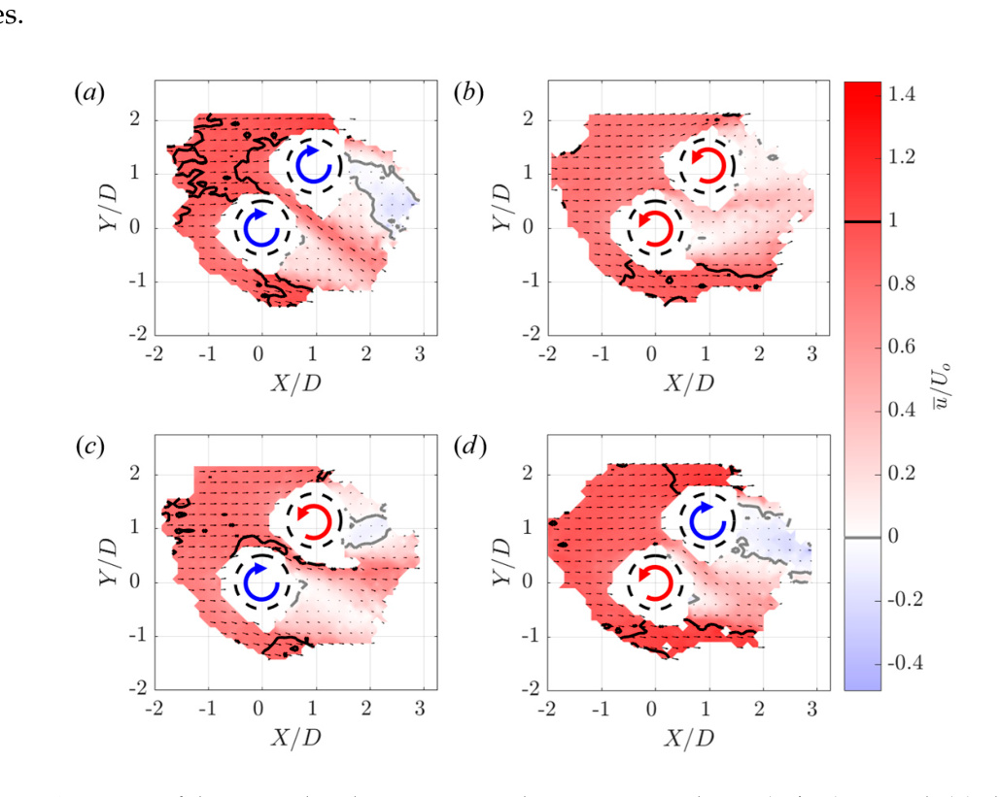
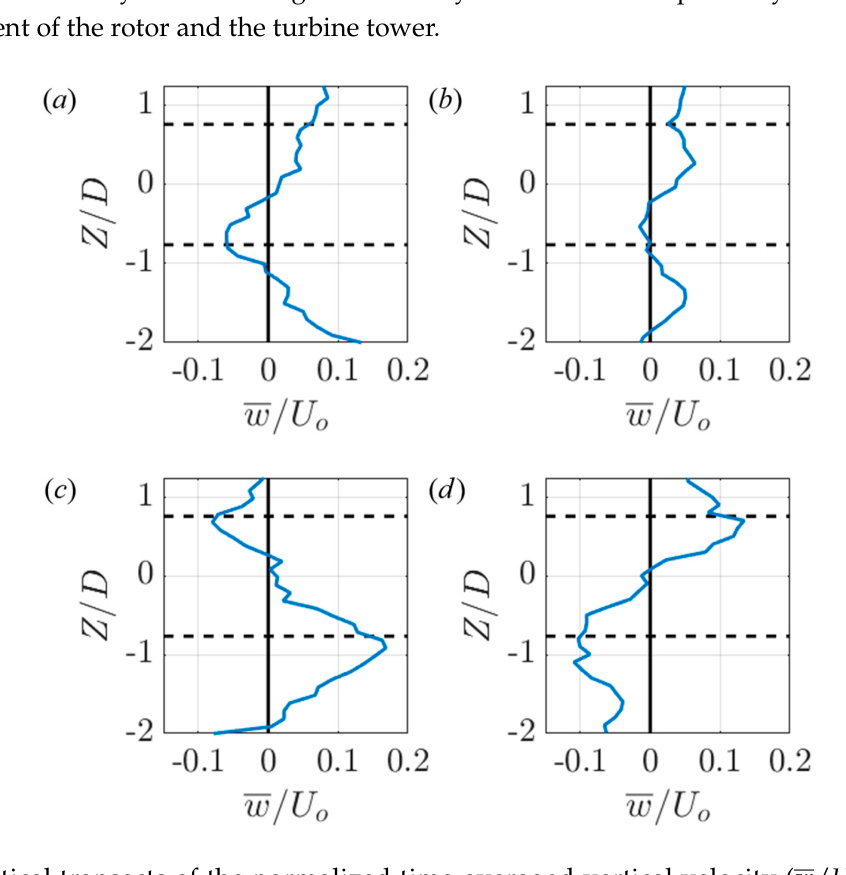

## H-rotor Wake Aerodynamics

Wake behavior of an H-rotor VAWT, including how velocity deficit, vortex structures, asymmetry, and wake recovery evolve downstream. (source: sources/va11.md)

Original caption: Fig. 8. Time-averaged normalized streamwise velocity along z = h [*] [53]. [[va11|Source]]

Original caption: Fig. 9. Time-averaged vertical velocity contour in the y-z plane [*] [53]. [[va11|Source]]

Original caption: Fig. 38. Schematic of the wake model [78]. [[va11|Source]]

- The review divides the wake into a near wake that extends to roughly 2D downstream and a farther wake region that is more suitable for wake modeling. (source: sources/va11.md)
- H-rotor wakes are presented as strongly asymmetric in the horizontal direction. (source: sources/va11.md)
- The review repeatedly describes counter-rotating vortical structures as a signature feature of the wake and a main mechanism for momentum entrainment and recovery. (source: sources/va11.md)
- It attributes wake asymmetry mainly to deep dynamic stall on the windward side plus Magnus-effect transport of the wake. (source: sources/va11.md)
- The review says wake recovery can be fast enough to support higher packing density than HAWT layouts in some VAWT array configurations. (source: sources/va11.md)
- It also distinguishes two design uses: near-wake understanding for rotor aerodynamics and far-wake models for multi-turbine layout design. (source: sources/va11.md)
- The va12 pair-study adds three array-angle regimes: a wake-loss regime, a broad enhancement regime, and a negative-angle regime where downstream enhancement can coexist with upstream loss. (source: sources/va12.md)
- It shows that downstream gains correlate with bluff-body accelerations around the upstream rotor, while poor placement inside the upstream wake can arrest the downstream turbine completely. (source: sources/va12.md)
- The same source reports that upstream-turbine performance is also modified by the downstream rotor, so pair interactions are not one-way wake effects. (source: sources/va12.md)
- Its three-dimensional wake measurements show streamwise vortices that can replenish wake momentum by mean advection from above and below the pair, especially in reverse-doublet-like cases. (source: sources/va12.md)

Original caption: Figure 11. Contours of the normalized time-averaged streamwise velocity (u/Uo) around: (a) clockwise co-rotating; (b) counter-clockwise co-rotating; (c) reverse doublet; and (d) doublet arrays at the plane Z/D = 0. The arrays have a turbine spacing of s = 1.5 D and are at an array angle of phi = 50 degrees. The grey and black contour levels denote u/Uo = 0 and u/Uo = 1, respectively. The dashed black lines denote the projection of the turbine on the plane. The overlaid vectors denote the in-plane velocity. Vectors are shown at 25% of the recorded resolution for visual clarity. The direction the individual VAWT rotations are denoted by the blue (clockwise) and red (counter-clockwise) arrows. As in Figure 6, the empty regions around the turbines correspond to locations where particles could not be tracked in multiple cameras. [[va12|Source]]

Original caption: Figure 13. Vertical transects of the normalized time-averaged vertical velocity (w/Uo) at X/D = 2 downstream and laterally between the rotors (Y/D = 0.57). Data are shown for: (a) clockwise co-rotating; (b) counter-clockwise co-rotating; (c) reverse doublet; and (d) doublet arrays. The arrays have a turbine spacing of s = 1.5 D and are at an array angle of phi = 50 degrees. The dashed black lines denote the top and bottom of the rotors in the array. The transects were smoothed using a five-point moving average. [[va12|Source]]

Related:
- [[H-VAWT]]
- [[Straight-bladed Darrieus]]
- [[Dynamic Stall]]
- [[Atmospheric Turbulence]]
- [[PIV Testing]]
- [[3D Particle Tracking Velocimetry]]
- [[CFD and Validation]]

#concepts
