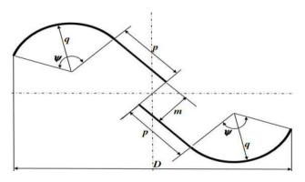

## Helical Savonius

A Savonius variant with the scoop geometry twisted helically around the shaft. (source: sources/HRI2526.md)

- Geometry:
  - The rotor uses a helical twist instead of a straight stacked scoop profile. (source: sources/HRI2526.md)
  - It keeps the drag-based Savonius operating principle while changing the blade path along the shaft. (source: sources/HRI2526.md)
  - The vj12 review says helical Savonius designs often improve torque smoothness and can improve Cp, with one 180-degree twist study reporting a 51% Cp gain. (source: sources/vj12.md)
- Performance:
  - It appears in the report's hybrid design search and contributes startup torque. (source: sources/HRI2526.md)
  - The review says one study found peak power at 45 degrees twist, while another found a 105-degree helical twist with endplates performed best. (source: sources/vj12.md)
- Tradeoffs:
  - The helical form is more complex to fabricate than the classical Savonius. > Inference. (source: sources/HRI2526.md)
  - It is used when smoother loading or hybrid integration is more important than the simplest build. > Inference. (source: sources/HRI2526.md)

- Listed in the report as one of the Savonius forms examined in the design space. (source: sources/HRI2526.md)
- Used as part of hybrid configurations in the report's concept search. (source: sources/HRI2526.md)

Original caption: Figure 18: Top and side view of wind rotor shapes with different twist angle [95]. [[vj12|Source]]

Original caption: Figure 19: Comparison of helical and conventional Savonius rotor [81]. [[vj12|Source]]

Related:
- [[Savonius Turbine]]
- [[HRI2526 Classical Savonius|Classical Savonius]]
- [[Helical VAWT]]
- [[VAWT Types]]
