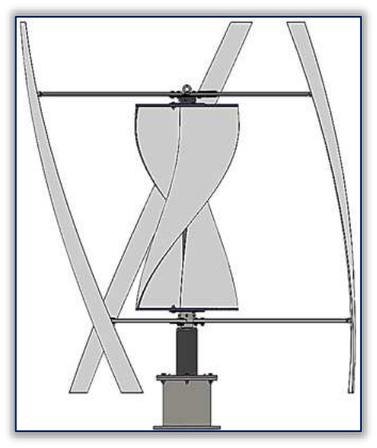
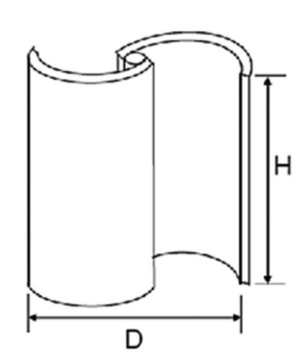
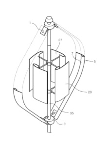
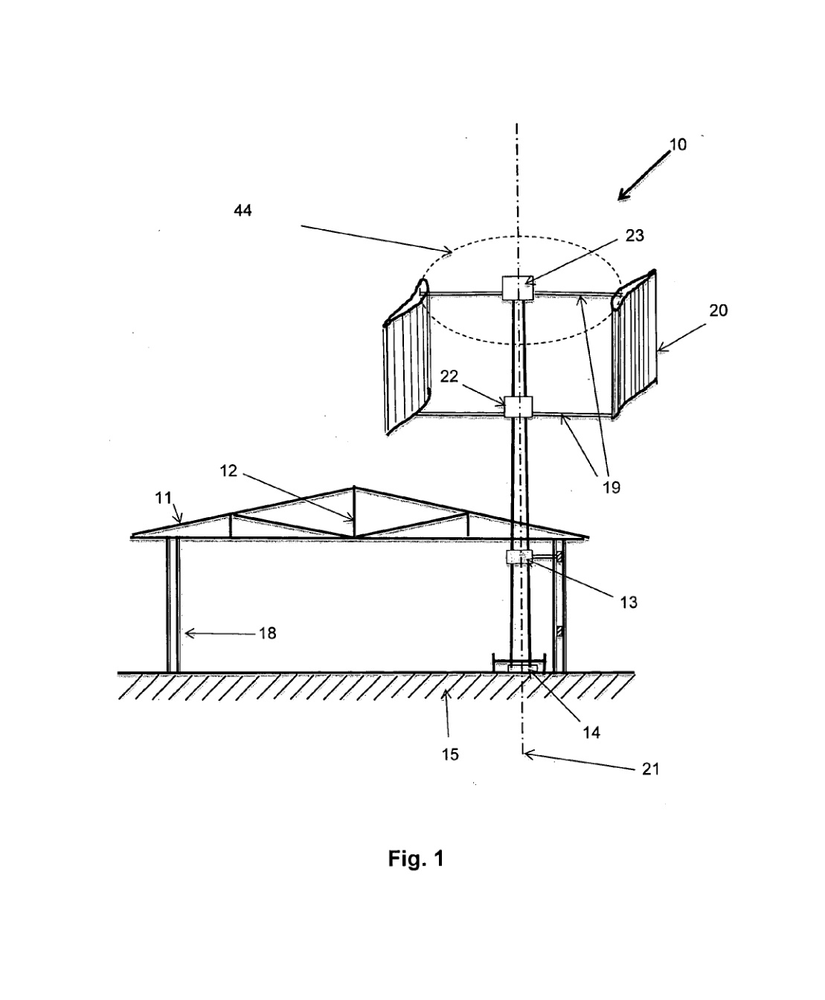

---
Created:
Updated: 2026-07-03
Sources:
- [[HRI2526]]
- [[n2]]
- [[va8]]
- [[vj11]]
- [[vj2]]
Source_count: 5
Tags:
- concepts
---
## Hybrid VAWT

Vertical axis wind turbine combining Darrieus (lift-based) and Savonius (drag-based) rotors. (source: sources/HRI2526.md)

Original caption: Figure 3: (a) CAD model of the initial configuration of the proposed hybrid wind turbine (at the bottom - bearing housing and power generator); (b) simplified CAD model for CFD analysis [Source](../../sources/vj2.md)

Original caption: Fig. 9. Hybrid VAWT with inner classical Savonius and outer H-rotor Darrieus [29] [Source](../../sources/HRI2526.md)

Original caption: Fig. 14. Final CAD Model of the Helical Hybrid VAWT. [Source](../../sources/HRI2526.md)

Original caption: Figure 1: External perspective view of the vertical axis wind turbine. [Source](../../sources/va8.md)

- Geometry:
  - Common layout is an outer Darrieus rotor with an inner Savonius rotor. (source: sources/HRI2526.md)
  - The HRI report's final choice was a helical Darrieus around a widened internal helical Savonius. (source: sources/HRI2526.md)
- Performance:
  - The Savonius helps startup at low wind speeds and the Darrieus improves higher-speed efficiency. (source: sources/HRI2526.md)
  - The report selected the helical hybrid after testing and scoring. (source: sources/HRI2526.md)
- Tradeoffs:
  - Hybrids are more complex structurally and aerodynamically than single-rotor designs. (source: sources/HRI2526.md)
  - The balance between startup torque and efficiency depends strongly on rotor placement. (source: sources/vj2.md)

The review describes the common hybrid layout as an inner Savonius rotor with an outer Darrieus rotor. (source: sources/vj11.md)
It reports optimized hybrid Cp around 0.25-0.35, with reliable self-starting from near-zero wind speed. (source: sources/vj11.md)
It warns that Savonius drag can degrade high-TSR efficiency, so swept-area balance and solidity need careful tuning. (source: sources/vj11.md)

The va8 patent adds a different hybrid architecture: asymmetrical lift blades are mounted between upper and lower horizontal channel beams, and the compartmented channel beams are described as generating Savonius-like drag torque that complements blade lift torque. (source: sources/va8.md)
In that patent design, the generator/storage hardware is placed near the bottom of the turbine, and the source frames that placement as a stability improvement compared with placing power-generation equipment at the top. (source: sources/va8.md)
The source claims high starting torque at low wind and similar torque when wind comes from the leading or trailing edge direction, but this is a single patent source and should not be treated as a broadly validated performance trend without corroborating studies. (source: sources/va8.md)

Purpose:
- Improve self-starting via Savonius rotor (source: sources/HRI2526.md)
- Improve efficiency at higher wind speeds via Darrieus rotor (source: sources/HRI2526.md)
- In the HRI phase 1 report, this was the selected design after screening 200+ concepts and testing four prototypes. (source: sources/HRI2526.md)

Typical configuration:
- Outer Darrieus rotor
- Inner Savonius rotor
(source: sources/HRI2526.md)

Alternative patented configuration:
- Asymmetrical Darrieus-like lift blades connected to horizontal channel beams with compartments. (source: sources/va8.md)
- Channel compartments act as the drag-producing component instead of a separate central Savonius rotor. (source: sources/va8.md)

Final HRI configuration:
- Asymmetrical helical Darrieus blades surrounding a widened internal helical Savonius rotor. (source: sources/HRI2526.md)
- Optimized blade overlap ratio. (source: sources/HRI2526.md)
- CFD reported Cp 0.19 at TSR 1 for the selected concept. (source: sources/HRI2526.md)
- The report treated this concept as the best-performing of the four prototyped designs after wind tunnel testing and screening of 200+ initial concepts. (source: sources/HRI2526.md)

Advantages:
- Better performance across a wider range of wind speeds (source: sources/HRI2526.md)
- Suitable for low-speed, turbulent urban environments (source: sources/HRI2526.md)

Tradeoffs:
- Increased structural complexity (source: sources/HRI2526.md)
- Design requires balancing competing mechanisms (source: sources/HRI2526.md)

- Potential interference: outer Darrieus may reduce wind capture of inner Savonius at low speeds. (source: sources/n2.md)
- CFD case study: a helical Savonius inside a helical Darrieus rotor gained 10.5% torque after removing the Savonius shaft and 22.3% after moving split Savonius halves outside the Darrieus rotor. (source: sources/vj2.md)
- The same study reports the initial hybrid geometry used a 1000 mm by 500 mm Savonius rotor inside a 1600 mm diameter, three-bladed helical Darrieus rotor with NACA 0018 blades of 110 mm chord and 1800 mm projected height. (source: sources/vj2.md)

Original caption: Figure 8: Torque values calculated for each configuration, for one third of a complete rotation (15 degree steps) [Source](../../sources/vj2.md)

Method note:
- SolidWorks Flow Simulation was used on a 3D domain with nine attack angles from 0 to 120 degrees. (source: sources/vj2.md)

See also:
- [[VAWT]]
- [[Darrieus Turbine]]
- [[Savonius Turbine]]
- [[Outer Darrieus with Inner Savonius]]
- [[Helical Hybrid]]
- [[Darrieus above Savonius]]
- [[Multi-stage Savonius within H-rotor Darrieus]]
- [[Double Darrieus with Inner H-rotor and Outer Eggbeater]]
- [[Aerodynamic Design Parameters]]
- [[Structures and Loads]]
- [[Materials and Manufacturing]]
- [[vj2 Savonius-Darrieus Hybrid Wind Turbine]]
- [[vj2 Savonius Shaft Removal]]
- [[vj2 Savonius Placement Outside Darrieus Rotor]]

#concepts 
