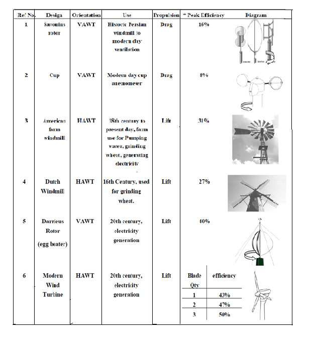
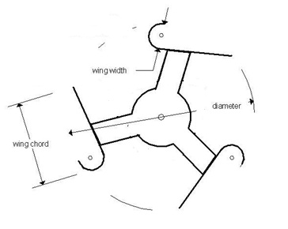

## J-Type VAWT

A small drag-based vertical-axis wind turbine design using J-shaped blades. (source: sources/va5.md)

- The paper uses the design for rooftop deployment and low-cost rural electrification. (source: sources/va5.md)
- The rotor is three-bladed and paired with a direct-drive generator. (source: sources/va5.md)
- The target design point is 35 W at 6.67 m/s. (source: sources/va5.md)
- The reported prototype efficiency is 23.3%. (source: sources/va5.md)

## Figures

Related:
- [[VAWT]]
- [[Savonius Turbine]]
- [[Wind Turbine Parameters]]
