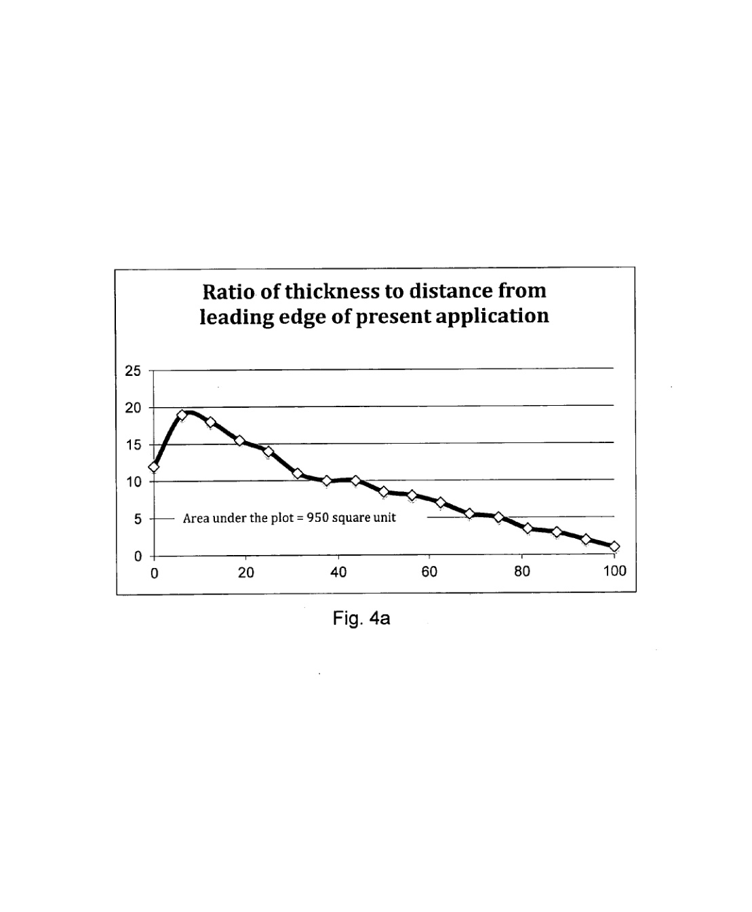
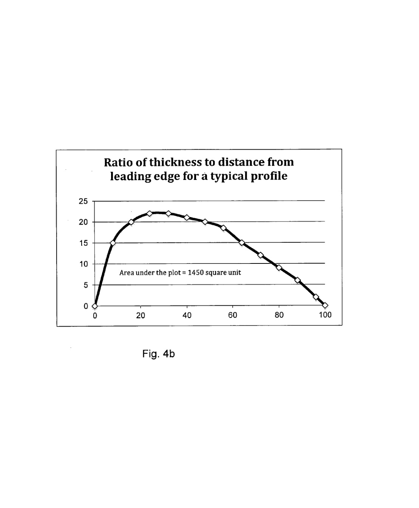

---
Created:
Updated: 2026-07-02
Sources:
- [[va8]]
- [[va9]]
- [[vj1]]
- [[vj7]]
Source_count: 4
Tags:
- concepts
---
## Materials and Manufacturing

Blade material choice is not just a cost issue; it affects fatigue life, stiffness, corrosion resistance, and maintenance.

- SB-VAWT blade materials should have high yield strength, fatigue resistance, stiffness, low density, and corrosion resistance. (source: sources/vj7.md)
- The vj1 comparison paper frames maintenance, manufacturing, and electrical equipment as core design factors. (source: sources/vj1.md)
- Small VAWTs can be attractive because ground-level components make maintenance easier. (source: sources/vj1.md)
- Aluminum is common, but the source says its fatigue properties are a concern for wind-turbine use. (source: sources/vj7.md)
- The va8 patent argues for a simple asymmetric blade profile partly because avoiding complex cut-outs should lower manufacturing difficulty, cost, stress concentration, fatigue risk, and lifecycle cost. (source: sources/va8.md)
- In the patent's comparison with a typical flat-bottom profile, the proposed profile is described as having a smaller area under the thickness-ratio curve and being 54% lighter, which the source links to lighter supporting structures. (source: sources/va8.md)
- The va9 paper frames self-starting blade-profile design as a way to avoid extra startup components or external electricity feed-in, which it says would otherwise increase turbine complexity, manufacturing and maintenance costs, and lower sustainability. (source: sources/va9.md)
- Its patented blade design uses a main body and two blade ends that can be fixed or dynamically changed during operation. (source: sources/va9.md)

Original caption: Figure 4a: Ratio of airfoil profile thickness to distance from leading edge of the present application. [[va8|Source]]

Original caption: Figure 4b: Ratio of airfoil profile thickness to distance from leading edge for a typical flat bottom profile. [[va8|Source]]

Original caption: Fig. 23. New Darrieus VAWT with blade ends in two different positions. [[va9|Source]]

Related:
- [[Structures and Loads]]
- [[Rules of Thumb]]
- [[HRI2526 Aerodynamic Design Parameters|Aerodynamic Design Parameters]]
- [[Darrieus Turbine]]
