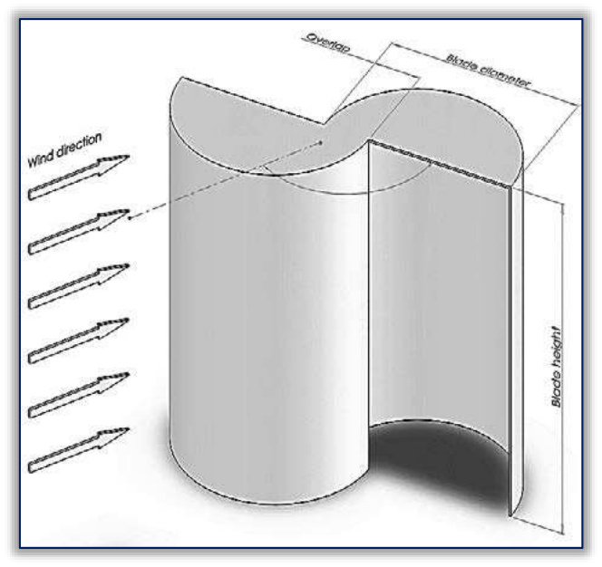
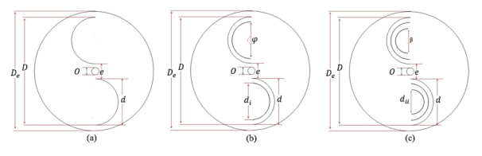
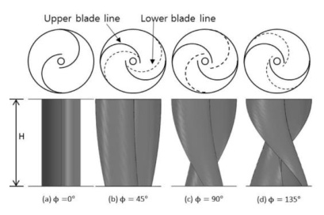
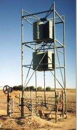

---
Created:
Updated: 2026-07-03
Sources:
- [[HRI2526]]
- [[n1]]
- [[n2]]
- [[va3]]
- [[va5]]
- [[va8]]
- [[vj11]]
- [[vj12]]
Source_count: 8
Tags:
- concepts
---
## Savonius Turbine

Drag-based VAWT using scooped blades. (source: sources/n1.md, sources/va1.md)

- Geometry:
  - Typically uses two semicircular blades around a vertical shaft. (source: sources/HRI2526.md)
  - Classical and helical forms are both represented in the wiki. (source: sources/HRI2526.md)
- Performance:
  - Self-starting and effective at low wind speeds. (source: sources/HRI2526.md)
  - TSR is typically between 0 and 1. (source: sources/HRI2526.md)
  - The review says overlap ratio has no single optimum, but 0.1-0.15 is a common useful range and no-overlap cases can still win on mechanical power in some studies. (source: sources/vj12.md)
  - It reports that inner blades can raise Cp by up to 41%, with different gap settings favoring one- or two-inner-blade layouts. (source: sources/vj12.md)
  - It says some twisted Savonius designs improve Cp substantially, including a 180-degree twist case that improved Cp by 51%. (source: sources/vj12.md)
- Tradeoffs:
  - Simple, low-cost construction and low noise are advantages. (source: sources/HRI2526.md)
  - Negative torque on the returning blade limits efficiency. (source: sources/HRI2526.md)
  - The review says adding more blades can improve torque but often lowers Cp; one three-bladed case reported much lower Cp and dynamic torque than the two-bladed rotor. (source: sources/vj12.md)
  - Endplates reduce leakage; the review notes a common recommendation that endplate diameter be about 10% larger than the turbine diameter. (source: sources/vj12.md)

- Self-starting and effective at low wind speeds. (source: sources/n1.md, sources/va1.md)
- Low efficiency due to high drag. (source: sources/n1.md)

- Typically consists of two semicircular blades creating differential drag. (source: sources/HRI2526.md)
- Tip speed ratio is between 0 and 1. (source: sources/HRI2526.md)
- Simple, low-cost construction and low noise. (source: sources/HRI2526.md)
- Suffers from negative torque on returning blade, reducing efficiency. (source: sources/HRI2526.md)
- Optimization includes blade count, overlap ratio, and augmentation devices. (source: sources/HRI2526.md)

The review places Savonius operation around TSR 0.6-1.2 and peak Cp about 0.15-0.25, with self-starting as the main advantage. (source: sources/vj11.md)
It treats Savonius as the drag-based family used when low-speed startup matters more than peak efficiency. (source: sources/vj11.md)
In hybrid systems, Savonius is the startup element that helps cover Darrieus negative-torque regions at low TSR. (source: sources/vj11.md)
- The va8 patent defines Savonius-type VAWTs as primarily drag devices where downwind thrust exceeds upwind drag, and says its compartmented horizontal channel beams act similarly by trapping wind to generate drag torque. (source: sources/va8.md)
- The source identifies Savonius as a 1922 impulse rotor introduced by S. J. Savonius. (source: sources/va3.md)
- Modern variants evolved from half drums into fluted spiral-bladed designs that improve efficiency and reduce vibration. (source: sources/va3.md)
- The J-type rooftop design is a separate drag-based VAWT concept, but it shares the low-cost drag-rotor rationale. (source: sources/va5.md)

- Two-bladed configurations often achieve higher power coefficients. (source: sources/n2.md)
- Optimal aspect ratio typically around 1.5–2. (source: sources/n2.md)
- Overlap ratio ~0.15 performs well at low wind speeds (~<4 m/s). (source: sources/n2.md)
- Elliptical blades and ~45° twist can improve performance. (source: sources/n2.md)
- Endplates, curtains/shields, and auxiliary blades can reduce losses and improve efficiency. (source: sources/n2.md)
- In one hybrid-CFD study, a 38 mm shaft occupying about 66% of the Savonius overlap space was treated as a flow obstruction, and removing it increased average hybrid-rotor torque by 10.5% at 7 m/s. (source: sources/vj2.md)

Related:
- [[VAWT]]
- [[Classical Savonius]]
- [[Helical Savonius]]
- [[Darrieus Turbine]]
- [[Hybrid VAWT]]
- [[vj2 Savonius-Darrieus Hybrid Wind Turbine]]
- [[Wind Turbine Parameters]]
- [[Aerodynamic Design Parameters]]
- [[Tip Speed Ratio Classification]]

#concepts 
