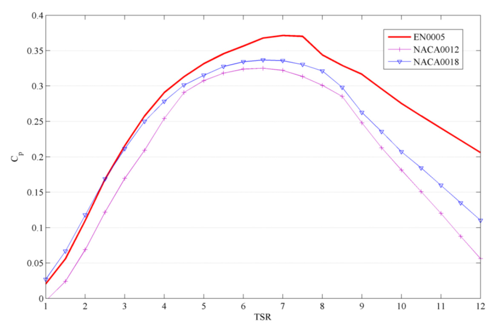

---
Created:
Updated: 2026-07-02
Sources:
- [[HRI2526]]
- [[va2]]
- [[vj4]]
Source_count: 3
Tags:
- concepts
---
## Straight-bladed Darrieus / H-rotor

The straight-bladed Darrieus family with blades arranged around a vertical shaft. (source: sources/HRI2526.md)

- Geometry:
  - Straight blades keep a constant radius over the blade length. (source: sources/vj4.md)
  - The rotor is commonly arranged as an H-rotor around the shaft. (source: sources/HRI2526.md)
- Performance:
  - It is lift-based and belongs to the Darrieus family. (source: sources/HRI2526.md)
  - The HRI report treats it as a benchmark for high-speed lift-based operation. (source: sources/HRI2526.md)
- Tradeoffs:
  - Straight blades are simpler to build than curved blades. (source: sources/vj4.md)
  - They still carry cyclic loading and self-starting issues common to Darrieus turbines. (source: sources/HRI2526.md, sources/vj4.md)

- The report names this as the H-rotor Darrieus, one of the three main Darrieus types. (source: sources/HRI2526.md)
- The straight-bladed form keeps the blade radius constant over its length. (source: sources/vj4.md)
- It is a common benchmark for aerodynamic modeling and optimization. (source: sources/va2.md, sources/vj4.md)
- The va9 DMS prediction case compares EN0005, NACA0012, and NACA0018 on a straight-bladed VAWT with height 4.6 m, blade radius 2 m, five blades, 0.30 m profile chord, and V∞ = 12 m/s. (source: sources/va9.md)
- In that prediction, the EN0005 profile is reported to give better high-TSR performance than the compared NACA0012 and NACA0018 profiles. (source: sources/va9.md)

Related:
- [[H-VAWT]]
- [[Darrieus Turbine]]
- [[Eggbeater Darrieus]]
- [[VAWT Types]]
- [[Double-Multiple Streamtube Model]]
