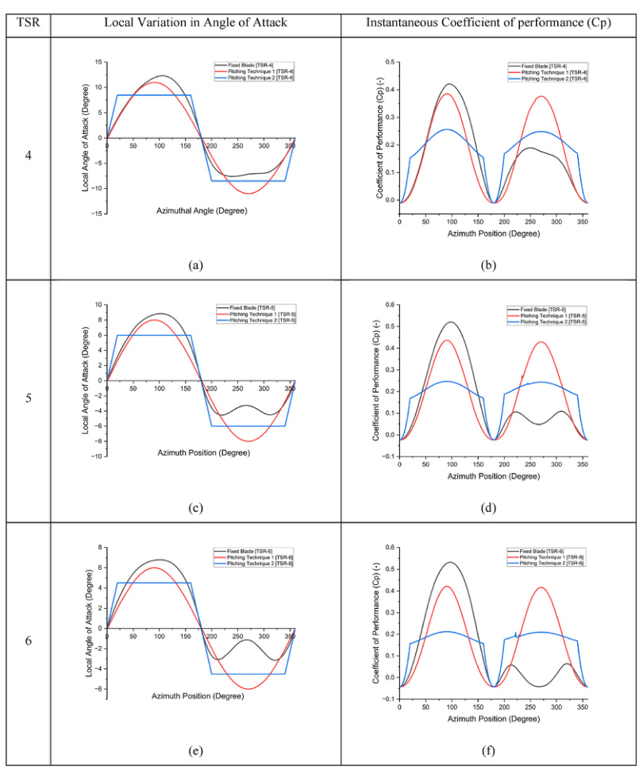

## Straight-bladed Darrieus / H-rotor

The straight-bladed Darrieus family with blades arranged around a vertical shaft. (source: sources/HRI2526.md)

- Geometry:
  - Straight blades keep a constant radius over the blade length. (source: sources/vj4.md)
  - The rotor is commonly arranged as an H-rotor around the shaft. (source: sources/HRI2526.md)
- Performance:
  - It is lift-based and belongs to the Darrieus family. (source: sources/HRI2526.md)
  - The HRI report treats it as a benchmark for high-speed lift-based operation. (source: sources/HRI2526.md)
- Tradeoffs:
  - Straight blades are simpler to build than curved blades. (source: sources/vj4.md)
  - They still carry cyclic loading and self-starting issues common to Darrieus turbines. (source: sources/HRI2526.md, sources/vj4.md)

- The report names this as the H-rotor Darrieus, one of the three main Darrieus types. (source: sources/HRI2526.md)
- The straight-bladed form keeps the blade radius constant over its length. (source: sources/vj4.md)
- It is a common benchmark for aerodynamic modeling and optimization. (source: sources/va2.md, sources/vj4.md)
- The va9 DMS prediction case compares EN0005, NACA0012, and NACA0018 on a straight-bladed VAWT with height 4.6 m, blade radius 2 m, five blades, 0.30 m profile chord, and V∞ = 12 m/s. (source: sources/va9.md)
- In that prediction, the EN0005 profile is reported to give better high-TSR performance than the compared NACA0012 and NACA0018 profiles. (source: sources/va9.md)
- The va11 review adds that straight-bladed H-rotor wakes are strongly asymmetric and shaped by deep dynamic stall, blade-wake interaction, and counter-rotating vortex structures. (source: sources/va11.md)
- It also says wake recovery can be fast enough to motivate closer VAWT spacing and wake-model-based layout design. (source: sources/va11.md)
- The va16 study adds that spanwise circulation and local power are strongest near the blade center and weaken toward the tip because of blade-tip-vortex effects. (source: sources/va16.md)
- It also reports that, in its fixed-`H/c` comparison, power coefficient depends more on solidity than on `H/D` alone. (source: sources/va16.md)
- The va24 paper adds an active-pitch case where a straight-bladed NACA0015 Darrieus rotor is modeled with DMST and two variable-pitch control strategies. (source: sources/va24.md)
- That source says variable blade pitching can both improve self-starting behavior at low TSR and raise peak `Cp` well above the fixed-blade baseline. (source: sources/va24.md)
- The vj21 design-parameter paper reframes the fixed-pitch straight-bladed rotor as a small-system candidate for urban and off-grid use, emphasizing that ground-level maintenance access and geometric simplicity are major practical advantages. (source: sources/vj21.md)
- It also says the most sensitive design choices for this family include blade airfoil, strut layout and shape, solidity, and blade material. (source: sources/vj21.md)
- The vj24 paper adds a low-speed `3`-bladed straight-bladed example with `6 m` blade length, `6 m` rotor diameter, and `0.125 m` chord, used specifically to test whether inverse airfoil redesign can improve output. (source: sources/vj24.md)
- In that case, the modified `NACA 0018-M` profile is reported to raise predicted power from `1.610 kW` to `1.850 kW` and `Cp` from `0.294` to `0.338` relative to the baseline `NACA 0018` case. (source: sources/vj24.md)
- The va25 airfoil study adds a 3-bladed H-rotor CFD comparison where startup and low-TSR performance depend strongly on airfoil family and on whether a cambered airfoil is installed camber-in or camber-out. (source: sources/va25.md)
- The va26 study adds that even a simple fixed pitch offset can materially change both peak `Cp` and the azimuthal distribution of moment on a straight-bladed H-rotor. (source: sources/va26.md)
- The `vj28` paper reframes small fixed-pitch straight-bladed Darrieus design around low-Re airfoil choice, arguing that the older symmetric `NACA` sections commonly reused from aviation are a poor fit for smaller-capacity SB-VAWTs. (source: sources/vj28.md)
- It says the preferred blade-section geometry for this class is cambered, thicker, with a larger leading-edge radius and a sharper trailing edge, but still warns that no single screened public-domain airfoil satisfied every desired criterion. (source: sources/vj28.md)

Original caption: Fig. 18. Darrieus VAWT performance prediction. [[va9|Source]]

Original caption: Fig. 11. Instantaneous Coefficient of Performance (Cp) as a function of one blade azimuth position obtained using Variable blade pitching technique 1 and 2 compared to fixed 3 blade rotor configuration at TSR 4 (a, b), 5(c, d), and 6 (e, f). [[va24|Source]]

Related:
- [[H-VAWT]]
- [[H-rotor Wake Aerodynamics]]
- [[Darrieus Turbine]]
- [[HRI2526 Eggbeater Darrieus|Eggbeater Darrieus]]
- [[VAWT Types]]
- [[Double-Multiple Streamtube Model]]
- [[va24 Variable-Pitch 3-Bladed NACA0015 Straight-Bladed VAWT]]
- [[va25 Reference H-Rotor Darrieus VAWT]]
- [[va26 3-Bladed H-Type VAWT]]
- [[vj24 3-Bladed Straight-Bladed Darrieus VAWT]]
