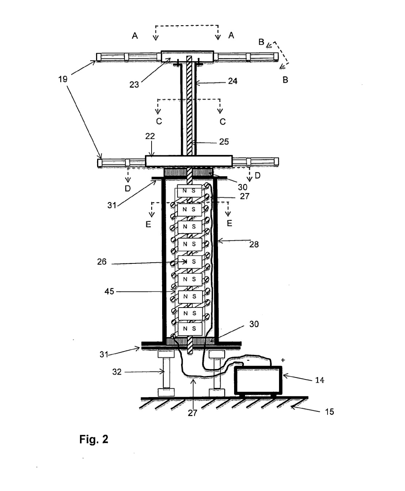

---
Created:
Updated: 2026-07-07
Sources:
- [[HRI2526]]
- [[va7]]
- [[va8]]
- [[vj1]]
- [[vj2]]
- [[vj4]]
- [[vj5]]
- [[vj6]]
- [[vj8]]
- [[vj18]]
- [[vj26]]
Source_count: 11
Tags:
- concepts
---
## Structures and Loads

This page collects the load and structural issues that shape a VAWT design.

- Dynamic stall is a central load driver at low TSR. (source: sources/vj5.md, sources/vj6.md)
- Torque ripple and cyclic loading matter for rotor smoothness and fatigue. (source: sources/vj1.md, sources/vj4.md, sources/va7.md)
- Stability is a design goal in contra-rotating configurations. (source: sources/vj8.md)
- Blade loads depend on blade number, inclination, and camber line. (source: sources/vj4.md)
- Offshore and urban applications both create structural constraints that show up in VAWT studies. (source: sources/HRI2526.md, sources/vj1.md)
- The va8 patent uses a central vertical rotating shaft, upper and lower hubs, upper and lower channel beams, and two thrust bearings to support side loads, allow shaft rotation, and carry self-weight. (source: sources/va8.md)
- The patent explicitly treats shaft/building-framework connection as a stability measure so the shaft does not bend enough to interfere with free rotation. (source: sources/va8.md)
- It places the generator/storage hardware near the bottom of the turbine and frames that choice as improving stability. (source: sources/va8.md)
- The hybrid-CFD study in `vj2` identifies the internal Savonius shaft as a structural element that also obstructs flow through the blade overlap space, creating a tradeoff between structure and aerodynamic torque. (source: sources/vj2.md)
- The same source says Savonius-generated turbulence can negatively affect the lift-based Darrieus blades when the Savonius rotor sits in the middle of the hybrid rotor. (source: sources/vj2.md)
- The vj18 review says movable mass blocks can cut radial loading and shaft deformation but can also slow startup because the extra inertia works against self-starting. (source: sources/vj18.md)
- It also treats strut durability and load path design as long-term issues for variable mechanisms. (source: sources/vj18.md)
- The vj26 review adds that large oscillatory stresses on the tower and rotor arms are a main reason VAWTs have historically been harder to scale safely than HAWTs. (source: sources/vj26.md)
- It also cites experimental evidence that high-solidity H-type VAWTs can show significant resonance in the supporting struts, with vibration response strongly tied to rotor rotational frequency and changing flow conditions. (source: sources/vj26.md)
- For offshore VAWTs, the same review identifies gyroscopic effects and large overturning moments as central structural problems, and points to V-shaped rotors with sails and rotating float concepts as attempts to reduce those loads. (source: sources/vj26.md)

Original caption: Figure 2: Vertical cross section of the turbine shaft. [[va8|Source]]

Related:
- [[Dynamic Stall]]
- [[Materials and Manufacturing]]
- [[Rules of Thumb]]
- [[Hybrid VAWT]]
- [[vj2 Savonius-Darrieus Hybrid Wind Turbine]]
- [[vj2 Shaftless Savonius-Darrieus Hybrid Wind Turbine]]
- [[Variable VAWT Design]]
