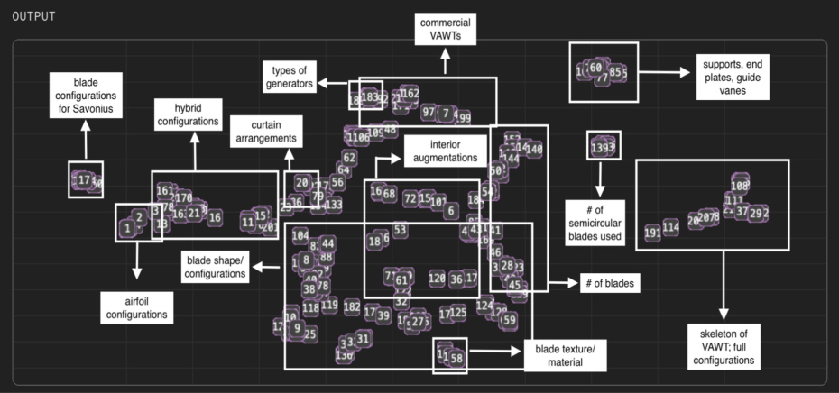
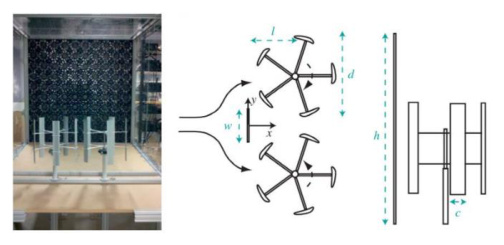
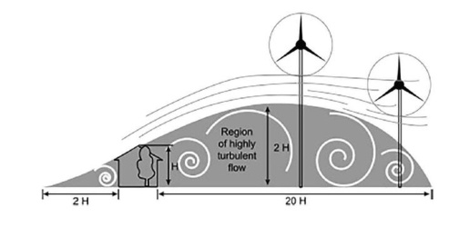
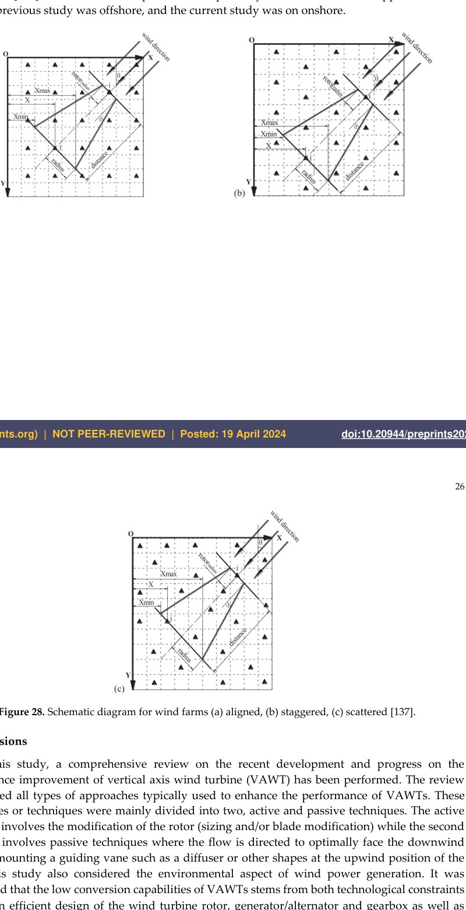

---
Created:
Updated: 2026-07-06
Sources:
- [[HRI2526]]
- [[va13]]
- [[va8]]
- [[va9]]
- [[vj10]]
- [[vj11]]
- [[vj12]]
- [[vj13]]
- [[vj14]]
Source_count: 9
Tags:
- concepts
---
## Urban Wind Conditions

Characteristics of airflow in built environments. (source: sources/HRI2526.md)

- Lower average wind speeds due to surface roughness from buildings. (source: sources/HRI2526.md)
- Highly turbulent with rapid changes in speed and direction. (source: sources/HRI2526.md)
- Flow obstruction creates localized բարձր (higher) velocity regions and complex wake patterns. (source: sources/HRI2526.md)
- Increased turbulence intensity leads to fluctuating loads on turbines. (source: sources/HRI2526.md)
- The wind-shear paper says non-uniform wind conditions are especially relevant for urban wind turbines because high disturbance makes the flow domain complicated. (source: sources/vj10.md)
- The vj12 review says proper siting needs long-term wind-history data and suggests at least two years of observations before judging a site. (source: sources/vj12.md)
- It says a turbine should be placed about 10 obstacle-heights away, or the tower should be at least twice the obstacle height if the turbine must stay closer. (source: sources/vj12.md)
- It reports that wind-farm spacing choices matter too: one study used 14.5D/11D optimal separation for aligned and staggered offshore layouts, while another found nonuniform layouts could improve space utilization to 99.21%. (source: sources/vj12.md)
- In the McConnell Hall roof data analyzed by the HRI team, the 2025 daily average wind speed was 0.67 m/s and the average daily high was 4.02 m/s. (source: sources/HRI2526.md)
- The review says rooftop wind is often below 5 m/s, with turbulence intensity commonly around 15-25% in urban settings. (source: sources/vj11.md)
- It treats site-specific flow characterization as essential before judging turbine performance in buildings. (source: sources/vj11.md)
- It reinforces the fit between urban deployment and VAWT traits such as omnidirectionality and low visual impact. (source: sources/vj11.md)
- The va8 patent motivates its design around low-altitude, scattered, turbulent, low-speed wind near residences and rooftops, where it says VAWTs can accept wind from any direction better than HAWTs. (source: sources/va8.md)
- The same patent frames rural rooftop deployment as a target use case and says battery storage could reduce or possibly eliminate grid-power need for household electric power. (source: sources/va8.md)
- The va9 paper motivates Darrieus VAWT development for urban areas because wind turbulence and brisk changes in wind direction cannot be disregarded there. (source: sources/va9.md)
- Its tested prototype was evaluated in urban field sites and in a wind tunnel, and the source reports no audible noise emission in the urban environment. (source: sources/va9.md)
- The va13 rooftop-building study treats Çe¸sme, Izmir as a favorable urban-wind site with about 7 m/s local average wind speed for VAWT integration. (source: sources/va13.md)
- It uses that stronger-wind urban case to show that rooftop VAWTs can be viable when the local wind resource is much better than low-speed rooftop cases elsewhere in the wiki. (source: sources/va13.md)
- The vj13 study shows that wind-direction energy distribution, not just average wind speed or frequency, can change the best cluster orientation. (source: sources/vj13.md)
- It reinforces that urban or rooftop siting needs directional wind roses before deciding where a Savonius cluster should face. (source: sources/vj13.md)
- The vj14 study shows that buildings around the site likely reduced wind speed, and that low local wind speed was the main reason the H-Darrieus prototype underperformed. (source: sources/vj14.md)
- It also suggests roof mounting could reduce environmental impact because the mast and foundation dominate many LCA categories. (source: sources/vj14.md)

Original caption: Fig. 16. Wind Data from McConnell Rooftop [[HRI2526|Source]]

Implications:
- Reduces overall power potential due to cubic dependence on wind speed. (source: sources/HRI2526.md)
- Favors omnidirectional and low cut-in technologies like VAWTs. (source: sources/HRI2526.md)
- For CFD, the team used a 2 m/s inlet velocity as a practical design point because it was reached with some frequency. (source: sources/HRI2526.md)

Original caption: Figure 26: The effect of obstacle on the height of a wind turbine [133]. [[vj12|Source]]

Original caption: Figure 27: Typical wind farm layout arranged with a rectangular grid pattern [136]. [[vj12|Source]]

Original caption: Figure 28: Schematic diagram for wind farms (a) aligned, (b) staggered, (c) scattered [137]. [[vj12|Source]]

Related:
- [[VAWT]]
- [[Wind Turbine Parameters]]
- [[CFD]]
- [[Atmospheric Turbulence]]
- [[Wind Shear]]
- [[Hybrid VAWT]]
- [[Darrieus Turbine]]
- [[Economic Viability of VAWTs]]
- [[Savonius Wind Turbine Cluster]]

#concepts 
