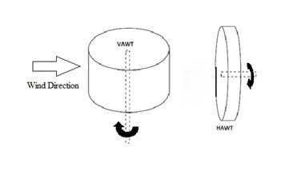
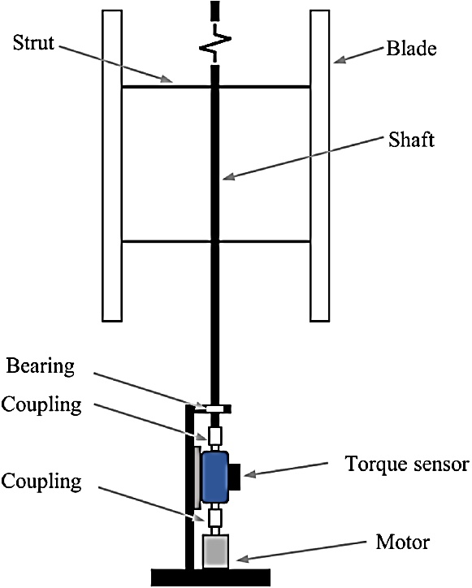
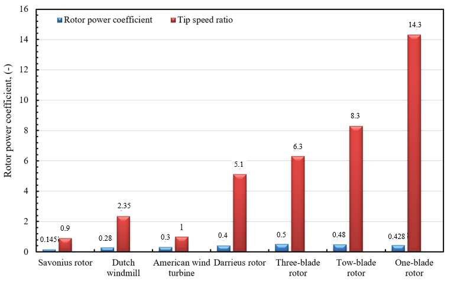

## Vertical-Axis Wind Turbine (VAWT)

Wind turbine with a vertical rotor axis that can accept wind from any direction. (source: sources/n1.md, sources/va1.md)

- Suitable for urban environments with turbulent, changing wind directions. (source: sources/n1.md, sources/va1.md)
- Lower efficiency than HAWTs but easier integration in buildings. (source: sources/n1.md)
- Includes lift-based and drag-based designs. (source: sources/va1.md)

- Omnidirectional operation eliminates need for yaw systems. (source: sources/HRI2526.md)
- Lower cut-in speeds allow operation in low wind conditions. (source: sources/HRI2526.md)
- Better suited for turbulent, multidirectional urban airflow. (source: sources/HRI2526.md)
- Urban environments have lower average wind speeds but higher turbulence due to surface roughness and obstacles. (source: sources/HRI2526.md)
- Power output scales with the cube of wind velocity, making low-speed environments challenging. (source: sources/HRI2526.md)
- Currently less mature with lower market penetration compared to HAWTs. (source: sources/HRI2526.md)
- Tip speed ratio α > 1 suggests lift-based operation, while α < 1 indicates mostly drag-based behavior. (source: sources/va3.md)
- Small VAWTs can be easier to manufacture and maintain because the generator sits at ground level, and the article cites 10 m / 3-5 kW machines as a low-cost scale target. (source: sources/va3.md)
- Correctly positioned VAWT arrays can exploit wake interactions to improve downstream turbine output. (source: sources/va3.md)
- The source frames VAWTs as quieter, less visible, and more suitable for constrained sites than large HAWTs. (source: sources/va3.md)

Additional advantages:
- No yaw system required, reducing mechanical complexity and cost. (source: sources/vj1.md)
- Generator and drivetrain can be placed at ground level, improving maintenance access. (source: sources/vj1.md)
- Lower noise due to lower tip speeds and ground-level machinery. (source: sources/vj1.md)

Structural/operational traits:
- Simpler overall structure with fewer moving parts compared to HAWTs. (source: sources/vj1.md)
- Subject to torque ripple due to cyclic angle of attack. (source: sources/vj1.md)

Performance context:
- Potential efficiency comparable to HAWTs, but historically less optimized due to lower investment. (source: sources/vj1.md)
- H-type airfoil optimization with CST, Kriging, and MIGA improved Cp by 14.2% at TSR > 1.5 and average efficiency by 9.8%. (source: sources/va2.md)

## Figures

Inefficiencies:
- Blades pass through their own wake, reducing efficiency. (source: sources/n2.md)
- Dynamic stall from changing angle of attack causes losses. (source: sources/n2.md)
- Drag-based designs suffer from returning blade opposing motion. (source: sources/n2.md)
- Dynamic stall is especially important at low tip speed ratios, where vortex shedding and wake roll-up strongly affect loads and power. (source: sources/vj5.md)
- The CFD review reiterates that VAWTs are attractive for urban use because they capture wind from any direction and fit constrained sites, but they still face dynamic stall and blade-wake challenges. (source: sources/vj6.md)
- The same review notes that 2-D CFD often over-predicts Darrieus performance, while 3-D models better capture tip losses and secondary flow. (source: sources/vj6.md)
- The review treats power coefficient, torque, flow separation, and wake dynamics as key CFD outputs for VAWT analysis. (source: sources/vj6.md)
- Straight-bladed VAWT blade material matters because fatigue resistance, stiffness, density, and corrosion resistance affect lifetime and cost. (source: sources/vj7.md)
- Helical VAWTs can smooth power output because blade phases are spread across the rotation. (source: sources/va4.md)
- Small J-type drag VAWTs can be designed for rooftop electrification and low-cost domestic loads. (source: sources/va5.md)
- A contra-rotating VAWT can improve stability and wind-energy recovery, but the paper reports lower pre-optimization Cp than an isolated VAWT. (source: sources/vj8.md)
- A helical-blade CFD study reports a tradeoff between performance and smoothness: the 60-degree helical VAWT had the best power performance among the tested cases, while the 120-degree helical VAWT had the lowest Cp standard deviation. (source: sources/va7.md)
- The same study found helical VAWT wakes dissipate more quickly than straight-bladed VAWT wakes, and wake profiles weaken as helix angle increases. (source: sources/va7.md)

The VAWT review frames the main archetypes as Savonius, H-Darrieus, troposkein Darrieus, helical Darrieus, and Savonius-Darrieus hybrids. (source: sources/vj11.md)
It treats dynamic stall, leading-edge vortex shedding, and blade-wake interaction as the main low-TSR aerodynamic limits. (source: sources/vj11.md)
It emphasizes urban and floating offshore use cases because VAWTs tolerate omnidirectional and disturbed inflow. (source: sources/vj11.md)

The va8 patent presents a rooftop/rural hybrid VAWT concept intended for low-speed, scattered wind, using asymmetrical lift blades plus drag-producing compartmented channel beams for starting torque. (source: sources/va8.md)
The design keeps generator and storage elements near the bottom of the turbine, which the source frames as a stability advantage. (source: sources/va8.md)

The va9 paper emphasizes VAWT advantages for urban areas, including yaw-direction insensitivity, fewer components, very low sound emission, skewed-flow operation, and ability to operate closer to ground level. (source: sources/va9.md)
It reports a Darrieus VAWT prototype that self-started at 1.25 m/s without extra components or external electricity feed-in. (source: sources/va9.md)

Deployment considerations:
- Performance improves significantly in higher wind environments (e.g., tall buildings, bridges). (source: sources/n2.md)

Types of VAWTs:
- [[Darrieus Turbine]] (lift-based)
- [[Savonius Turbine]] (drag-based)
- [[Hybrid VAWT]] (combination)
- [[H-VAWT]] (H-type / H-rotor)
- [[Helical VAWT]]
- [[J-Type VAWT]]
- [[Dynamic Stall]]

Related:
- [[Lift vs Drag]]
- [[VAWT Types]]
- [[VAWT Design Overview]]
- [[VAWT Design Comparisons]]
- [[Design Checklist]]
- [[Rules of Thumb]]
- [[CFD and Validation]]
- [[Optimization]]
- [[Wind Tunnel Testing]]
- [[Double-Multiple Streamtube Model]]

#concepts 
