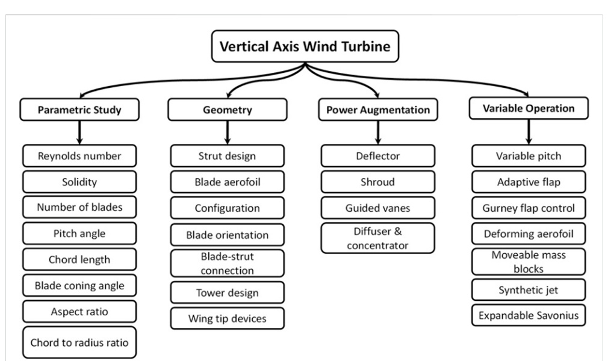
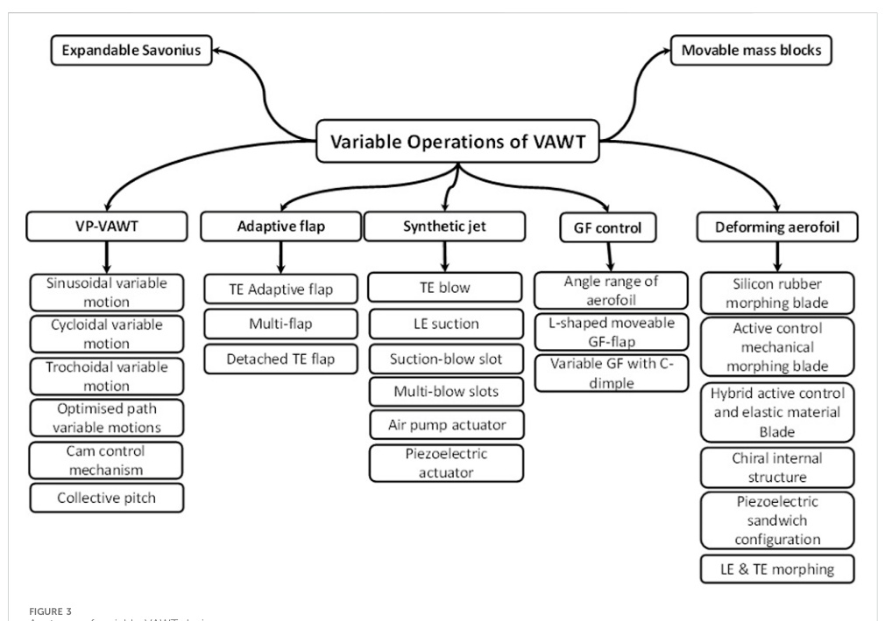

## Variable VAWT Design

Variable VAWT design means changing blade geometry or rotor behavior during operation so the turbine can respond better to changing wind conditions. The review treats this as a broad family of methods rather than one specific mechanism. (source: sources/vj18.md)

- The paper groups variable designs into variable pitch, adaptive flap, Gurney flap control, deforming aerofoil, movable mass blocks, synthetic jet, and variable swept area. (source: sources/vj18.md)
- The main intended benefits are more lift, more torque, better self-starting, and less dynamic stall / wake interaction. (source: sources/vj18.md)
- The main barriers are moving-part complexity, actuator power, material durability, and maintenance burden. (source: sources/vj18.md)
- The review treats passive or low-complexity variants as more realistic for commercialization than heavy active systems. (source: sources/vj18.md)

Original caption: FIGURE 1. VAWT performance studies. [[vj18|Source]]

Original caption: FIGURE 3. Anatomy of variable VAWT designs. [[vj18|Source]]

Related:
- [[Optimization]]
- [[Dynamic Stall]]
- [[Materials and Manufacturing]]
- [[Structures and Loads]]
- [[VAWT Aerodynamic Design Parameters|Aerodynamic Design Parameters]]
- [[VAWT Design Overview]]

#concepts
