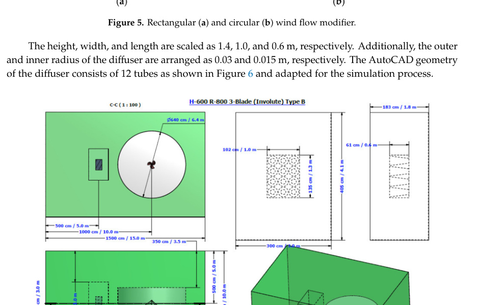

## Wind Flow Modifier

Passive front-end flow-acceleration structure used to increase the wind speed reaching a VAWT rotor in low-wind conditions. (source: sources/va20.md)

- In `va20`, the wind flow modifier (`WFM`) is a stack of diffuser tubes placed upstream of the involute rotor. (source: sources/va20.md)
- The rectangular WFM uses `12` tubes arranged in `4` rows and `3` columns, with diameter reducing from `0.3 m` on the inlet side to `0.15 m` toward the turbine side. (source: sources/va20.md)
- The source says the shrinking cross-sectional area accelerates flow toward the rotor, and reports velocity magnification from about `1.822 m/s` at the diffuser inlet to `5.562 m/s` at the outlet. (source: sources/va20.md)
- In the same paper, adding the WFM to the involute rotor increases the reported maximum power coefficient from `0.22` to `0.397` at `5 m/s`. (source: sources/va20.md)
- The authors note that the simulated rectangular WFM only catches wind from the proposed direction and suggest circular WFM geometry as future work for omnidirectional capture. (source: sources/va20.md)
- The `vj27` review places this kind of device inside the broader family of wind deflectors and flow augmenters, alongside flat plates, airfoil-shaped deflectors, and compound structures used to block the returning blade and redirect wind toward the advancing blade. (source: sources/vj27.md)

Original caption: Figure 5. Rectangular (a) and circular (b) wind flow modifier. [[va20|Source]]

Original caption: Figure 20. Pressure (a) and velocity (b) variations inside the diffuser tubes. [[va20|Source]]

Related:
- [[Wind Deflector]]
- [[Urban Wind Conditions]]
- [[Optimization]]
- [[CFD]]

#concepts
