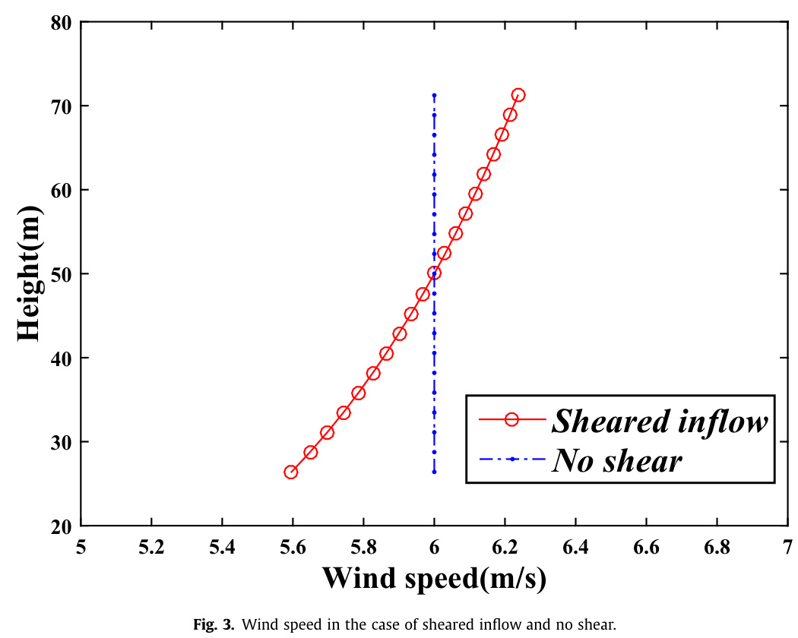
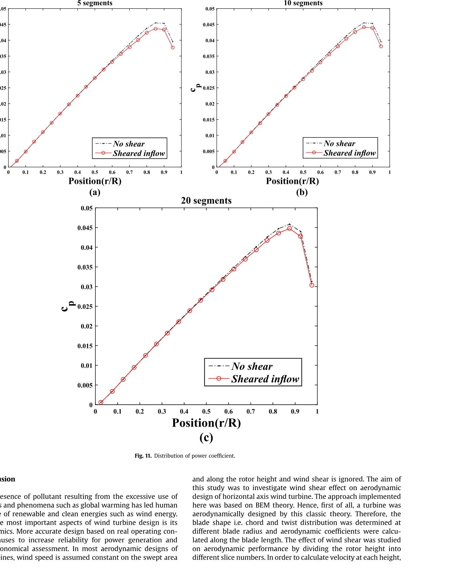

## Wind Shear

Wind shear is a vertical change in wind speed caused by atmospheric-boundary-layer effects such as earth friction, climatic conditions, and vertical gradients of temperature and pressure. (source: sources/vj10.md)

Core model:
- The paper models vertical wind-speed variation with the power law, where velocity at height depends on hub-height velocity, height, hub height, and a wind shear coefficient. (source: sources/vj10.md)
- It also names logarithmic law as another way to model the vertical gradient of wind velocity. (source: sources/vj10.md)

Effects on turbines:
- Wind shear creates non-uniform inflow across the rotor swept area rather than a constant wind speed along rotor height. (source: sources/vj10.md)
- For the HAWT studied in vj10, wind shear has little effect near the blade root, while most changes occur from 0.2 to 0.8 of blade length. (source: sources/vj10.md)
- The same study reports that wind shear reduces angle of attack, lift coefficient, and power coefficient, while increasing thrust coefficient. (source: sources/vj10.md)
- The study reports a maximum local power reduction of about 4.4% around 70-80% blade length in the 20-slice case. (source: sources/vj10.md)
- Atmospheric-turbulence material also identifies wind shear and surface friction as causes of turbulence. (source: sources/vj3.md)

Figures:
- 
  Original caption: Figure 3: Wind speed in the case of sheared inflow and no shear. [Source](../../sources/vj10.md)
- 
  Original caption: Figure 11: Distribution of power coefficient. [Source](../../sources/vj10.md)

Related:
- [[Blade Element-Momentum Model]]
- [[Wind Turbine Parameters]]
- [[Atmospheric Turbulence]]
- [[Urban Wind Conditions]]

#concepts
