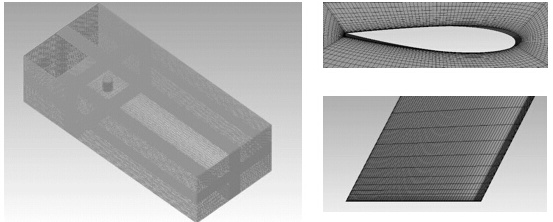
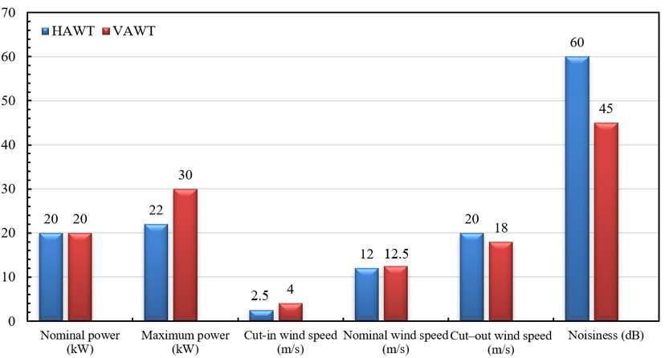
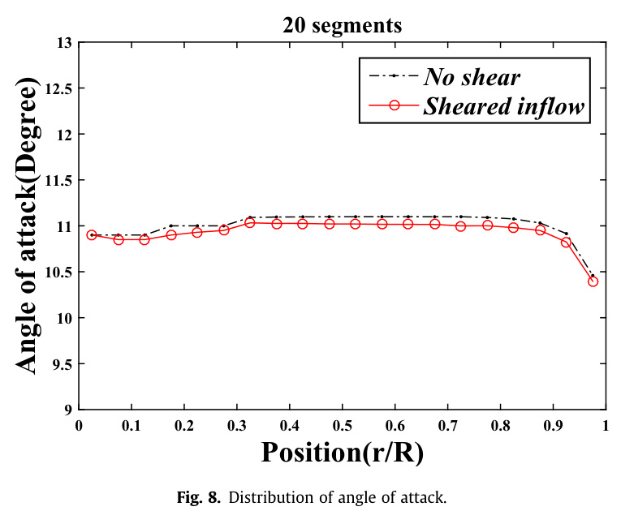
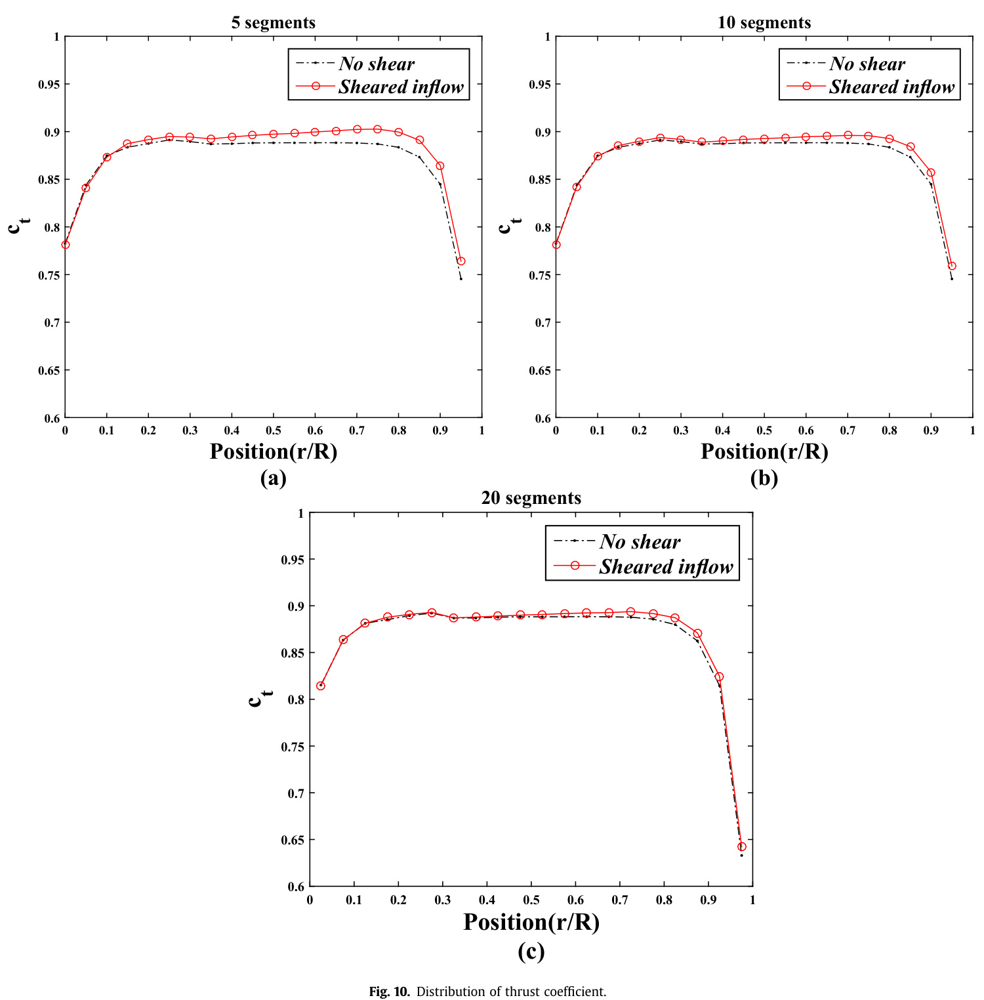
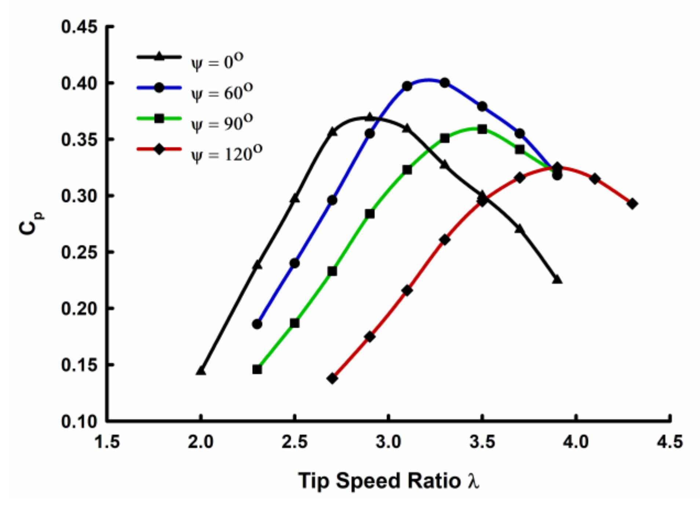
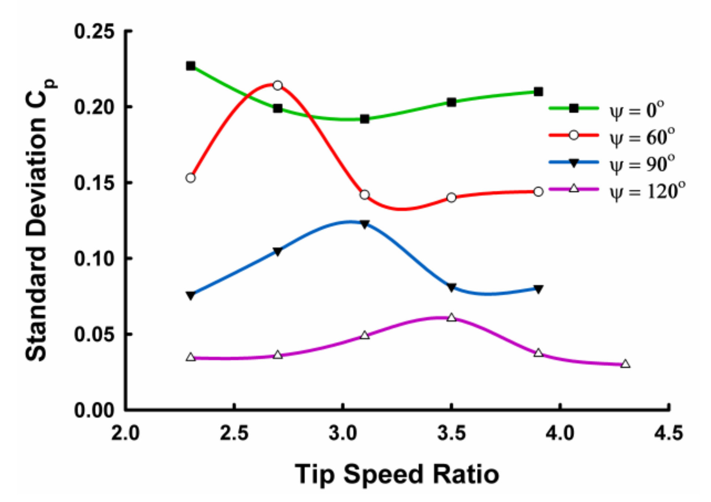
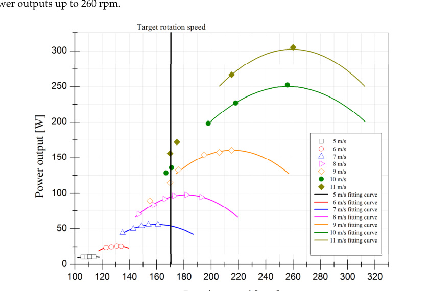
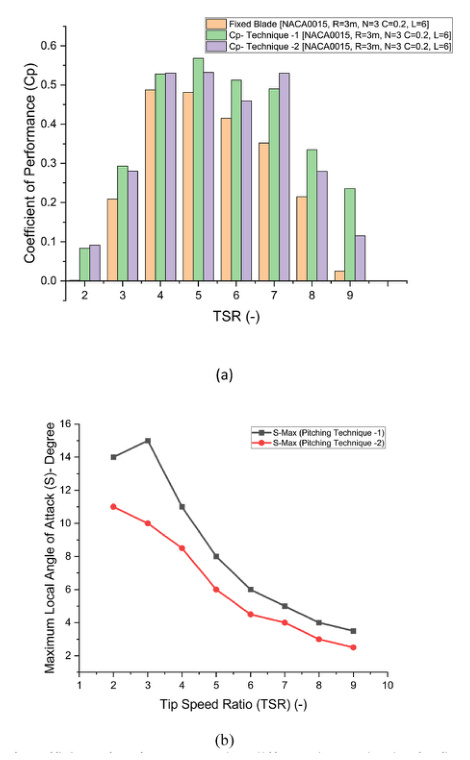

---
Created:
Updated: 2026-07-06
Sources:
- [[HRI2526]]
- [[va20]]
- [[va22]]
- [[va24]]
- [[va16]]
- [[va15]]
- [[va14]]
- [[va4]]
- [[va5]]
- [[va6]]
- [[va7]]
- [[vj1]]
- [[vj10]]
- [[vj11]]
- [[vj12]]
- [[vj14]]
- [[vj17]]
- [[vj15]]
- [[vj6]]
- [[vj18]]
Source_count: 17
Tags:
- concepts
---
## Wind Turbine Parameters

Key metrics used to evaluate wind turbine performance. (source: sources/HRI2526.md)

- Cut-in speed: wind speed at which the turbine begins rotating (source: sources/HRI2526.md)
- Cut-out speed: wind speed at which the turbine shuts down to prevent damage (source: sources/HRI2526.md)
- Rated power: maximum power output of the turbine (source: sources/HRI2526.md)
- Rated speed: wind speed at which rated power is achieved (source: sources/HRI2526.md)
- Tip Speed Ratio (TSR): ratio of blade tip speed to wind speed (source: sources/HRI2526.md)
- Coefficient of Power (CP): ratio of extracted power to available wind power (source: sources/HRI2526.md)
- Starting torque: torque before rotation begins; must exceed system friction to self-start (source: sources/HRI2526.md)
- Swept area: area covered by turbine blades, typically height × diameter for VAWTs (source: sources/HRI2526.md)
- Reynolds number: indicates flow regime (laminar vs turbulent) (source: sources/HRI2526.md)

- The vj12 review treats aspect ratio, overlap ratio, multi-staging, blade count, blade profile, inner blades, end plates, twist angle, TSR, and Reynolds number as the main knobs for VAWT performance tuning. (source: sources/vj12.md)
- It says Savonius overlap has no universal optimum, but 0.1-0.15 is often useful and some studies still favor no-overlap for higher mechanical power. (source: sources/vj12.md)
- It notes that Reynolds-number increases generally improve Cp and static torque in Savonius studies. (source: sources/vj12.md)

- Betz limit: theoretical maximum power coefficient (~0.59). (source: sources/vj1.md)
- Solidity: ratio of blade area to swept area; influences performance and structural tradeoffs. (source: sources/vj1.md)
- The va14 parameter study adds that optimal tip-speed ratio decreases as solidity increases and proposes `sλ^3` as an approximately invariant parameter for `λopt` across its tested H-type VAWTs. (source: sources/va14.md)
- The va16 study adds that fixed-solidity and fixed-`H/c` comparisons can lead to different conclusions, so `H/D`, `H/c`, and solidity should be kept distinct when interpreting straight-bladed VAWT results. (source: sources/va16.md)
- The CFD review repeatedly uses power coefficient, torque, flow separation, and wake dynamics as the main performance indicators for VAWT studies. (source: sources/vj6.md)
- The helical VAWT case found peak power coefficient near TSR 1.8 and used power fluctuation as a stability metric. (source: sources/va4.md)
- The rooftop J-type design in va5 targets 35 W output, 3 m/s cut-in speed, and 6.67 m/s rated speed. (source: sources/va5.md)
- The comparison paper reports peak efficiencies of 50% for a three-blade HAWT and 40% for a Darrieus VAWT, with tip-speed ratios of 14.3 and 5.1 respectively. (source: sources/va6.md)
- It also reports power coefficients around 0.5 for HAWTs and 0.4 for VAWTs. (source: sources/va6.md)
- In the wind-shear HAWT study, vertical wind shear reduces angle of attack and lift coefficient, reduces power coefficient, and increases thrust coefficient. (source: sources/vj10.md)
- The same study reports that most wind-shear-driven coefficient changes occur between 0.2 and 0.8 of blade length, with little effect near the root region. (source: sources/vj10.md)
- In the helical-VAWT helix-angle study, the coefficient of performance is treated as the product of TSR and average moment coefficient. (source: sources/va7.md)
- The study uses the standard deviation of Cp as a cyclic-loading smoothness metric; higher helix angles reduced this standard deviation, while the 60-degree helical blade gave the highest reported power performance. (source: sources/va7.md)

The VAWT review gives typical design ranges of TSR 0.6-1.2 for Savonius and 2.5-5.0 for Darrieus, with peak Cp around 0.15-0.25 and 0.35-0.45 respectively. (source: sources/vj11.md)
It treats solidity, blade profile, pitch angle, blade count, and chord Reynolds number as the main geometry-performance knobs. (source: sources/vj11.md)
It says startup, torque ripple, and wake interaction are the practical metrics that sit alongside Cp when comparing designs. (source: sources/vj11.md)

The va14 study says that for constant-speed urban VAWTs operating often at moderate to high `λ`, relatively low solidity is optimal, while a variable-speed optimal rotor should have moderately high solidity and relatively low `λ`. (source: sources/va14.md)
It also reports that near `λopt`, peak `Cp` is almost independent of blade number, so blade count should often be chosen for smoothness, loads, and cost rather than for peak power alone. (source: sources/va14.md)

The va15 study adds a startup tradeoff: higher solidity helps self-start, but lowers peak power output. (source: sources/va15.md)
It also shows that rougher surfaces, negative pitch, and thicker symmetric blades can help low-`lambda` startup in some cases, but those same changes can reduce higher-`lambda` performance. (source: sources/va15.md)
The vj15 study adds pitch amplitude as a control knob, with `3` degrees outperforming `0`, `10`, and `20` degrees in the tested harmonic pitch functions. (source: sources/vj15.md)
The vj17 study adds TSR as the optimization point for a Savonius airfoil design, using `0.4` during optimization and comparing CFD results at `0.4`, `0.55`, and `0.7`. (source: sources/vj17.md)
- The vj18 review reports broad performance ranges for variable designs: variable pitch 13%-78.9%, adaptive flap 10%-54%, Gurney flap 2.7%-37.5%, deforming aerofoil 8%-46.2%, synthetic jet 15.2%-32.16%, and swept area 8%-90%. (source: sources/vj18.md)
- It also treats complexity as a design parameter in practice, because the number of joints and actuators affects whether a variable concept is viable. (source: sources/vj18.md)

The va16 study reports that at fixed solidity, larger `H/D` increases peak `Cp` and shifts the optimum tip-speed ratio upward, while at fixed `H/c = 6`, solidity has the stronger effect on peak performance. (source: sources/va16.md)
Capacity factor: actual energy generated divided by theoretical maximum energy at nominal capacity over the same period. (source: sources/vj14.md)
The vj14 study shows that capacity factor is the dominant driver of the LCA result and that very small changes in it can move the turbine across environmental benchmarks. (source: sources/vj14.md)

The va20 CFD study adds a low-wind urban comparison where three-blade cases with the same `0.96 m^2` swept area reached `Cp = 0.071` for a C-blade drag rotor, `0.22` for an involute rotor, and `0.397` for an involute rotor with a wind flow modifier at `5 m/s`. (source: sources/va20.md)
It also reports that the WFM-assisted involute case reached `1361.4 W` at `250 rpm` / `21 m/s`, compared with `951.31 W` for the involute rotor and `188.9 W` for the C-blade rotor. (source: sources/va20.md)

The va22 paper adds an explicitly low-TSR helical design case with rated values of `100 W`, `9 m/s`, `170 rpm`, swept area `1.57 m^2`, solidity `0.3`, aspect ratio `1.3`, and design `Cp = 0.15`. (source: sources/va22.md)
It also reports startup at `3.5 m/s`, measured `114.7 W` and `Cp = 0.163` at the rated condition, and a highest listed table value of `Cp = 0.262` at `10 m/s`. (source: sources/va22.md)

The va24 paper adds maximum local angle of attack `S` as an active control parameter, reporting that different optimal `S` values are needed at different TSRs and for different pitch strategies. (source: sources/va24.md)
It reports a fixed-blade peak `Cp` near `0.48` at `TSR = 5`, compared with `0.568` for pitching Technique 1 and `0.532` for Technique 2 at the same TSR. (source: sources/va24.md)

## Figures

Original caption: Figure 6. Power coefficient at different TSR with Reynold number 60,800. The instantaneous torque of the HVAWT at different TSR values is shown in Figure 7. The black and red lines represent the results of the 2D U-RANS and LES simulation, respectively. It is found that due to the uniform arrangement of the four blades along the azimuthal direction, the torque is varied with a 90◦cycle. Furthermore, the peak torque position during one revolution is also rotated in a counterclockwise direction with the increase of TSR. As for the differences between the U-RANS and LES methods, it is obvious to see that the instantaneous torque results of the LES method show much distinct oscillation. This is caused by the fact the U-RANS method applied a time averaged solver, which would smoothen the oscillation along with the time scale. [[va4|Source]]

Original caption: Figure 5. Wind turbines properties at the same nominal power [[va6|Source]]

Original caption: Figure 3. Wind turbines rotor power coefficient and the tip speed ratio for several wind turbines [[va6|Source]]

Original caption: Fig. 4: Block Diagram [[va5|Source]]

Original caption: Figure 8: Distribution of angle of attack. [[vj10|Source]]

Original caption: Figure 10: Distribution of thrust coefficient. [[vj10|Source]]

Original caption: Figure 7. Coefficient of performance of VAWT for various helix angles. [[va7|Source]]

Original caption: Figure 14. The standard deviation of Cp of different helical-bladed and straight-bladed VAWT [[va7|Source]]

Original caption: Fig. 7. Optimal tip speed ratio vs. solidity with a curve fit using Eq. (1) based on data sets in Table 7. [[va14|Source]]

Original caption: Figure 26. Electrical characteristics: (a) rotor power and (b) power coefficient. [[va20|Source]]

Original caption: Figure 9. Graph of power output according to wind velocity obtained from wind tunnel test (symbols: test results; lines: fitting curve). [[va22|Source]]

Original caption: Fig. 10. a) Comparison of Coefficient of Performance against different tip speed ratios for fixed blade with pitching model technique 1 and 2, b) Maximum local angle of attack (S) used during technique 1 and 2 to achieve Cp in Fig. 10(a). [[va24|Source]]

These parameters are often visualized using a power curve, which relates wind speed to power output. (source: sources/HRI2526.md)

Related:
- [[VAWT]]
- [[Darrieus Turbine]]
- [[Savonius Turbine]]
- [[Wind Shear]]
- [[va14 Solidity]]
- [[va14 Blade Number]]
- [[va15 Solidity]]
- [[va15 Blade Profile]]
- [[va16 Solidity]]
- [[va16 Span-to-Diameter Ratio (H-D)]]
- [[vj15 Pitch Amplitude]]
- [[va24 Variable Blade Pitching Strategy]]
- [[va20 Rotor Blade Profile]]
- [[va20 Wind Flow Modifier]]
- [[Variable VAWT Design]]
- [[va22 100-W Helical-Blade Vertical-Axis Wind Turbine]]

#concepts
