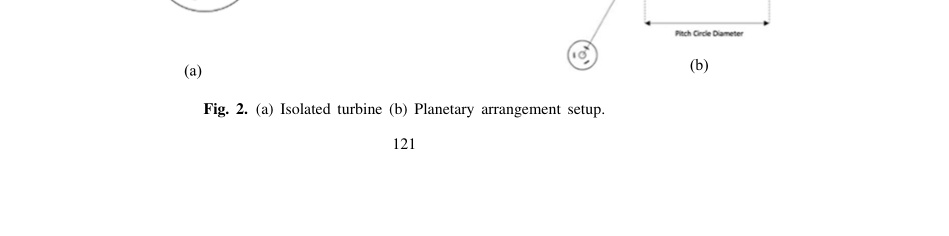

# cj1 Planetary Cluster Darrieus VAWT

The simulated cluster has a central three-bladed NACA 7715 Darrieus “sun” turbine with three smaller “planet” turbines. The central rotor has a reported diameter of 3 m, 1 m chord, and 1 m height; the resulting swept area is 3 m^2. (source: sources/cj1.md)

The planet-turbine scale is 0.25. The study varies pitch-circle diameter and oblique angle to assess their effect on the central turbine. (source: sources/cj1.md)

At 6 m/s, the best reported central-rotor result is `Cp = 0.3405` and TSR `1.5` for the 30-degree planetary arrangement. The isolated rotor peaks at `Cp = 0.3304` and TSR `1.25`. (source: sources/cj1.md)

Original caption: Fig. 2. (a) Isolated turbine (b) Planetary arrangement setup. [[cj1|Source]]

> Uncertainty: the paper validates only the smaller isolated rotor, not the cluster. Its reported central-rotor spacing wording is internally inconsistent, so the stated 5D / 3.75 m condition needs clarification before using it for geometry reproduction. (source: sources/cj1.md)

#designs
