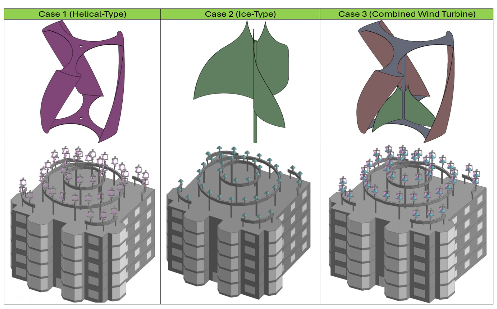

## Combined Helical-IceWind VAWT

The `va13` study presents a combined rooftop VAWT that merges helical/Darrieus and IceWind rotor features into one unit. (source: sources/va13.md)

## Geometry

- The inner IceWind rotor has semicircular blades. (source: sources/va13.md)
- The inner rotor diameter is 0.7575 m and height is 0.75 m. (source: sources/va13.md)
- The outer Darrieus/helical rotor diameter is 1.05 m and height is 1.52 m. (source: sources/va13.md)
- Reported total swept area is 1.45 m2. (source: sources/va13.md)

Original caption: Figure 6. Turbine designs for each case and rooftop installation (developed by authors). [[va13|Source]]

## Unique Design Choices

- The design combines the complementary aerodynamic behavior of the IceWind and helical/Darrieus rotors to improve rooftop energy capture. (source: sources/va13.md)

## Performance

- Reported rated power output is 590 W. (source: sources/va13.md)
- Reported maximum power coefficient is 0.31. (source: sources/va13.md)
- On the modeled building, this case reduced annual energy use by 30.88% and had the shortest reported payback period of 10.49 years. (source: sources/va13.md)

## Related

- [[Hybrid VAWT]]
- [[Payback Period Analysis]]
- [[Economic Viability of VAWTs]]

#designs
