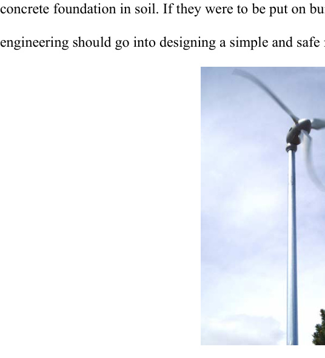
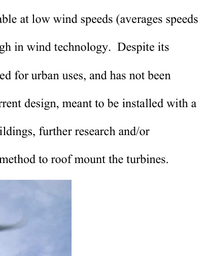

## Skystream 3.7

The `va19` campus study evaluates the `Skystream 3.7` as the stronger of its two candidate small wind systems for MIT rooftop use. (source: sources/va19.md)

## Geometry

- The source describes it as a downwind, horizontal-axis, lift-type turbine with a `12 ft` rotor diameter. (source: sources/va19.md)
- The report also gives a swept area of `10.87 m^2`. (source: sources/va19.md)
- It includes an integrated inverter in the nacelle and `360 degrees` wind-tracking capability. (source: sources/va19.md)

Original caption: Figure 3. Skystream 3.7. [[va19|Source]]

Original caption: Figure 4. Skystream's integrated AC inverter. [[va19|Source]]

## Unique Design Choices

- The machine was designed to make wind power viable at relatively low wind speeds, around `10 mph` average wind speed according to the report's background discussion. (source: sources/va19.md)
- The study notes that it was not specifically designed for rooftop use and would need further engineering for safe roof mounting because its standard installation is pole-mounted with a concrete foundation in soil. (source: sources/va19.md)

## Performance

- Rated power is reported as `2.4 kW`. (source: sources/va19.md)
- In the report's normalized `6 kW` comparison, the Skystream system produced more power than the AV system at the same wind speed once wind speed rose above about `10 mph`. (source: sources/va19.md)
- The source says the best campus case was a Skystream installation on Eastgate, with electricity cost around `$0.08/kWh` and payback within turbine lifetime. (source: sources/va19.md)
- It also says a Skystream on `W8` came closer to feasibility than the AV cases, with about `27 years` payback before any extra electricity-price or REC upside. (source: sources/va19.md)

## Related

- [[Architectural Wind Turbines]]
- [[Measure-Correlate-Predict (MCP)]]
- [[Payback Period Analysis]]

#designs
