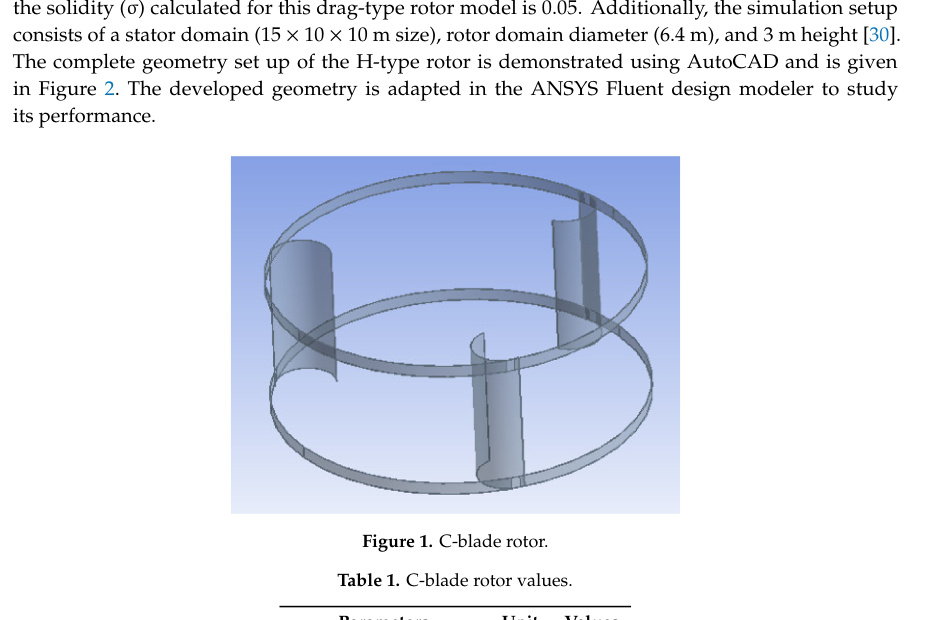
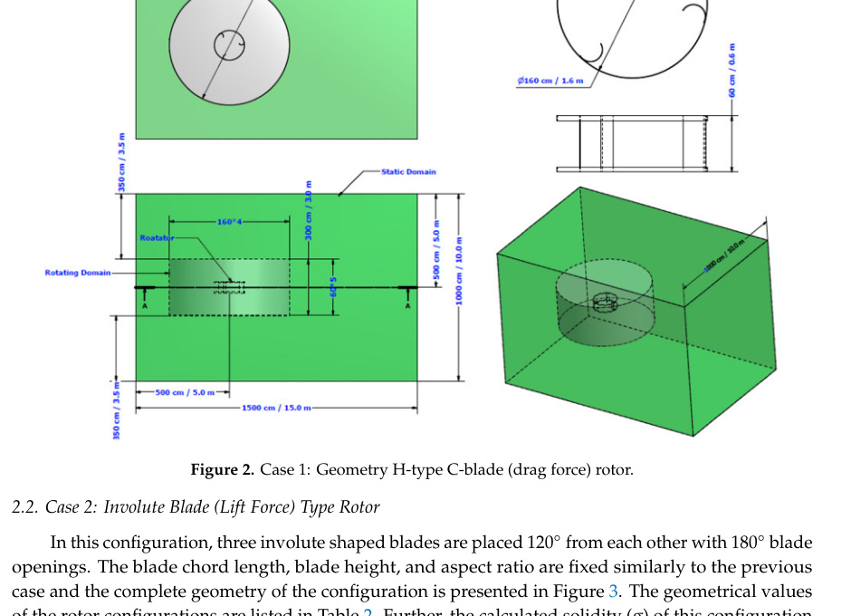

## H-Type Rotor with C-Blade

The first `va20` reference design is a three-bladed drag-force H-type VAWT using C-shaped blades. (source: sources/va20.md)

## Geometry

- Three C-shaped blades are spaced `120 degrees` apart. (source: sources/va20.md)
- Reported blade height is `0.6 m`, rotor radius is `0.8 m`, and swept area is `0.96 m^2`. (source: sources/va20.md)
- The reported arc radius / chord parameter is `0.13 m`, and the aspect ratio is `0.75`. (source: sources/va20.md)
- The paper reports solidity `0.05` for this configuration. (source: sources/va20.md)

Original caption: Figure 1. C-blade rotor. [[va20|Source]]

Original caption: Figure 2. Case 1: Geometry H-type C-blade (drag force) rotor. [[va20|Source]]

## Unique Design Choices

- The source uses this case as the drag-driven baseline against the more lift-oriented involute designs. (source: sources/va20.md)

## Performance

- At `60 rpm` / `5 m/s`, the source reports net drag coefficient `0.205`, net lift coefficient `-0.094`, and drag-to-lift ratio `2.181`. (source: sources/va20.md)
- The reported maximum power coefficient is `0.071` at `60 rpm` / `5 m/s`. (source: sources/va20.md)
- The reported maximum turbine power is `188.9 W` at `250 rpm` / `21 m/s`. (source: sources/va20.md)
- The paper says two blades generate negative momentum in the low-speed case, which reduces net torque and helps explain the lower drag-rotor performance. (source: sources/va20.md)

## Related

- [[H-VAWT]]
- [[Wind Flow Modifier]]
- [[Wind Turbine Parameters]]

#designs
