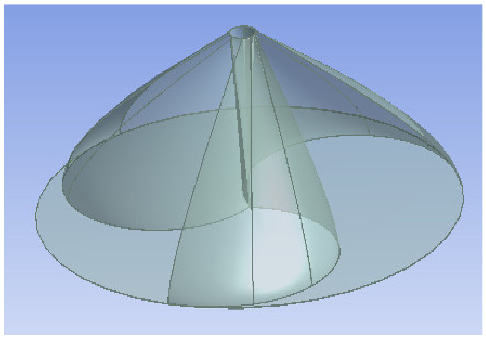
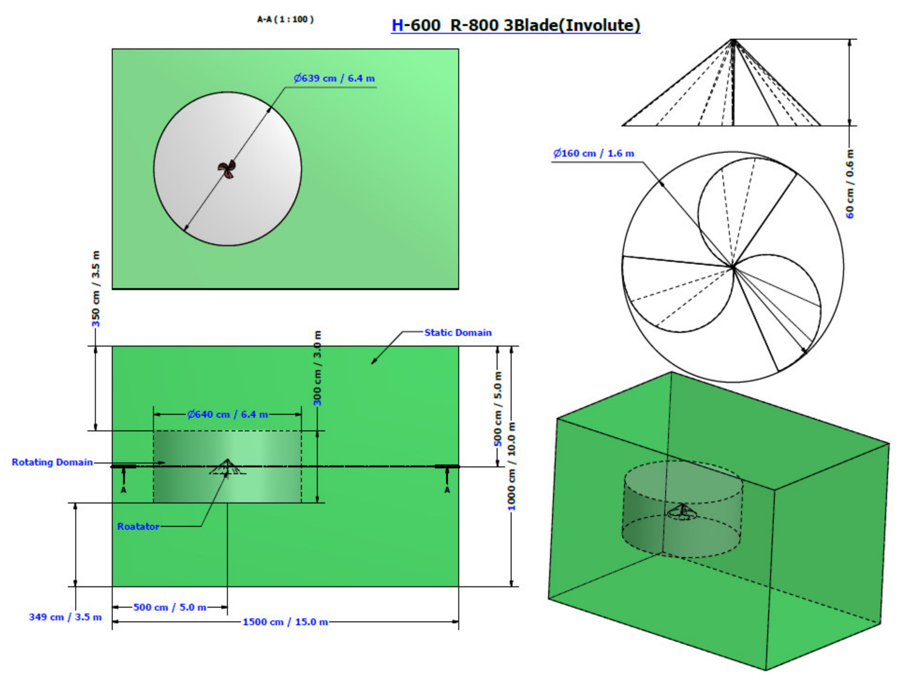

## Involute Blade Type Rotor

The second `va20` configuration is a three-bladed involute rotor intended to convert the baseline drag-type H-rotor into a stronger lift-assisted design. (source: sources/va20.md)

## Geometry

- Three involute blades are spaced `120 degrees` apart with `180 degrees` blade openings. (source: sources/va20.md)
- Reported blade height is `0.6 m`, rotor radius is `0.8 m`, and swept area is `0.96 m^2`. (source: sources/va20.md)
- The paper reports blade curvature `0.0024 per mm`, maximum curvature `1.799 per m`, and solidity about `3.43`. (source: sources/va20.md)

Original caption: Figure 3. Involute rotor type blades profile. [[va20|Source]]

Original caption: Figure 4. Case 2: Geometry of involute-type rotor. [[va20|Source]]

## Unique Design Choices

- The source proposes the involute blade because its conical and voluminous shape can support lift while still benefiting from drag inside the blade cavity. (source: sources/va20.md)

## Performance

- At `60 rpm` / `5 m/s`, the paper reports net lift coefficient about `-0.5524`, net drag coefficient `-0.0375`, and lift-to-drag ratio `14.02`. (source: sources/va20.md)
- The reported maximum power coefficient is `0.22` at `60 rpm` / `5 m/s`. (source: sources/va20.md)
- The reported maximum turbine power is `951.31 W` at `250 rpm` / `21 m/s`. (source: sources/va20.md)
- The paper says all three blades generate positive moments in this case, raising resultant torque above the C-blade baseline. (source: sources/va20.md)

## Related

- [[Darrieus Turbine]]
- [[Wind Flow Modifier]]
- [[Wind Turbine Parameters]]

#designs
