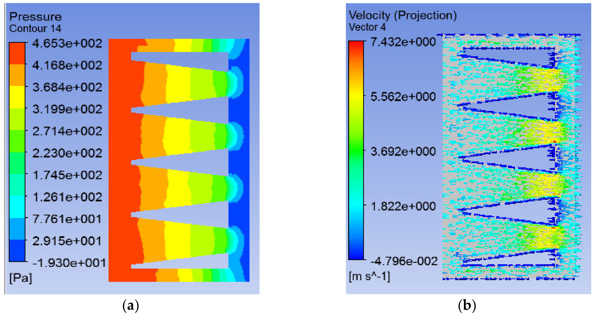

## Involute Rotor with Wind Flow Modifier

The third `va20` configuration adds a front-mounted wind flow modifier (`WFM`) to the involute rotor to boost low-wind urban performance. (source: sources/va20.md)

## Geometry

- The rotor geometry remains the same involute three-blade turbine with `0.96 m^2` swept area. (source: sources/va20.md)
- The added WFM uses `12` diffuser tubes in `4` rows and `3` columns, with diameter reduction from `0.3 m` to `0.15 m` toward the turbine. (source: sources/va20.md)
- Reported WFM envelope dimensions are `1.4 m` height, `1.0 m` width, and `0.6 m` length. (source: sources/va20.md)

Original caption: Figure 6. Involute-type blade with WFM. [[va20|Source]]

Original caption: Figure 20. Pressure (a) and velocity (b) variations inside the diffuser tubes. [[va20|Source]]

## Unique Design Choices

- The shrinking diffuser area is used as a passive wind accelerator to raise flow speed before the rotor. (source: sources/va20.md)
- The source explicitly treats the rectangular WFM as directional and suggests circular WFM as future work for omnidirectional capture. (source: sources/va20.md)

## Performance

- The paper reports diffuser-tube velocity increase from about `1.822 m/s` at inlet to `5.562 m/s` at outlet, with magnification ratio `3.05`. (source: sources/va20.md)
- At `60 rpm` / `5 m/s`, the reported lift-to-drag ratio improves to about `18.44`, and it rises to `31.44` at `250 rpm`. (source: sources/va20.md)
- The reported maximum power coefficient is `0.397` at `60 rpm` / `5 m/s`. (source: sources/va20.md)
- The reported maximum turbine power is `1361.4 W` at `250 rpm` / `21 m/s`. (source: sources/va20.md)

## Related

- [[Wind Flow Modifier]]
- [[Optimization]]
- [[Wind Turbine Parameters]]

#designs
