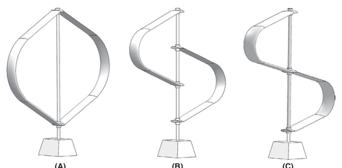
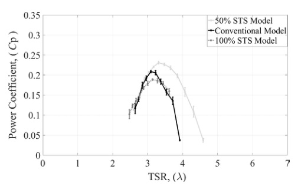

## 50% STS-VAWT

The `50% STS-VAWT` is the best-performing `va23` shifted-troposkien concept, designed so one blade wake only partially intersects the other blade. (source: sources/va23.md)

## Geometry

- The turbine keeps `2` blades, radius `0.375 m`, total height `0.75 m`, swept area `0.36 m^2`, and chord length `0.1 m`, matching the baseline in those global dimensions. (source: sources/va23.md)
- The blade height is reduced to `0.50 m`, blade length to `0.93 m`, and solidity to `0.50`. (source: sources/va23.md)
- The blade airfoil remains NACA0015. (source: sources/va23.md)

Original caption: Figure 1. Vertical axis wind turbine (VAWT) configurations: (A) conventional VAWT (troposkien shape), (B) novel 50% STS-VAWT (50% shifted troposkien shape-VAWT), (C) novel 100% STS-VAWT. [[va23|Source]]

Original caption: Figure 9. Power coefficient (Cp) vs TSR after corrections at 600 rpm. [[va23|Source]]

## Unique Design Choices

- The advancing blade is shortened and shifted vertically relative to the second blade so the wake of one blade only partially affects the other blade. (source: sources/va23.md)
- The source frames this as a direct attempt to reduce blade-wake interaction while also reducing blade cost and weight. (source: sources/va23.md)

## Performance

- At `600 rpm`, the paper reports an uncorrected peak around `Cp = 0.28` at `lambda = 4.2`. (source: sources/va23.md)
- The corrected `600 rpm` peak is reported near `Cp = 0.23`, about `10%` above the corrected conventional peak of about `Cp = 0.21`. (source: sources/va23.md)
- At `700 rpm`, the paper reports a slightly higher uncorrected peak near `Cp = 0.286` at `lambda = 4.4`. (source: sources/va23.md)
- The source says this configuration outperforms both the conventional and `100% STS-VAWT` cases over most of the tested range, especially at mid-to-high TSR. (source: sources/va23.md)

## Related

- [[Blade-Wake Interaction]]
- [[Wind Tunnel Blockage Correction]]
- [[va23 Shifted Troposkien Vertical Offset]]

#designs
