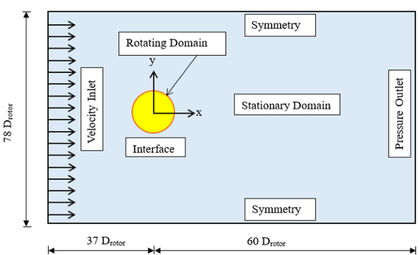

## Reference H-Rotor Darrieus VAWT

The `va25` paper uses a published straight-bladed H-rotor Darrieus VAWT as its CFD reference model for airfoil-comparison and self-starting analysis. (source: sources/va25.md)

## Geometry

- The reference model is a straight-bladed Darrieus VAWT with `3` blades and a NACA0021 reference airfoil. (source: sources/va25.md)
- Reported geometry includes rotor diameter `1.03 m`, chord `0.0858 m`, and solidity `0.5`. (source: sources/va25.md)
- The table says rotor height is treated as unity for the `2D` simulation and gives installed power as about `0.2 kW`. (source: sources/va25.md)

Original caption: Fig. 3 Computational domain with specified boundary conditions. [[va25|Source]]

Original caption: Fig. 8 Reference model (NACA0021) validation and verification. [[va25|Source]]

## Unique Design Choices

- The source uses this rotor as a common geometric baseline so airfoil profile and orientation can be compared without changing blade count, chord, or overall rotor size. (source: sources/va25.md)
- The entire analysis is carried out with `2D` URANS CFD, sliding mesh, and SST `k-omega`, rather than with a wind-tunnel or full `3D` campaign. (source: sources/va25.md)

## Performance

- The validated reference model reaches a maximum `Cp` of about `0.313` near `TSR = 2.63` in the cited baseline case. (source: sources/va25.md)
- In the airfoil-comparison study, the source uses the NACA0021 case as the fixed reference against which improvements such as `E474` and cambered-in `NACA6712` are measured. (source: sources/va25.md)
- The source reports less than `5%` maximum `Cp` error between the present CFD model and the published experimental reference data. (source: sources/va25.md)

## Related

- [[H-VAWT]]
- [[Straight-bladed Darrieus]]
- [[CFD]]
- [[va25 Blade Airfoil Profile]]

#designs
