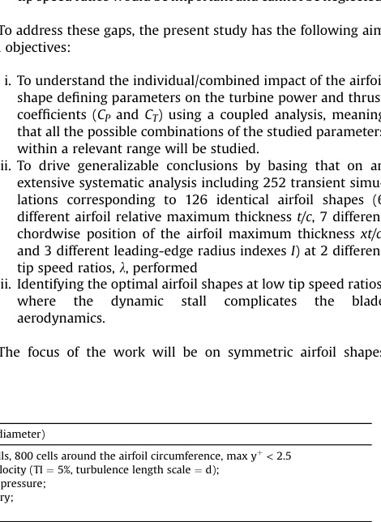
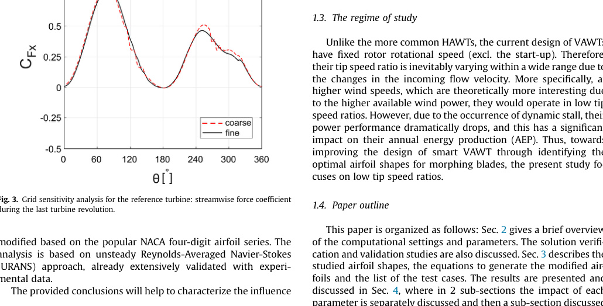

## Reference One-Bladed H-Type VAWT

The `va27` paper uses a simplified one-bladed H-type Darrieus rotor as a computational reference turbine so it can study a large airfoil-shape design space at manageable cost. (source: sources/va27.md)

## Geometry

- The reference turbine is a one-bladed Darrieus H-type rotor. (source: sources/va27.md)
- Reported baseline airfoil is `NACA0018` with `t/c = 18%`, `xt/c = 30%`, and `I = 6`. (source: sources/va27.md)
- The table gives turbine diameter `1 m`, chord `0.06 m`, solidity `0.06`, freestream velocity `9.3 m/s`, and studied tip-speed ratios `2.5` and `3.0`. (source: sources/va27.md)

Original caption: Fig. 1. Top view of the reference turbine (not to scale). The `(+)` and `(-)` signs denote the pressure and suction sides for `0 degrees <= q < 180 degrees`. [[va27|Source]]

Original caption: Fig. 2. Schematic of (a) the computational domain (not to scale); (b-e) grid. [[va27|Source]]

## Unique Design Choices

- The paper intentionally excludes shaft and spoke geometry and reduces the rotor to one blade because prior work by the same authors suggested those simplifications have negligible impact on the airfoil-shape conclusions while greatly reducing computational cost. (source: sources/va27.md)
- The design study is explicitly targeted at deep dynamic stall, where morphing or adaptive airfoil shapes may be most useful. (source: sources/va27.md)

## Performance

- The source treats the reference turbine mainly as a baseline for comparing airfoil-shape effects rather than as a final design recommendation. (source: sources/va27.md)
- It reports that the optimal airfoil shape depends on operating tip-speed ratio, changing from `NACA0024e4.5/3.5` at `lambda = 2.5` to `NACA0018e4.5/2.75` at `lambda = 3.0`. (source: sources/va27.md)

## Related

- [[H-VAWT]]
- [[Straight-bladed Darrieus]]
- [[Morphing Airfoil]]
- [[va27 Airfoil Relative Maximum Thickness]]

#designs
