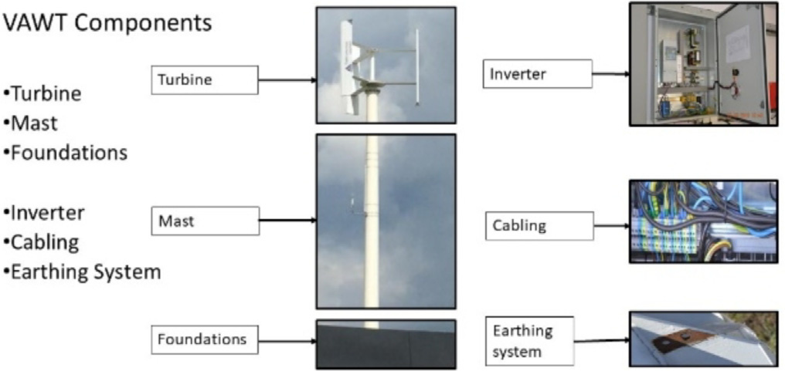

## Windkop 5 kW H-Darrieus VAWT

The paper studies a prototype H-Darrieus, three-blade VAWT manufactured in Poland and installed on the Bialystok University of Technology campus. (source: sources/va28.md)

- Diameter is `3.5 m` and blade height is `3 m`, giving a swept area of `10.5 m^2`. (source: sources/va28.md)
- The mast is `15.6 m` high. (source: sources/va28.md)
- The turbine is nominally rated at `5 kW`. (source: sources/va28.md)
- The source says the company brochure listed a cut-in speed of `1.5 m/s`, but the actual cut-in speed was not verified and may be higher. (source: sources/va28.md)
- Measured generation over three years totaled `658.3 kWh`, or `219.4 kWh/year`, for a `0.50%` capacity factor. (source: sources/va28.md)
- The paper attributes the poor output mainly to low wind speed at the site and surrounding buildings. (source: sources/va28.md)

Original caption: Fig. 2. Main components of the Windkop 5 kW Vertical Axis Wind Turbine system. [[va28|Source]]

Related: [[Capacity Factor]], [[Life Cycle Assessment]], [[Urban Wind Conditions]], [[Economic Viability of VAWTs]]

#designs
