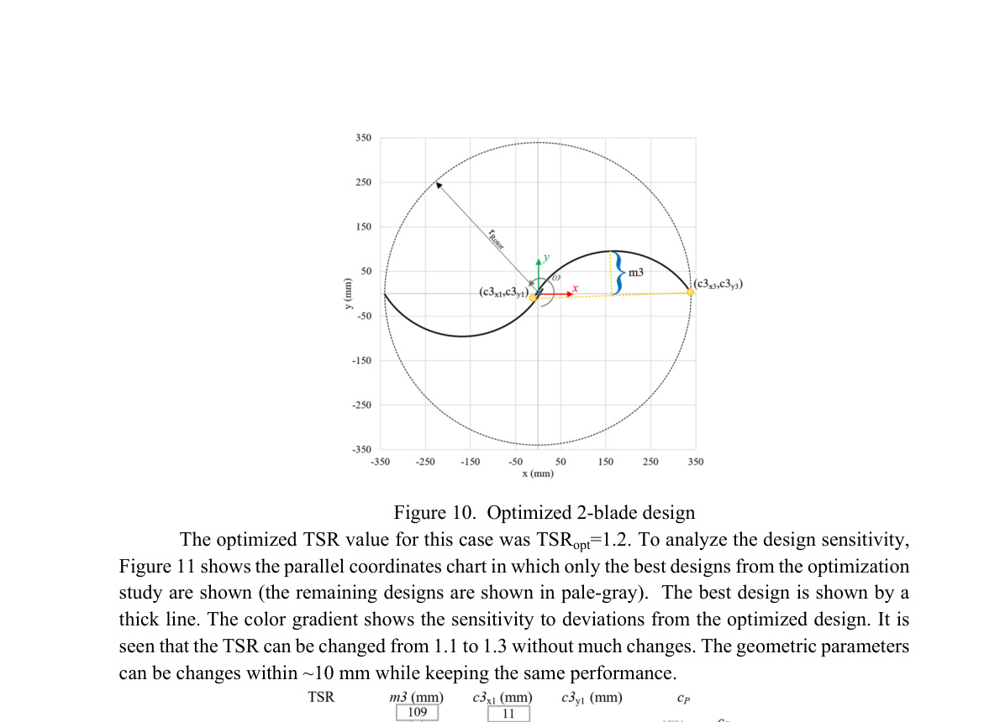

## va29 2-Blade Circular-Arc Savonius VAWT

The paper's globally optimized two-blade circular-arc Savonius design has rotor diameter `0.68 m` and was first assessed at `AR = 1.5`, corresponding to `H = 1.02 m` and swept area `0.6936 m^2`. (source: sources/va29.md)

- It achieved cP `0.242` at the reported optimum TSR `1.2` in the study's `12 m/s` CFD condition. (source: sources/va29.md)
- This is a 12% cP improvement relative to the paper's classical two-blade `s/d = 0.1` baseline, which obtained cP `0.217` in the same CFD model. (source: sources/va29.md)
- The optimized overlap is practically zero, unlike the classical baseline's `s/d = 0.1`; the authors describe the blades as slightly flatter. (source: sources/va29.md)
- The study reports limited change near TSR `1.1-1.3` and for approximately `10 mm` geometric deviations. (source: sources/va29.md)

Original caption: Figure 10. Optimized 2-blade design. [[va29|Source]]

Related: [[va29 Circular-Arc Blade Profile]], [[va29 Blade Number]], [[va29 Rotor Aspect Ratio]], [[Savonius Turbine]]

#designs
