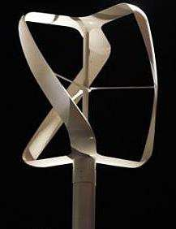

## Counter-rotating VAWT Array

The source describes close-spaced counter-rotating VAWT arrays as an alternative wind-farm architecture using many smaller turbines instead of fewer large HAWTs. (source: sources/va3.md)

## Geometry

- Example array turbines are 10 m tall and 1.2 m in diameter. (source: sources/va3.md)
- Turbine spacing is 1.6 turbine diameters in the shown array. (source: sources/va3.md)
- Adjacent turbines counter-rotate so the induced airflow between them is oriented in the same direction. (source: sources/va3.md)

## Performance

- The source says this configuration yields twice as much power per acre as horizontal-axis wind turbines. (source: sources/va3.md)
- It says close turbine proximity slightly improved performance relative to isolated turbines when averaged over incident wind directions. (source: sources/va3.md)
- It contrasts this with typical 20-50 percent performance reductions for HAWTs at similar spacing. (source: sources/va3.md)
- It reports wind-farm power flux of approximately 18 W/m2, described as 6-9 times the power density of modern HAWT wind farms. (source: sources/va3.md)
- The source says this process is most effective for VAWTs operating at tip speed ratios greater than 2. (source: sources/va3.md)

## Related

- [[va3 Counter-rotating Array Spacing]]
- [[va3 Tip Speed Ratio Classification]]
- [[VAWT]]

#designs
