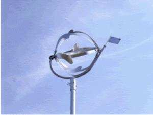

## Venturi Wind Turbine

The Venturi turbine concept attaches rotor blades to the hub at both ends so rotation generates a spherical surface, creating a Venturi-like converging flow pattern and low-pressure region. (source: sources/va3.md)

## Geometry

- Rotor diameter: 1.1 m. (source: sources/va3.md)
- Swept area: 1 m2. (source: sources/va3.md)
- Rotor volume: 1 m3. (source: sources/va3.md)
- Number of rotor blades: 6. (source: sources/va3.md)
- Rotor blade type: flat blade polyester. (source: sources/va3.md)
- Total weight: 30 kg. (source: sources/va3.md)
- Gearbox type: no gearbox, direct driven. (source: sources/va3.md)
- Generator: four-phase brushless permanent-magnet generator. (source: sources/va3.md)

## Performance

- Cut-in wind speed: 2 m/s. (source: sources/va3.md)
- Survival wind speed: 40 m/s. (source: sources/va3.md)
- Rated output at 10 m/s: 100 W. (source: sources/va3.md)
- Maximum output at 17 m/s: 500 W. (source: sources/va3.md)
- Maximum rotational speed at 40 m/s: 2,100 rpm. (source: sources/va3.md)
- The source says Delft wind-tunnel measurements showed 85 percent measured efficiency, 40 percent higher than Betz's 59 percent theoretical maximum; this is a source claim that should be checked before using as a general design rule. (source: sources/va3.md)
- Typical yearly output is listed as 100 kW.hr at 4 m/s average wind, 200 kW.hr at 5 m/s, 350 kW.hr at 6 m/s, and 450 kW.hr at 7 m/s. (source: sources/va3.md)

## Related

- [[VAWT]]
- [[va3 Blade Count for VAWT Startup and Pulsation]]
- [[Materials and Manufacturing]]

#designs
