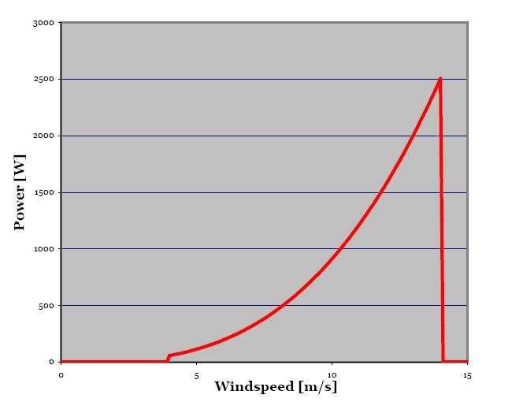
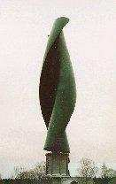

## Windside Helical Wind Turbine

The Windside turbine is a Finnish vertical helical turbine whose design is based on sailing engineering principles and uses two spiral-formed vanes. (source: sources/va3.md)

## Geometry

- Rotor rotation is driven by two spiral-formed vanes. (source: sources/va3.md)
- The generator is shown at the base/right side in the manufacturing figure. (source: sources/va3.md)
- The design is intended for inland and marine environments. (source: sources/va3.md)

Original caption: Figure 26. Helical wind turbine with generator at its base. [[va3|Source]]

Original caption: Figure 27. Manufacturing of helical wind blades. The generator is at right. [[va3|Source]]

## Performance

- The source says the design is for use in wind speeds up to 60 m/s. (source: sources/va3.md)
- It is described as suitable for battery charging in harsh environments, cold or hot conditions, violent storms, and low wind speeds. (source: sources/va3.md)
- The source says the turbines generate almost no noise and are safe for population centers, public spaces, parks, wildlife parks, and building rooftops. (source: sources/va3.md)

## Related

- [[Helical VAWT]]
- [[Urban Wind Conditions]]
- [[Materials and Manufacturing]]

#designs
