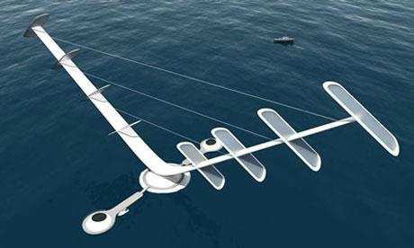
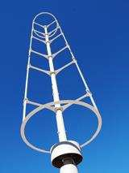

## Windspire Gyromill

The Windspire is a slender, straight-bladed Darrieus/gyromill design optimized for small-scale power generation with low tip speed ratio and low noise. (source: sources/va3.md)

## Geometry

- Standard unit height: 30 ft / 9.1 m. (source: sources/va3.md)
- Rotor height: 20 ft / 6.1 m. (source: sources/va3.md)
- Rotor radius: 2 ft / 0.6 m. (source: sources/va3.md)
- Swept area: 80 sq ft / 7.43 sq m. (source: sources/va3.md)
- Total weight: 600 lb / 273 kg. (source: sources/va3.md)
- Rotor type: vertical-axis Darrieus low-speed gyromill. (source: sources/va3.md)
- Rotor material: aircraft-grade extruded aluminum. (source: sources/va3.md)
- Monopole/structure material: recycled high-grade steel. (source: sources/va3.md)

Original caption: Figure 31. Winsdspire vertical straight blade or gyromill Darrieus wind turbine design. [[va3|Source]]

Original caption: Figure 32. Air core generator used with the Windspire turbine. [[va3|Source]]

## Performance

- Annual energy production: 2,000 kW.hr. (source: sources/va3.md)
- Instantaneous power rating: 1.2 kW. (source: sources/va3.md)
- Maximum rotor speed: 500 rpm. (source: sources/va3.md)
- Peak tip speed ratio: 2.8. (source: sources/va3.md)
- Cut-in wind speed: 9 mph / 4 m/s. (source: sources/va3.md)
- AEP average wind speed: 12 mph / 5.4 m/s. (source: sources/va3.md)
- Rated wind speed for instantaneous power rating: 25 mph / 11.2 m/s. (source: sources/va3.md)
- Survival wind speed: 100 mph / 45 m/s. (source: sources/va3.md)
- Noise is described as imperceptible at 10 mph and 8.8 dB above ambient at 50 mph. (source: sources/va3.md)

Original caption: Figure 35. Power curve of the Windspire flat blade Darrieus turbine. [[va3|Source]]

## Related

- [[Straight-bladed Darrieus]]
- [[va3 Tip Speed Ratio Classification]]
- [[Materials and Manufacturing]]

#designs
