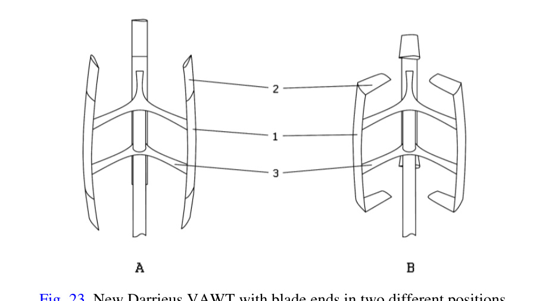
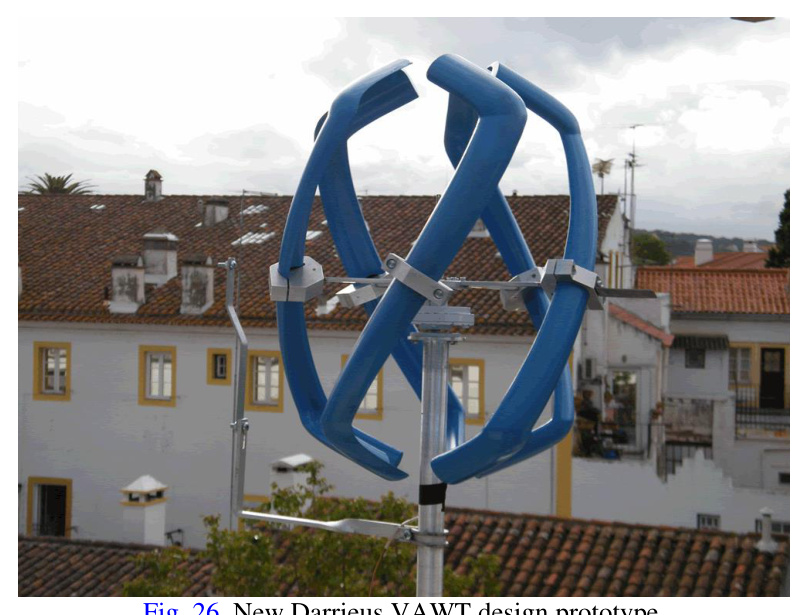
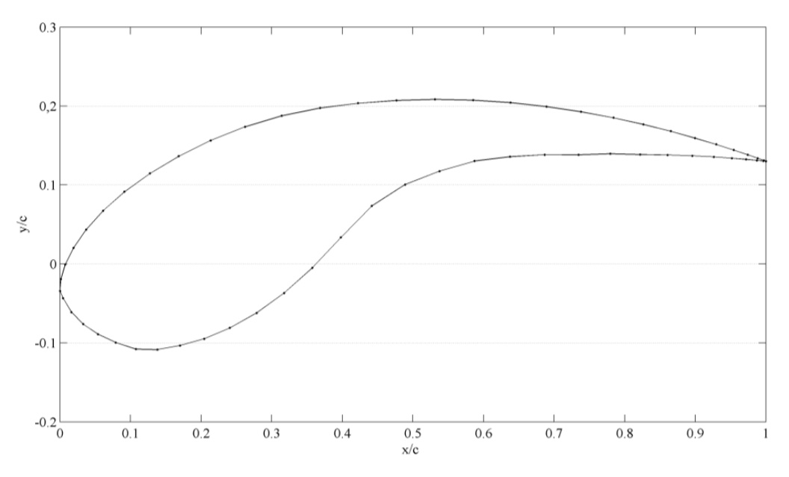
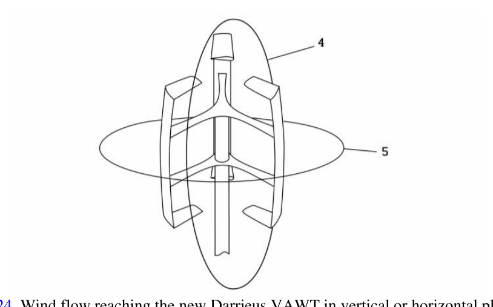
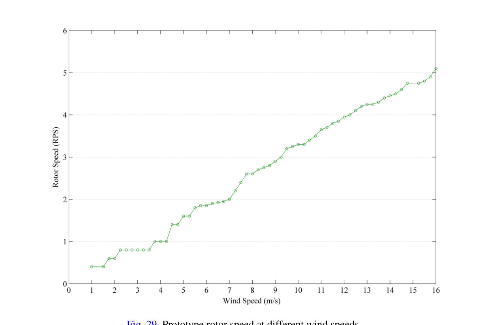

## EN0005 Self-start Darrieus VAWT

The source presents a Darrieus VAWT intended for urban areas, designed to self-start without extra components or external electricity feed-in by using the EN0005 blade profile and blade-end geometry. (source: sources/va9.md)

## Geometry

- Prototype blade body height: 36.0 cm. (source: sources/va9.md)
- Prototype rotor height: 48.0 cm. (source: sources/va9.md)
- Prototype rotor radius: 17.3 cm. (source: sources/va9.md)
- Prototype blade profile chord: 5.3 cm. (source: sources/va9.md)
- The design uses blades with a main body and two blade ends. (source: sources/va9.md)
- The blade ends can be placed toward the inside or outside of the rotor, or parallel to the main blade body. (source: sources/va9.md)

Original caption: Fig. 23. New Darrieus VAWT with blade ends in two different positions. [Source](../../sources/va9.md)

Original caption: Fig. 26. New Darrieus VAWT design prototype. [Source](../../sources/va9.md)

## Unique Design Choices

- The design uses the EN0005 blade profile, whose upper surface is described as high-lift, whose first 20% of lower surface length is high-lift, and whose remaining lower surface ends in a cup form. (source: sources/va9.md)
- The cup form is intended to increase drag force when the blade is stopped in the downstream zone, then decrease to negligible drag after rotation starts. (source: sources/va9.md)
- Blade ends positioned toward the inside of the rotor are described as increasing drag because of augmented blade-profile height, improving self-start capability. (source: sources/va9.md)
- When TSR is greater than 2, the source says lift forces on inward-positioned blade ends provide turbine-blade revolution stability. (source: sources/va9.md)

Original caption: Fig. 5. Blade profile EN0005. [Source](../../sources/va9.md)

Original caption: Fig. 24. Wind flow reaching the new Darrieus VAWT in vertical or horizontal planes. [Source](../../sources/va9.md)

## Performance

- Field tests report self-start at wind velocity of 1.25 m/s. (source: sources/va9.md)
- The prototype is reported stable under a wind-tunnel stress test at 25 m/s. (source: sources/va9.md)
- The source reports no audible noise emission in the tested urban environment. (source: sources/va9.md)
- The field-test torque table reports 0.035 Nm at 1.25 m/s, 0.069 Nm at 2 m/s, 0.087 Nm at 2.25 m/s, and 0.156 Nm at 3 m/s. (source: sources/va9.md)
- The field-test table reports power coefficients of 0.416 at 1.25 m/s, 0.321 at 2 m/s, 0.314 at 2.25 m/s, and 0.313 at 3 m/s. (source: sources/va9.md)
- The prototype shows high torque but low rotor angular speed; the source says the high torque helps it work at low wind speed. (source: sources/va9.md)

Original caption: Fig. 27. Different field tests scenarios. [Source](../../sources/va9.md)

Original caption: Fig. 29. Prototype rotor speed at different wind speeds. [Source](../../sources/va9.md)

## Related

- [[Darrieus Turbine]]
- [[Straight-bladed Darrieus]]
- [[va9 EN0005 Blade Profile]]
- [[Double-Multiple Streamtube Model]]

#designs
