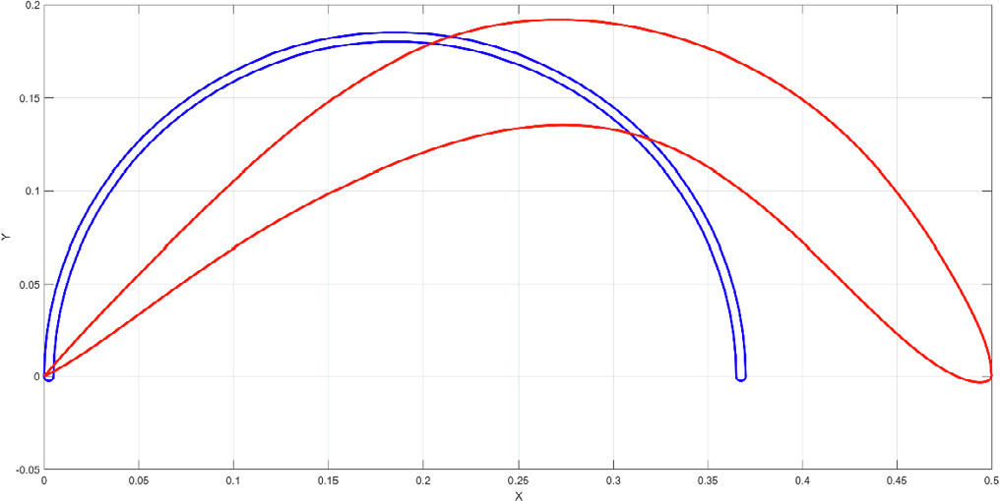

## Airfoil-Based Savonius Wind Turbine

The `vj17` study proposes an optimized airfoil-based Savonius rotor by coupling DVM, CST, and SSA. (source: sources/vj17.md)

Original caption: Fig. 5. The achieved optimum geometry coordinates. [[vj17|Source]]

Original caption: Fig. 6. The Airfoil and the semicircular simple Savonius coordinate. [[vj17|Source]]

- The optimized geometry is evaluated at TSR 0.4 and free-stream velocity 7 m/s. (source: sources/vj17.md)
- The optimum airfoil-type rotor reaches Cp = 0.085 and outperforms the semicircular baseline by about 27%. (source: sources/vj17.md)
- The paper keeps the blade length comparison fair by matching the inner curve length of the two rotors. (source: sources/vj17.md)

Related: [[Savonius Turbine]], [[Optimization]], [[Discrete Vortex Method]], [[Salp Swarm Algorithm]], [[CST Parameterization]]

#designs
