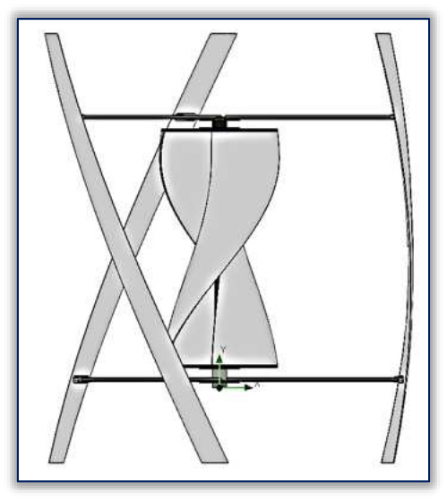

## Savonius-Darrieus Hybrid Wind Turbine

This page covers the original `vj2` hybrid configuration before the paper's two later optimization variants. It places a helical Savonius rotor inside a three-bladed helical Darrieus rotor to improve startup torque while retaining Darrieus lift-based performance. (source: sources/vj2.md)

## Geometry

- The base design uses a helical Savonius rotor placed at the middle of a three-bladed helical Darrieus rotor. (source: sources/vj2.md)
- Savonius height: 1000 mm. (source: sources/vj2.md)
- Savonius diameter: 500 mm. (source: sources/vj2.md)
- Darrieus diameter: 1600 mm. (source: sources/vj2.md)
- Darrieus blade projected height: 1800 mm. (source: sources/vj2.md)
- Darrieus blade profile: NACA 0018. (source: sources/vj2.md)
- Darrieus blade chord length: 110 mm. (source: sources/vj2.md)
- The shared shaft diameter is 38 mm through the Savonius region. (source: sources/vj2.md)
- The overlap space between the Savonius blades is 58 mm. (source: sources/vj2.md)

Original caption: Figure 3: (a) CAD model of the initial configuration of the proposed hybrid wind turbine (at the bottom - bearing housing and power generator); (b) simplified CAD model for CFD analysis [[vj2|Source]]

Original caption: Figure 3: (a) CAD model of the initial configuration of the proposed hybrid wind turbine (at the bottom - bearing housing and power generator); (b) simplified CAD model for CFD analysis [[vj2|Source]]

## Unique Design Choices

- The study focuses on a hybrid arrangement where the Savonius rotor provides drag-based starting torque and the Darrieus rotor provides lift-based output. (source: sources/vj2.md)
- The original design mounts both rotors on the same shaft. (source: sources/vj2.md)
- The source identifies the internal Savonius shaft as a possible flow obstruction because it occupies about 66% of the overlap space. (source: sources/vj2.md)

Original caption: Figure 5: The shaft (in blue) occupies about 66% of the overlapping space between the two blades of the Savonius rotor [[vj2|Source]]
## Performance

- The CFD study evaluates static torque at 7 m/s across nine attack angles from 0 degrees to 120 degrees. (source: sources/vj2.md)
- The original configuration reports torque values from 1.075 Nm to 1.683 Nm across the tested angles. (source: sources/vj2.md)

Original caption: Figure 4: Turbulent flow due to the Savonius rotor for an angle of attack of 30 degrees: (a) - side view; (b) - top view [[vj2|Source]]

Original caption: Figure 4: Turbulent flow due to the Savonius rotor for an angle of attack of 30 degrees: (a) - side view; (b) - top view [[vj2|Source]]

## Related

- [[Hybrid VAWT]]
- [[Savonius Turbine]]
- [[Darrieus Turbine]]
- [[vj2 Shaftless Savonius-Darrieus Hybrid Wind Turbine]]
- [[vj2 Split Savonius Outside Darrieus Hybrid Wind Turbine]]
- [[vj2 Savonius Shaft Removal]]
- [[vj2 Savonius Placement Outside Darrieus Rotor]]

#designs
