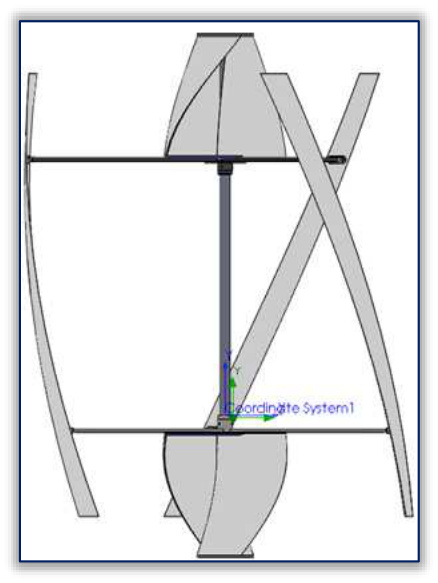
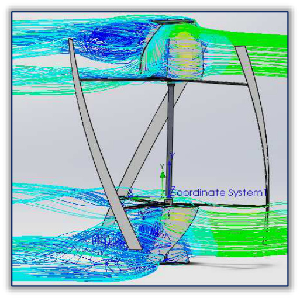
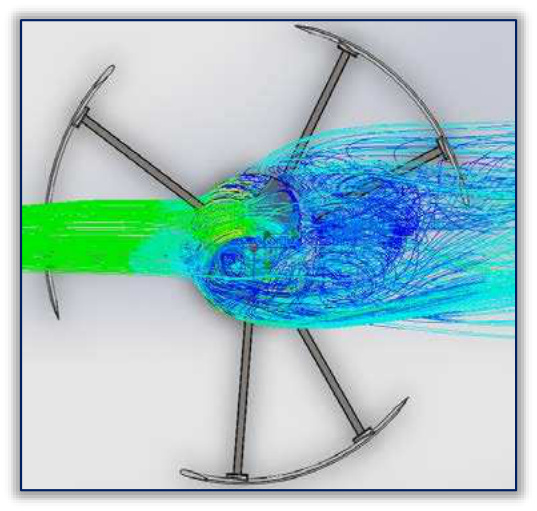
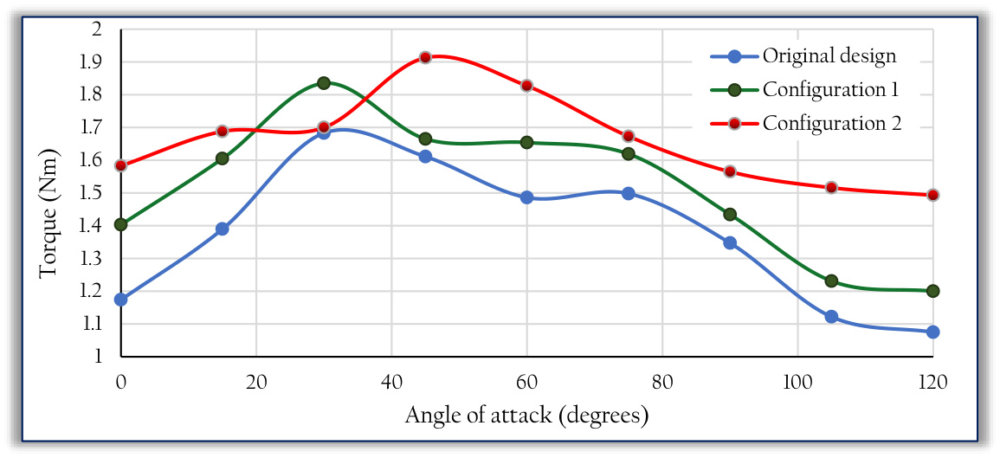

## Split Savonius Outside Darrieus Hybrid Wind Turbine

This `vj2` configuration moves the Savonius component out of the middle of the Darrieus rotor, splitting it into two shaftless halves placed at the top and bottom of the turbine. (source: sources/vj2.md)

## Geometry

- The Darrieus rotor remains the same three-bladed helical rotor used in the original hybrid design. (source: sources/vj2.md)
- The Savonius rotor is removed from inside the Darrieus space. (source: sources/vj2.md)
- The Savonius component is split into two shaftless halves. (source: sources/vj2.md)
- One half is placed at the top of the Darrieus rotor and the other at the bottom. (source: sources/vj2.md)

Original caption: Figure 6: The Savonius rotor was split in two halves that were placed on top and bottom of the hybrid wind turbine [Source](../../sources/vj2.md)

## Unique Design Choices

- The source presents this arrangement as a way to reduce the portion of the Darrieus blades exposed to Savonius-generated turbulence. (source: sources/vj2.md)
- The design also removes the shaft from the Savonius halves. (source: sources/vj2.md)

## Performance

- The CFD study evaluates static torque at 7 m/s across nine attack angles from 0 degrees to 120 degrees. (source: sources/vj2.md)
- This configuration reports an average torque increase of 22.3% relative to the original hybrid configuration. (source: sources/vj2.md)
- The source also reports an 11.8% gain relative to the first optimized shaftless-middle-Savonius configuration. (source: sources/vj2.md)
- The source notes that some of the improvement may also be partially explained by increased swept area. (source: sources/vj2.md)

Original caption: Figure 7: The influence of turbulence produced on the Darrieus blades is reduced compared with the original design; (a) - side view; (b) - top view [Source](../../sources/vj2.md)

Original caption: Figure 7: The influence of turbulence produced on the Darrieus blades is reduced compared with the original design; (a) - side view; (b) - top view [Source](../../sources/vj2.md)

Original caption: Figure 8: Torque values calculated for each configuration, for one third of a complete rotation (15 degree steps) [Source](../../sources/vj2.md)

## Related

- [[vj2 Savonius-Darrieus Hybrid Wind Turbine]]
- [[vj2 Shaftless Savonius-Darrieus Hybrid Wind Turbine]]
- [[vj2 Savonius Placement Outside Darrieus Rotor]]
- [[Hybrid VAWT]]

#designs
