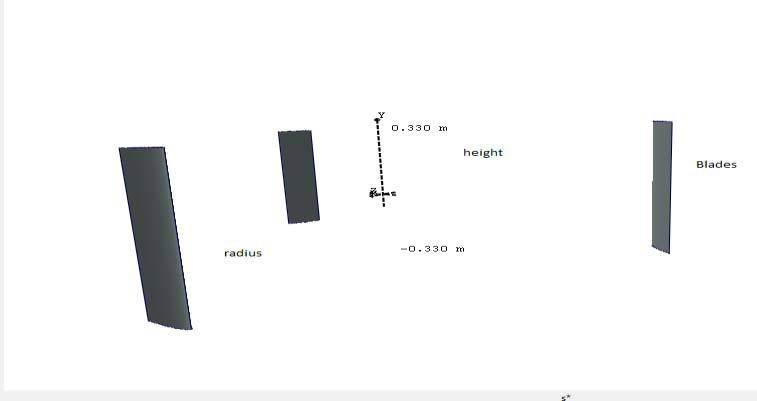

## Simulated Small-Scale Straight-Bladed VAWT

This page covers the small simulated straight-bladed VAWT geometry used in `vj22` to compare blade airfoils and blade number for low-wind-speed operation. (source: sources/vj22.md)

Original caption: Fig. 3 Side view of the rotor blade design [[vj22|Source]]

- The simulated rotor uses `0.66 m` turbine height, `0.167 m` chord length, and `1.00 m` blade radius. (source: sources/vj22.md)
- The paper compares `NACA 0012` and `NACA 0015` airfoils on this geometry and then varies blade number through `3`, `5`, and `8` blades. (source: sources/vj22.md)
- For the `3`-blade case, the source reports rotor solidity `0.51`. (source: sources/vj22.md)
- The paper says the `3`-blade case gives the highest and most stable power coefficient, with a maximum `Cp` of about `0.3` in the `TSR` range `3` to `4`. (source: sources/vj22.md)
- It also reports that higher blade counts lower efficiency but improve low-wind torque and self-rotation tendencies. (source: sources/vj22.md)

> Uncertainty: this source compares several variants on one simulated geometry and does not present one experimentally validated whole-turbine catalog case, so most catalog fields remain blank. (source: sources/vj22.md)

Related: [[Straight-bladed Darrieus]], [[Darrieus Turbine]], [[QBlade]], [[vj22 Blade Profile]], [[vj22 Blade Number]]

#designs
