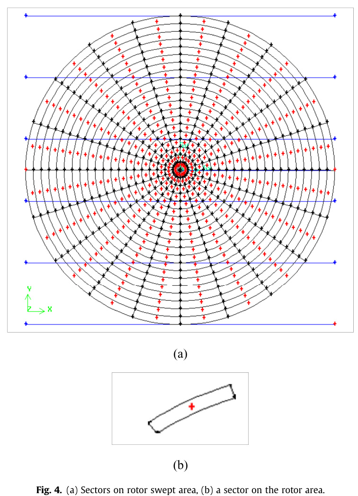

---
Created:
Updated: 2026-07-02
Sources:
- [[sources/vj10.md]]
- [[sources/vj4.md]]
Source_count: 2
Tags:
- methods
---
## Blade Element-Momentum Model

Load-prediction method used to estimate wind-turbine performance from blade aerodynamics and momentum theory. (source: sources/vj4.md, sources/vj10.md)

- The paper uses a Double Disk - Multiple Streamtube implementation of BE-M. (source: sources/vj4.md)
- It adds dynamic stall handling with the Boeing-Vetrol model and high-angle-of-attack extension with Viterna-Corrigan. (source: sources/vj4.md)
- It is used here to compare rotor architectures while holding solidity and swept area fixed. (source: sources/vj4.md)
- The method was validated against Sandia power-coefficient data and tangential force measurements. (source: sources/vj4.md)
- In the wind-shear HAWT paper, BEM is used to design chord and twist distributions for a 100 kW turbine and to calculate lift, thrust, and power coefficients along the blade length. (source: sources/vj10.md)
- The same paper combines BEM with a power-law wind-shear model by dividing the swept area into vertical slices, so each sector receives the wind speed corresponding to its height. (source: sources/vj10.md)
- The authors describe this as a way to improve classical BEM for wind-shear effects while keeping calculation cost close to the classical method. (source: sources/vj10.md)

Related:
- [[Darrieus Turbine]]
- [[H-VAWT]]
- [[Wind Turbine Parameters]]
- [[Wind Shear]]

#methods
