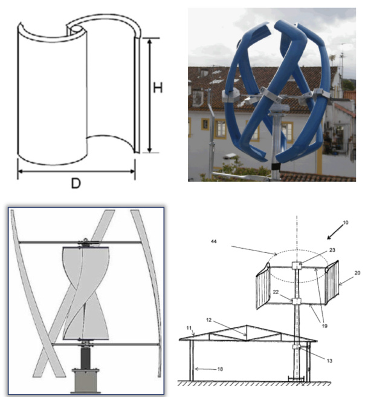
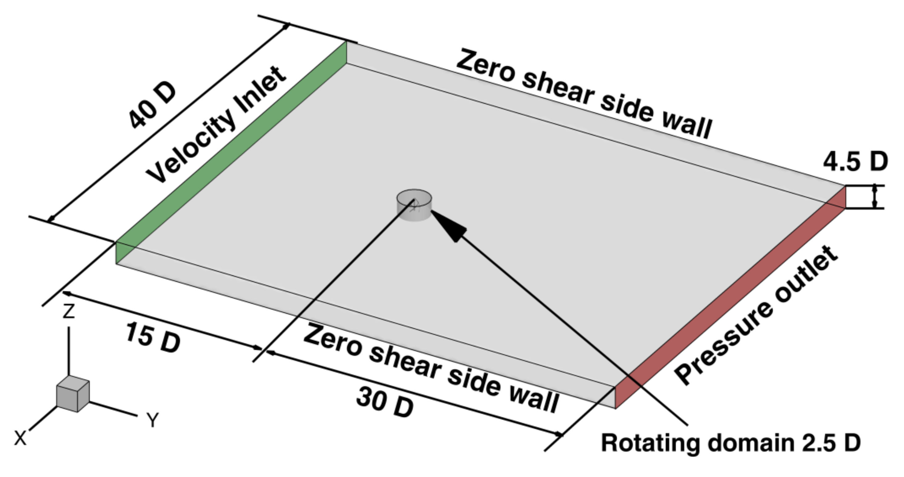
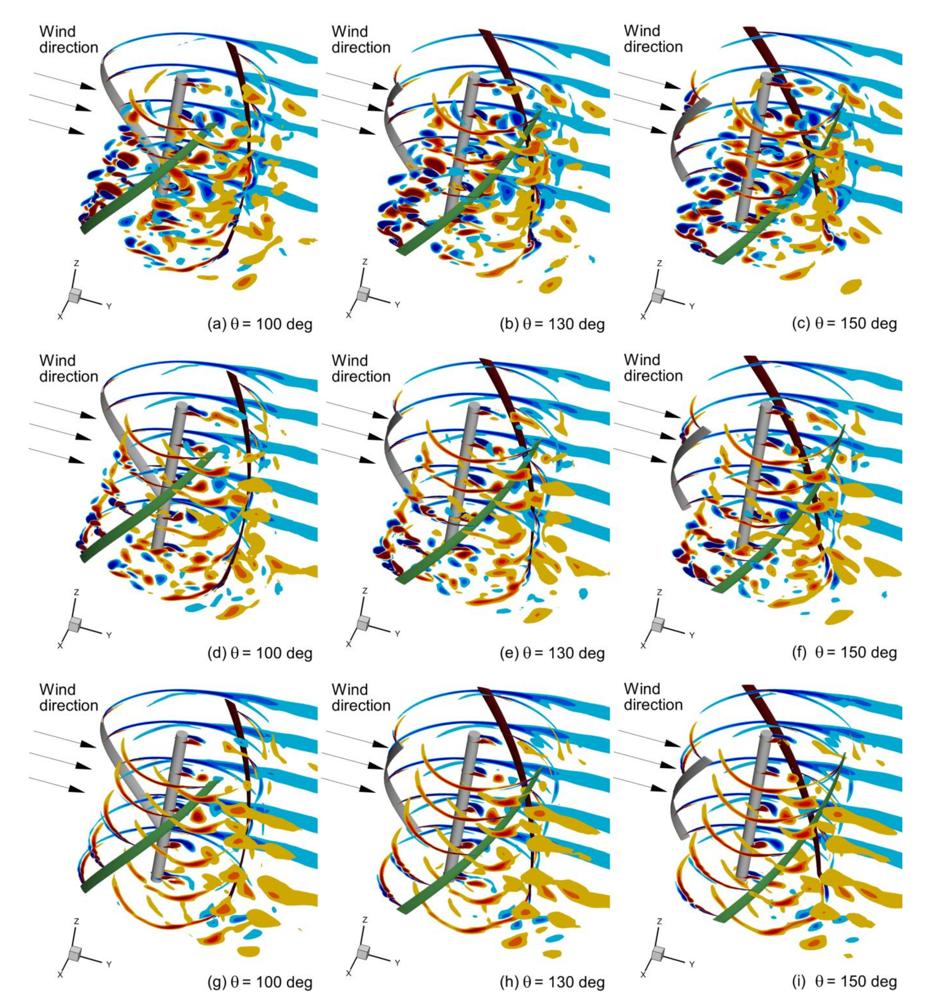
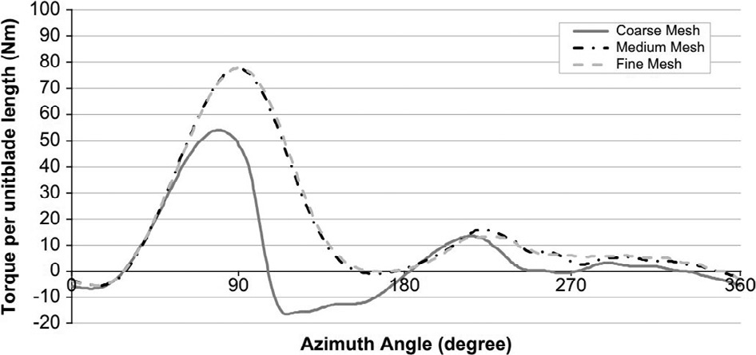
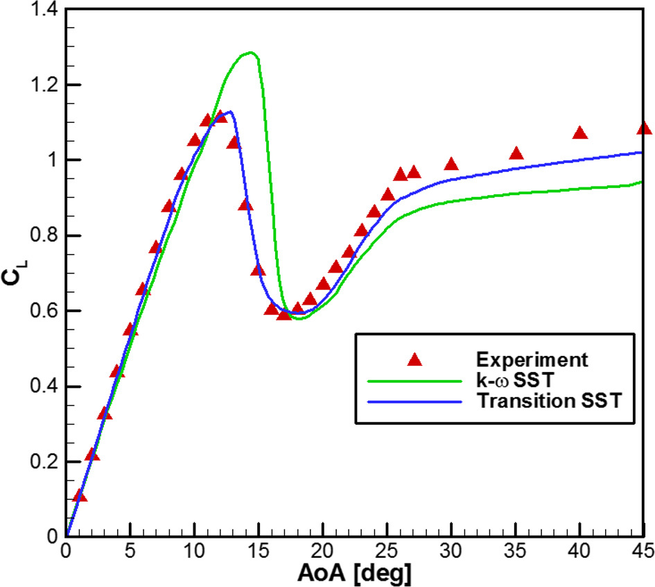
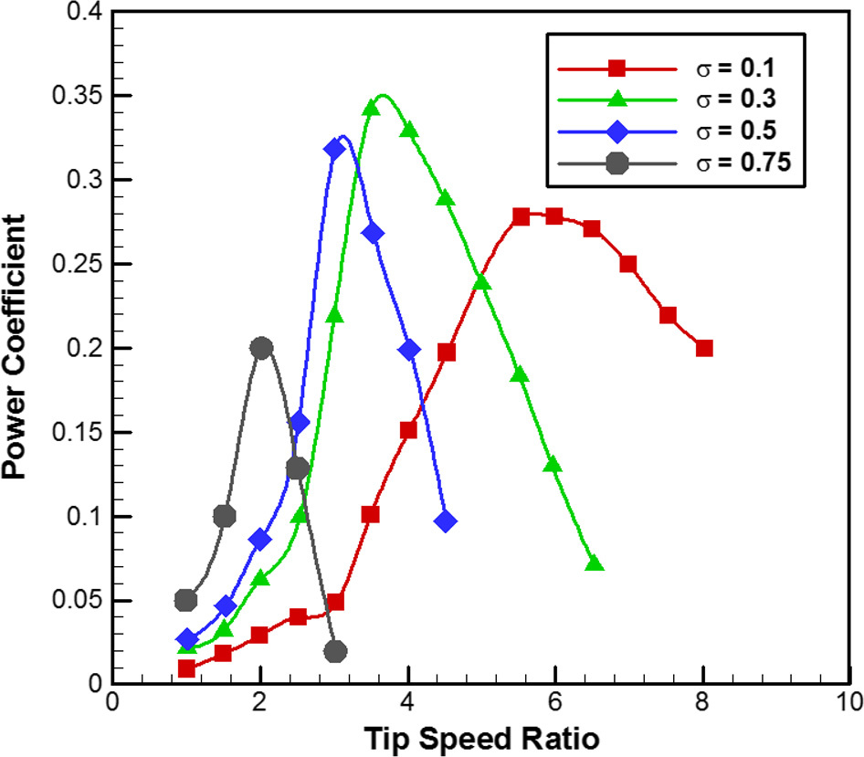
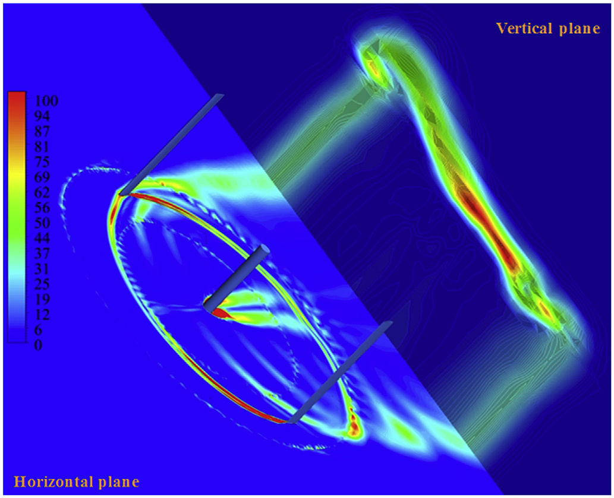
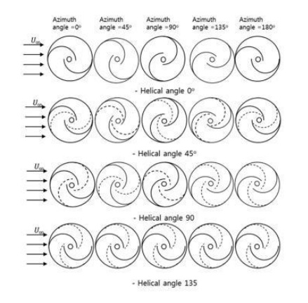
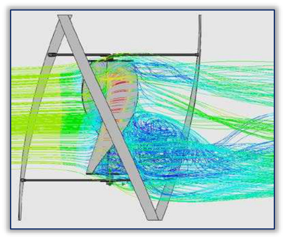
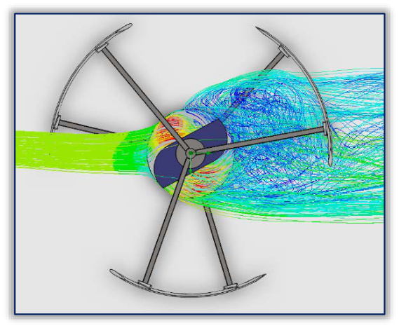

---
Created:
Updated: 2026-07-03
Sources:
- [[HRI2526]]
- [[n1]]
- [[va1]]
- [[va10]]
- [[va11]]
- [[va13]]
- [[va14]]
- [[va4]]
- [[va7]]
- [[vj12]]
- [[vj2]]
- [[vj5]]
- [[vj6]]
- [[vj8]]
Source_count: 14
Tags:
- methods
---
## Computational Fluid Dynamics (CFD)

Numerical method for simulating fluid flow by dividing the domain into discrete cells. (source: sources/n1.md, sources/va1.md)

Original caption: Fig. 17. CFD Flow volume with stationary and rotating domains [[HRI2526|Source]]

- Used to model wind flow and turbine performance. (source: sources/n1.md)
- Requires careful setup, boundary conditions, and mesh quality. (source: sources/n1.md)
- The HRI report used SimScale with stationary and rotating domains and a k-omega SST turbulence model. (source: sources/HRI2526.md)
- The workflow validated CFD against a NACA 0012 airfoil and a classical Savonius before analyzing the selected helical hybrid. (source: sources/HRI2526.md)
- The selected helical hybrid reported Cp 0.19 at TSR 1 in CFD. (source: sources/HRI2526.md)
- The vj12 review treats CFD as the main way to study counter-rotation, blade-profile changes, deflectors, and site/layout effects when experiments are not practical. (source: sources/vj12.md)
- It says one deflector study used URANS with the k-omega turbulence model as the main analysis tool. (source: sources/vj12.md)
- It reinforces that CFD sits alongside field and lab testing for VAWT review work, not as a replacement for measurements. (source: sources/vj12.md)
- Used in a SolidWorks Flow Simulation study of a Savonius-Darrieus hybrid rotor with a 3D domain, mesh refinement, and nine attack angles from 0 to 120 degrees. (source: sources/vj2.md)
- The same hybrid-rotor paper reports a 15 m by 12 m by 12 m domain, 7 m/s inlet wind speed, 5% turbulence intensity, and the Lam and Bremhorst modified `k-epsilon` model. (source: sources/vj2.md)
- A dynamic-stall study on a single-bladed 2D VAWT compared URANS, LES, and DES; DES matched PIV vorticity data best. (source: sources/vj5.md)
- That paper found grid refinement and convergence settings materially affected vorticity and force predictions. (source: sources/vj5.md)
- A later review organized VAWT CFD around problem definition, meshing, equation discretisation, boundary conditions, numerical solution, and post-processing. (source: sources/vj6.md)
- That review also emphasized static/dynamic meshing, turbulence-model choice, near-wall resolution, and experimental validation. (source: sources/vj6.md)
- It framed CFD as the detailed middle ground between lower-fidelity models and wind-tunnel experiments. (source: sources/vj6.md)
- The va10 review recommends grid-sensitivity and domain-sensitivity studies, clustering cells near the blade and wake, and matching `y+` to the wall treatment used by the turbulence model. (source: sources/va10.md)
- It reports a reviewed domain-size study where torque stabilized when the domain-to-rotor-diameter ratio exceeded 15, and it cites about 14 diameters of downwind length as enough for wake development. (source: sources/va10.md)
- It compares `k-epsilon`, `k-omega SST`, transition SST, LES, and hybrid RANS-LES, and frames LES and hybrid RANS-LES as higher-fidelity options for separated unsteady flow at higher computational cost. (source: sources/va10.md)
- In one reviewed solver comparison, PISO produced the best results while SIMPLE struggled at low TSR and COUPLED failed to capture the blade-flow behavior. (source: sources/va10.md)
- The va11 wake review adds wake-specific uses of RANS, LES, and DES, including PIV-validated simulations of asymmetric wake spreading, counter-rotating vortices, and blade-tip effects. (source: sources/va11.md)
- It says 2-D wake CFD misses blade-tip vortices and therefore over-predicts H-rotor performance relative to 3-D simulation. (source: sources/va11.md)
- It also reviews actuator-based LES approaches such as actuator line and actuator swept-surface models for reducing computational cost in large wake studies. (source: sources/va11.md)
- The va13 study uses SolidWorks for turbine geometry, ANSYS Fluent with the SST `k-ω` turbulence model for aerodynamic comparison, and case-specific rooftop domains and meshes for the three designs. (source: sources/va13.md)
- It reports node and element counts for each case but explicitly leaves mesh-sensitivity and experimental validation for future work because the study's main goal was building-scale energy and economic analysis. (source: sources/va13.md)
- The va14 study uses 2D URANS with the transition SST (`γ-Reθ`) model, a sliding mesh interface, about 400,000 quadrilateral cells, and a grid-sensitivity analysis quantified with GCI. (source: sources/va14.md)
- It validates against wake-velocity data for a 2-bladed turbine and power-coefficient data for a 3-bladed turbine before running the larger parametric sweep. (source: sources/va14.md)
- The helical-VAWT study used 2D LES for blade-scale flow and 3D U-RANS with SST k-omega for the full rotor. (source: sources/va4.md)
- It found that 3D effects such as tip vortex and second flow reduce performance relative to 2D predictions. (source: sources/va4.md)
- A helical-VAWT helix-angle study used Ansys FLUENT with stationary and rotating domains, a sliding mesh interface, transition SST k-omega turbulence modeling, grid/time-step independence checks, and validation against McLaren's experimental VAWT data. (source: sources/va7.md)
- That study used z-vorticity contours and wake profiles to connect section-wise blade loading, vortex shedding, wake interaction, and flow separation to moment-coefficient behavior. (source: sources/va7.md)

## Figures

Original caption: Figure 11. The streamlines at 60◦, 90◦, 150◦, 180◦, (a–c) corresponding to the results at TSR 0.9, 1.46 and 2.3 respectively, red frames represent the wake vortex generated from another blade. [[va4|Source]]

Original caption: Figure 14. Power coefficient results derived by 2D LES and 3D U-RANS methods for Rec = 60,800, TSR = 1.46. [[va4|Source]]

Original caption: Figure 3. (a) Sectional view of the domain mesh: (b) mesh near the blade, (c) mesh growth surrounding the blade. [[va7|Source]]

Original caption: Figure 21. Z-vorticity magnitude of 90◦helical-bladed VAWT at 100◦, 130◦, and 150◦of azimuth angles of rotation of a [[va7|Source]]

Original caption: Fig. 4. Structured computational grid around blade [25]. [[va10|Source]]

Original caption: Fig. 5. Computational grid independency study [31]. [[va10|Source]]

Original caption: Fig. 7. Lift coefficient comparison for transition SST and k omega SST turbulence models. Adapted from [32]. [[va10|Source]]

Original caption: Fig. 8. Comparison of power coefficient at different tip speed ratios for IDDES and k omega SST turbulence models [53]. [[va10|Source]]

Original caption: Fig. 25. Vorticity magnitudes in the blade mid-span and vertical planes (units, 1/s) [52]. [[va11|Source]]

Original caption: Fig. 26. Vorticity magnitudes in the top blade-tip and vertical planes (units, 1/s) [52]. [[va11|Source]]

Original caption: Figure 7. Computational domain and mesh setup. [[va13|Source]]

Original caption: Fig. 1. Schematic of (a) the reference turbine, (b) computational domain (both not to scale); (c-e) computational grid near the (c) rotating core, (d) airfoil, and (e) trailing edge. [[va14|Source]]
- The CRVAWT optimization paper used STAR-CCM+ CFD, validated an isolated VAWT against wind-tunnel data, and then used the simulation outputs in a response-surface optimization workflow. (source: sources/vj8.md)

Original caption: Figure 21: Schematic view and CFD streamlines for flow around a flanged diffuser [110]. [[vj12|Source]]

Original caption: Figure 4: Turbulent flow due to the Savonius rotor for an angle of attack of 30 degrees: (a) - side view; (b) - top view [[vj2|Source]]

Original caption: Figure 4: Turbulent flow due to the Savonius rotor for an angle of attack of 30 degrees: (a) - side view; (b) - top view [[vj2|Source]]

#methods
