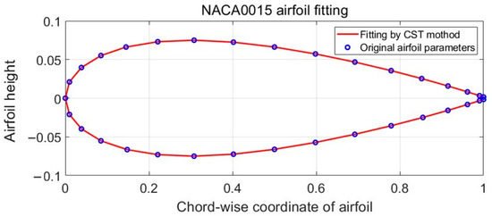

## CST Parameterization

Class/Shape Transformation (CST) is a geometry representation method for defining airfoil profiles with a compact set of coefficients. (source: sources/va2.md)

- The class function is written as `C(x) = k x^N1 (1-x)^N2`. (source: sources/va2.md)
- The shape function uses Bernstein polynomials. (source: sources/va2.md)
- The paper uses CST to reconstruct NACA0015 and defines 13 geometric variables before screening to 7 design variables. (source: sources/va2.md)
- Leading-edge radius, thickness, and trailing-edge thickness are controlled through selected coefficients. (source: sources/va2.md)

Related: [[H-VAWT]], [[Kriging Surrogate Model]], [[Multi-Island Genetic Algorithm]]

#methods