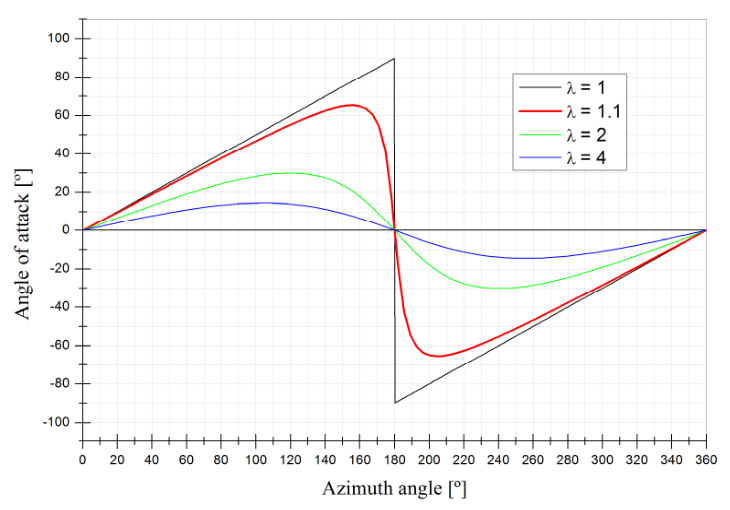
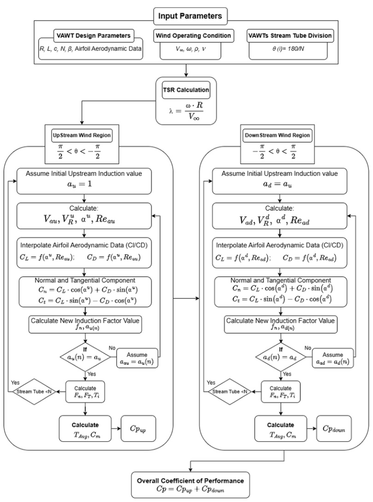

## Double-Multiple Streamtube Model

The double-multiple streamtube (DMS) model is a Blade Element-Momentum variant for Darrieus VAWTs where the actuator disk is divided into upstream and downstream half-cycles, each with its own induced velocity. (source: sources/va9.md)

Original caption: Fig. 16. Double-multiple streamtube model diagram. [[va9|Source]]

Core idea:
- The rotor is divided into streamtubes, and each streamtube has upstream and downstream actuator-disc behavior. (source: sources/va9.md)
- The upstream induced velocity is lower than the undisturbed velocity, the downstream velocity is influenced by the upstream wake, and torque/power coefficient are determined by integrating aerodynamic behavior over the streamtubes. (source: sources/va9.md)
- The calculation iterates an upstream interference factor until the force comparison converges with error `10^-4`, then computes final torque and power coefficient before repeating for the downstream side. (source: sources/va9.md)
- The va22 paper uses a related low-TSR helical-VAWT workflow where the DMS/DMST-style power model is supplied with lift and drag coefficients from `2D` CFD so the stall-region angle-of-attack range can still be handled at `λ = 1.1`. (source: sources/va22.md)
- That source presents the combination as a way to avoid full high-fidelity `3D` rotor CFD while still getting reasonable agreement with wind-tunnel power measurements for an urban-targeted design. (source: sources/va22.md)
- The va24 paper extends DMST by integrating two active blade-pitching strategies directly into a MATLAB DMST code so the local angle of attack is kept just below stall through the rotor cycle. (source: sources/va24.md)
- It reports that more than `20` stream tubes are needed for reliable `Cp` convergence and uses `180` stream tubes for the pitched-rotor calculations. (source: sources/va24.md)
- The same source uses XFLR5 aerodynamic lookup data over Reynolds numbers from `2 x 10^4` to `10 x 10^7`, with an induction-factor tolerance of `1 x 10^-6`. (source: sources/va24.md)
- The vj24 paper uses the related `CARDAAV` code, which it describes as a double-multiple-streamtube-based VAWT performance tool with variable upwind and downwind induced velocities in each streamtube. (source: sources/vj24.md)
- That source adds that the implementation can include finite-span effects, dynamic stall, rotating-column wake effects, and drag from struts and spoilers, even though several of those effects are neglected in its specific example case. (source: sources/vj24.md)
- The va25 paper adds a CFD comparison layer around a straight-bladed H-rotor case, using the DMST/BEM context to motivate why startup and low-TSR airfoil choice are difficult to predict with simpler assumptions alone. (source: sources/va25.md)

Model comparison from va9:
- Single streamtube is very fast but does not predict wind variation across the rotor. (source: sources/va9.md)
- Multiple streamtube is fast and reasonable for lightly loaded rotors but can have convergence problems and field-test disparities depending on solidity. (source: sources/va9.md)
- Double-multiple streamtube correlates well with experimental data but has convergence problems and can over-predict power for high-solidity turbines at higher TSR. (source: sources/va9.md)
- Vortex models can correlate highly with experimental data but take the most computation time. (source: sources/va9.md)
- Cascade models offer reasonable overall prediction for low- and high-solidity turbines without convergence problems, with reasonable computation time. (source: sources/va9.md)

Novel sliced DMS approach:
- The va9 paper proposes slicing the wind turbine parallel to the wind-flow path, analyzing blade movement path and blade-profile mutations inside each slice, treating each slice as a virtual Darrieus VAWT, and integrating the resulting slice performance data. (source: sources/va9.md)
- The source presents this as useful for complex blade forms and for integration into CFD and CAD tools. (source: sources/va9.md)

Original caption: Fig. 19. Novel approach to the DMS model in a V shaped Darrieus VAWT. [[va9|Source]]

Original caption: Fig. 20. Novel approach to the DMS model in an H-Rotor VAWT influenced by a wind in skewed flow. [[va9|Source]]

Original caption: Figure 3. Angle of attack variation in a blade revolution for different tip speed ratios. [[va22|Source]]

Original caption: Fig. 4. Double Multiple Stream Tube algorithm. [[va24|Source]]

Related:
- [[Blade Element-Momentum Model]]
- [[Wind Tunnel Testing]]
- [[Darrieus Turbine]]
- [[H-VAWT]]
- [[VAWT Aerodynamic Design Parameters|Aerodynamic Design Parameters]]
- [[va22 100-W Helical-Blade Vertical-Axis Wind Turbine]]
- [[va24 Variable-Pitch 3-Bladed NACA0015 Straight-Bladed VAWT]]
- [[PROFOIL]]

#methods
