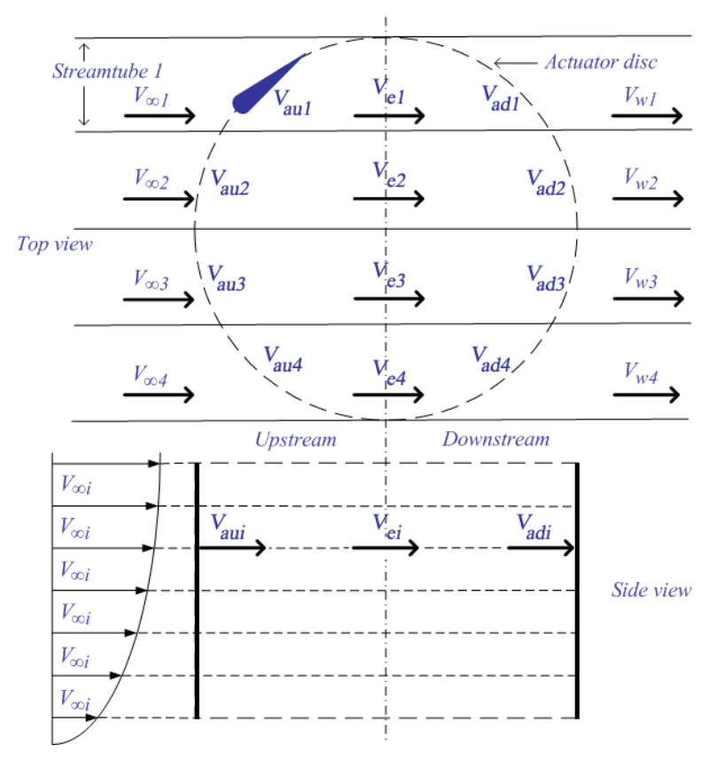
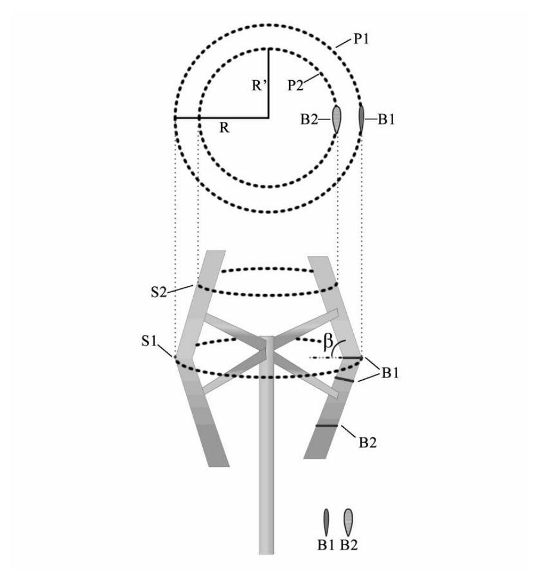
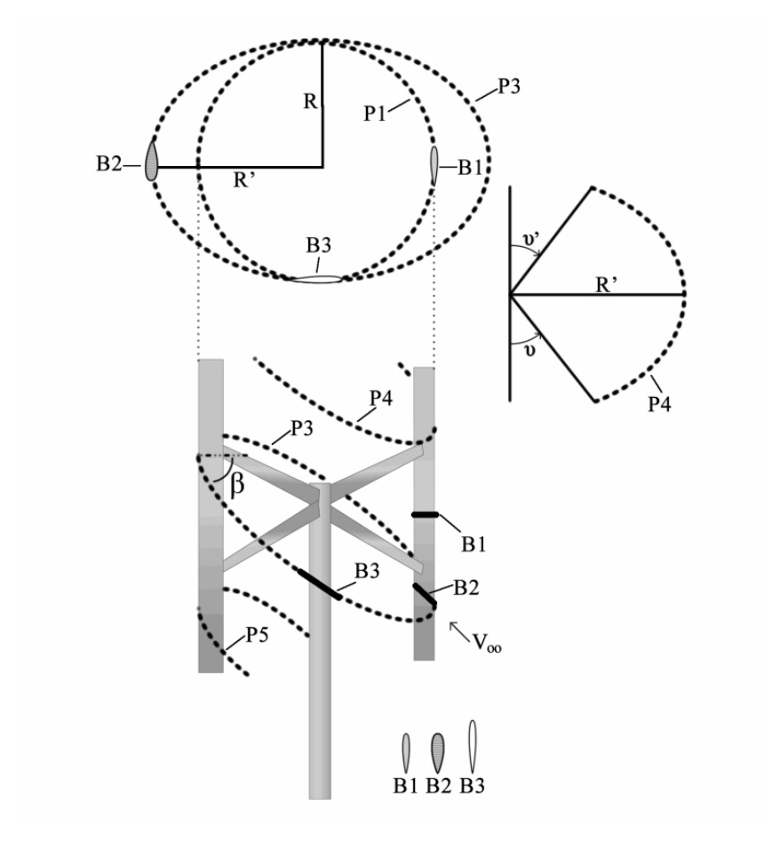

## Double-Multiple Streamtube Model

The double-multiple streamtube (DMS) model is a Blade Element-Momentum variant for Darrieus VAWTs where the actuator disk is divided into upstream and downstream half-cycles, each with its own induced velocity. (source: sources/va9.md)

Original caption: Fig. 16. Double-multiple streamtube model diagram. [Source](../../sources/va9.md)

Core idea:
- The rotor is divided into streamtubes, and each streamtube has upstream and downstream actuator-disc behavior. (source: sources/va9.md)
- The upstream induced velocity is lower than the undisturbed velocity, the downstream velocity is influenced by the upstream wake, and torque/power coefficient are determined by integrating aerodynamic behavior over the streamtubes. (source: sources/va9.md)
- The calculation iterates an upstream interference factor until the force comparison converges with error `10^-4`, then computes final torque and power coefficient before repeating for the downstream side. (source: sources/va9.md)

Model comparison from va9:
- Single streamtube is very fast but does not predict wind variation across the rotor. (source: sources/va9.md)
- Multiple streamtube is fast and reasonable for lightly loaded rotors but can have convergence problems and field-test disparities depending on solidity. (source: sources/va9.md)
- Double-multiple streamtube correlates well with experimental data but has convergence problems and can over-predict power for high-solidity turbines at higher TSR. (source: sources/va9.md)
- Vortex models can correlate highly with experimental data but take the most computation time. (source: sources/va9.md)
- Cascade models offer reasonable overall prediction for low- and high-solidity turbines without convergence problems, with reasonable computation time. (source: sources/va9.md)

Novel sliced DMS approach:
- The va9 paper proposes slicing the wind turbine parallel to the wind-flow path, analyzing blade movement path and blade-profile mutations inside each slice, treating each slice as a virtual Darrieus VAWT, and integrating the resulting slice performance data. (source: sources/va9.md)
- The source presents this as useful for complex blade forms and for integration into CFD and CAD tools. (source: sources/va9.md)

Original caption: Fig. 19. Novel approach to the DMS model in a V shaped Darrieus VAWT. [Source](../../sources/va9.md)

Original caption: Fig. 20. Novel approach to the DMS model in an H-Rotor VAWT influenced by a wind in skewed flow. [Source](../../sources/va9.md)

Related:
- [[Blade Element-Momentum Model]]
- [[Wind Tunnel Testing]]
- [[Darrieus Turbine]]
- [[H-VAWT]]
- [[Aerodynamic Design Parameters]]

#methods
