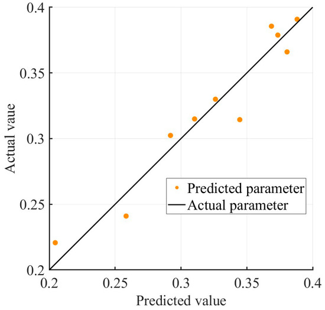

---
Created:
Updated: 2026-07-02
Sources:
- [[va2]]
Source_count: 1
Tags:
- methods
---
## Kriging Surrogate Model

A surrogate modeling method used to approximate expensive objective functions with a fitted statistical response surface. (source: sources/va2.md)

Original caption: Figure 12: The error analysis of the proxy model [[va2|Source]]

- The model decomposes the response into deterministic drift and a stochastic component. (source: sources/va2.md)
- It predicts a mean response and variance at unknown points. (source: sources/va2.md)
- This paper uses an exponential kernel and reports R2 = 0.91368 for the fitted model. (source: sources/va2.md)
- The surrogate reduces direct CFD calls during airfoil optimization. (source: sources/va2.md)

Related: [[CST Parameterization]], [[Multi-Island Genetic Algorithm]], [[CFD]]

#methods
