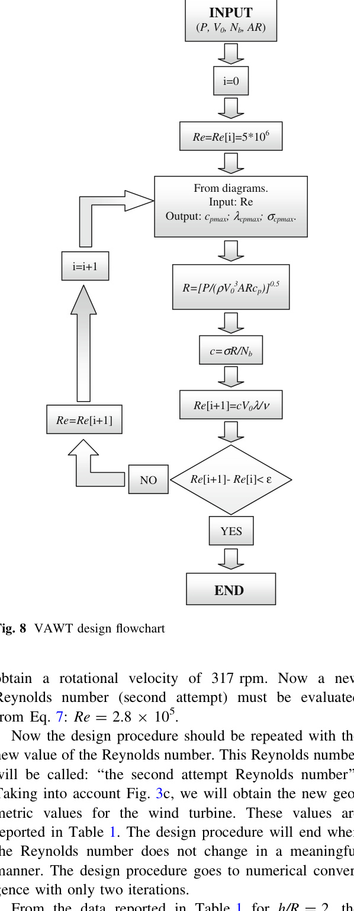

## Multiple Stream Tube Model

The `vj25` paper uses a calculation code based on the Multiple Stream Tube Model (`MSTM`) to generate `Cp` versus `TSR` curves for a straight-bladed H-rotor over different Reynolds numbers. (source: sources/vj25.md)

- In this workflow, the designer reads `cpmax`, `sigma_cpmax`, and `lambda_cpmax` from the MSTM-generated curves for an assumed Reynolds number. (source: sources/vj25.md)
- Those values are then used with the paper's sizing equations to calculate rotor radius, blade chord, rotational speed, and an updated Reynolds number. (source: sources/vj25.md)
- The paper says the process is iterative because geometry changes the Reynolds number, and that numerical convergence usually needs only `2` or `3` iterations. (source: sources/vj25.md)
- In the presented example, the MSTM is used as the core design-performance model rather than as a final experimental validation method. (source: sources/vj25.md)

Original caption: Fig. 8 VAWT design flowchart [[vj25|Source]]

Related: [[H-VAWT]], [[Wind Turbine Parameters]], [[Double-Multiple Streamtube Model]], [[vj25-summary]]

#methods
