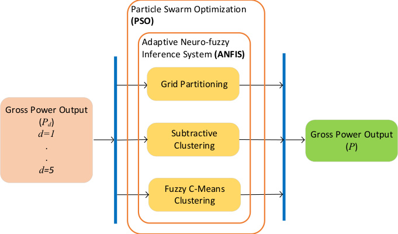
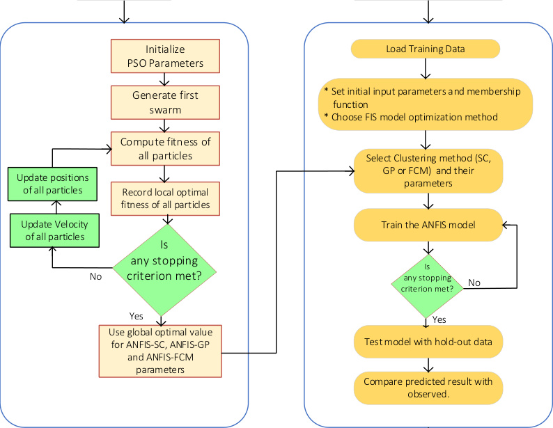

## PSO-ANFIS Forecasting

PSO-ANFIS combines adaptive neuro-fuzzy inference with particle swarm optimization to tune ANFIS parameters for prediction. (source: sources/vj16.md)

In `vj16`, the forecasting workflow is built around an autoregressive gross-power series and compared across grid partitioning, subtractive clustering, and fuzzy c-means. (source: sources/vj16.md)

- Subtractive clustering gives the best standalone and hybrid results in this study. (source: sources/vj16.md)
- The hybrid model improves accuracy, but it also increases runtime. (source: sources/vj16.md)
- The source reports that the hybrid SC model is the strongest of the six tested models. (source: sources/vj16.md)

Original caption: Fig. 3. Standalone and hybrid ANFIS model framework with the three clustering techniques. Each clustering technique was considered independently, resulting in six models in all. [[vj16|Source]]

Original caption: Fig. 6. The flowchart of the standalone and hybrid ANFIS model. [[vj16|Source]]

Related:
- [[Wind Turbine Parameters]]
- [[Optimization]]
