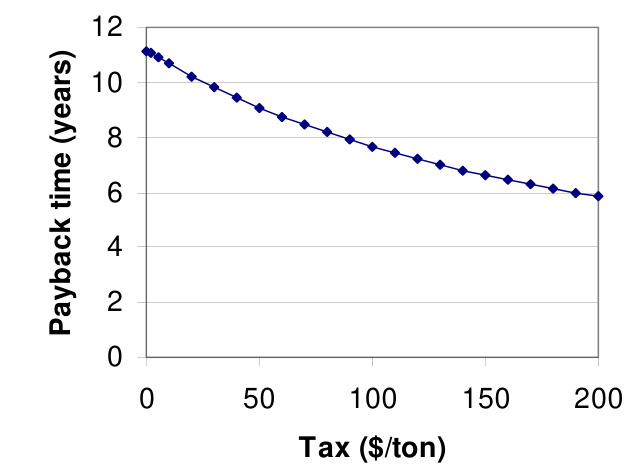

## Payback Period Analysis

Method for estimating how long a turbine retrofit takes to recover its initial cost through annual energy-cost savings. (source: sources/va13.md)

- Compute total installed turbine power from single-turbine power times turbine count. (source: sources/va13.md)
- Convert total power and operating hours into annual energy production. (source: sources/va13.md)
- Convert annual energy to annual electricity-cost savings using local electricity price. (source: sources/va13.md)
- Compute total initial investment and annual maintenance cost from per-turbine values. (source: sources/va13.md)
- Subtract maintenance from annual savings to get net annual savings, then divide total investment by net annual savings to get payback period. (source: sources/va13.md)
- The va19 campus study adds rooftop-wind specifics: include installed cost, state rebates, emissions-credit assumptions, and compare payback directly against the turbine lifetime. (source: sources/va19.md)
- It also compares scenarios at equal installed system capacity rather than equal turbine count, using `6 kW` as the fair-comparison basis between the `Skystream 3.7` and `AVX1000` systems. (source: sources/va19.md)
- The vj19 paper adds a simple small-turbine variant: estimate annual electricity savings from annual energy output times local tariff, assume a total installed cost, and divide cost by annual savings to get simple payback. (source: sources/vj19.md)
- In that source, `7838 kWh/year` at `0.108 USD/kWh` gives `846.51 USD/year`, and an assumed `3000 USD` total cost gives a stated simple payback of `3.5 years`. (source: sources/vj19.md)

Original caption: Figure 19. Payback versus a carbon tax or credit for a Skystream on Eastgate. [[va19|Source]]

Related:
- [[AEO Calculation]]
- [[Economic Viability of VAWTs]]
- [[va13-summary]]
- [[va19-summary]]

#methods
