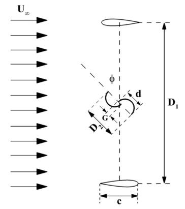
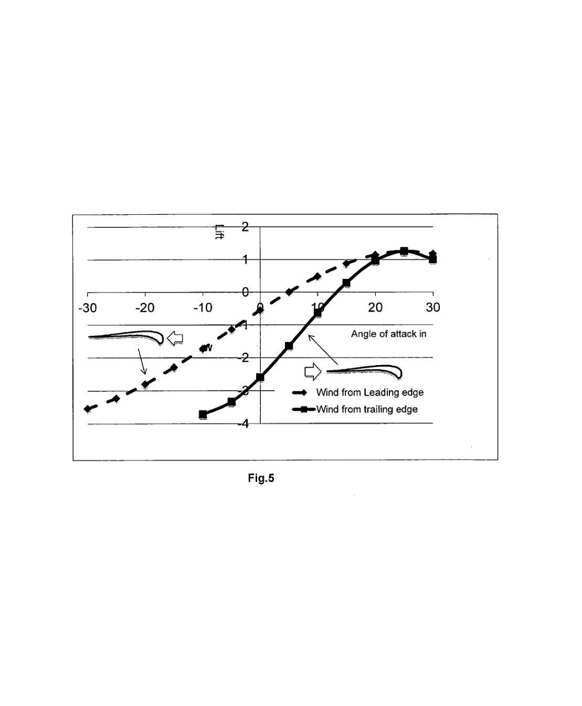
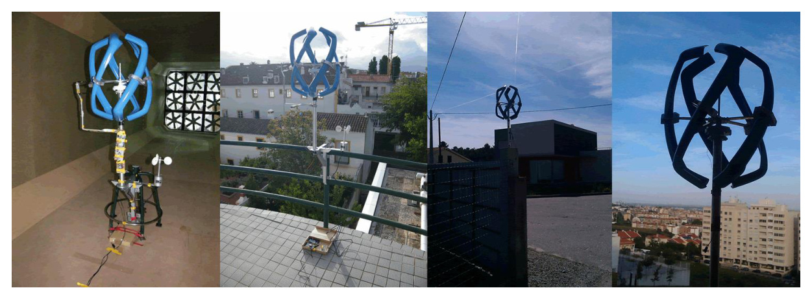
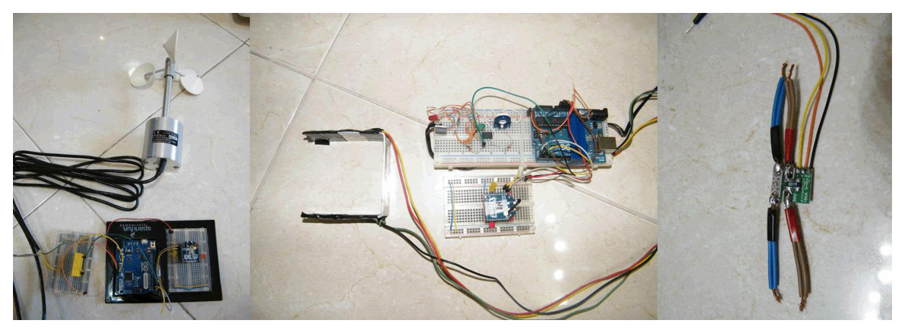
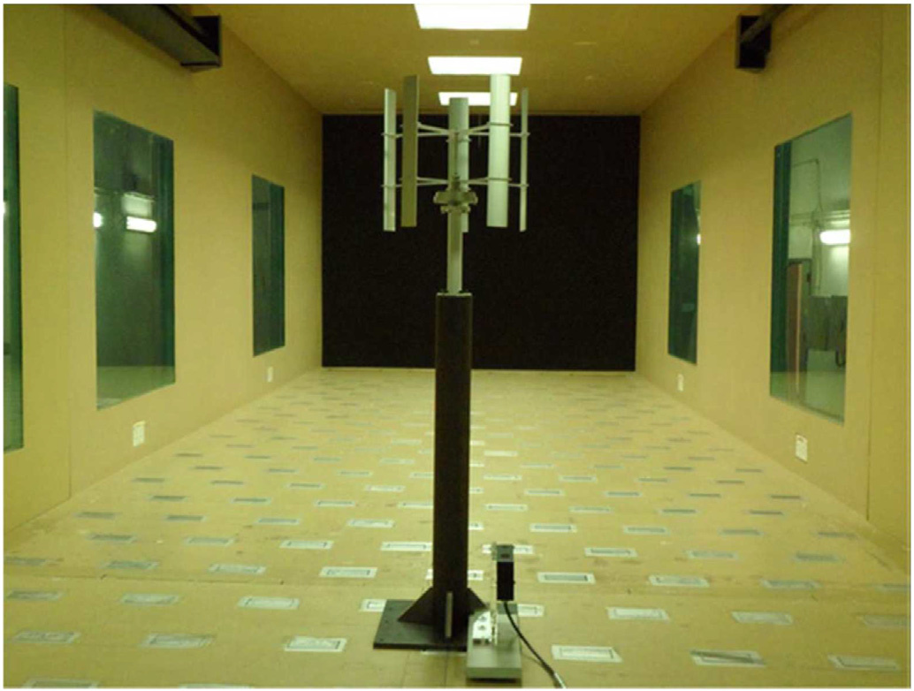

---
Created:
Updated: 2026-07-03
Sources:
- [[HRI2526]]
- [[va8]]
- [[va11]]
- [[va9]]
Source_count: 4
Tags:
- methods
---
## Wind Tunnel Testing

Experimental method used to evaluate turbine performance at small scale. (source: sources/HRI2526.md)

Original caption: Fig. 12. Wind Tunnel Testing Setup [[HRI2526|Source]]

Setup:
- Small-scale 3D printed turbines mounted on a vertical rod with bearings. (source: sources/HRI2526.md)
- Prototypes were about 5 in tall x 4.5 in wide for comparable swept area. (source: sources/HRI2526.md)
- Wind speed increased incrementally in 0.1 Hz steps starting around 0.4 Hz. (source: sources/HRI2526.md)

Measurements:
- No spin, intermittent spin, constant spin. (source: sources/HRI2526.md)
- Cut-in speed defined as first constant rotation. (source: sources/HRI2526.md)
- Angular velocity measured via tachometer. (source: sources/HRI2526.md)
- The Darrieus with Savonius Compartments concept was dropped after it failed to cut in. (source: sources/HRI2526.md)
- The va8 patent used a 3.6 m long, 0.36 m square wind tunnel with a 2-hp fan and reports a 13 m/s airflow for lift-coefficient testing of its blade profile at different angles of attack. (source: sources/va8.md)
- That source used the lift-coefficient curves to support a 25-degree blade mounting angle, but the result is a single patent example rather than a broadly validated experimental trend. (source: sources/va8.md)
- The va9 field tests used urban scenarios and a controlled wind-tunnel environment to evaluate a Darrieus VAWT prototype with sensor modules including an anemometer, infrared rotation counter, voltage sensor, and current sensor connected through Arduino and ZigBee data collection. (source: sources/va9.md)
- The va9 prototype self-started at 1.25 m/s and remained stable under a 25 m/s wind-tunnel stress test. (source: sources/va9.md)
- Its noise test reports identical measured values when stopped and running at 0, 1, 2, and 3 m distance for 2.5 m/s and 5.0 m/s wind speeds. (source: sources/va9.md)
- The va11 wake review adds wind-tunnel wake measurements out to about 10D downstream for H-rotor VAWTs, including streamwise and vertical wake-velocity mapping and paired-turbine wake comparisons. (source: sources/va11.md)
- It also notes a reviewed case with about 24.7% blockage ratio, explicitly flagging blockage as a wind-tunnel interpretation issue for VAWT wake studies. (source: sources/va11.md)

Original caption: Figure 5: Relation between lift coefficient and angle of attack. [[va8|Source]]

Original caption: Fig. 27. Different field tests scenarios. [[va9|Source]]

Original caption: Fig. 28. Field test sensors. [[va9|Source]]

Original caption: Fig. 7. VAWT prototype in wind tunnel [53]. [[va11|Source]]

Limitations:
- Scaling mismatch with real-world conditions. (source: sources/HRI2526.md)
- Limited ability to estimate full power output. (source: sources/HRI2526.md)

Related:
- [[Wind Turbine Parameters]]
- [[Urban Wind Conditions]]
- [[CFD]]
- [[PIV Testing]]
- [[HRI2526 Aerodynamic Design Parameters|Aerodynamic Design Parameters]]
- [[Double-Multiple Streamtube Model]]

#methods
