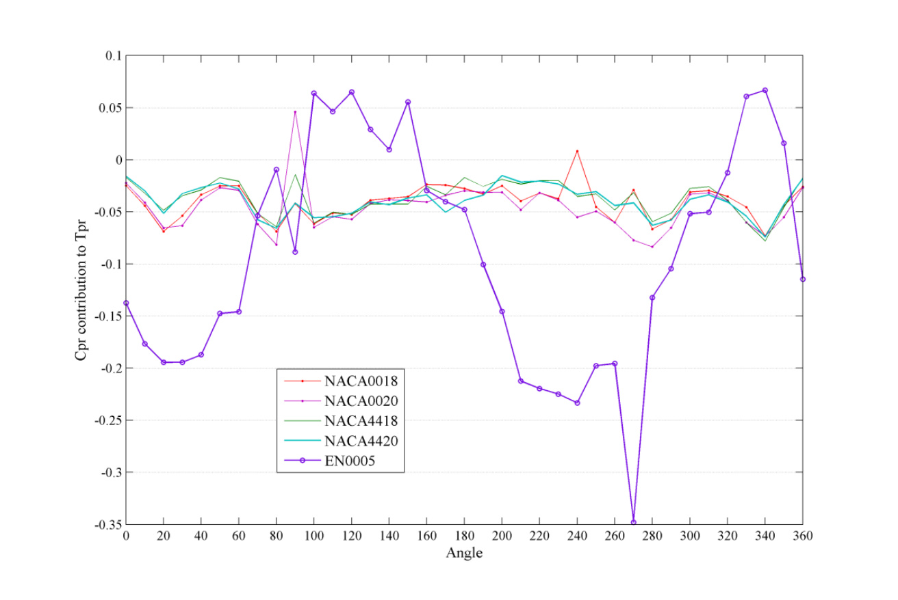
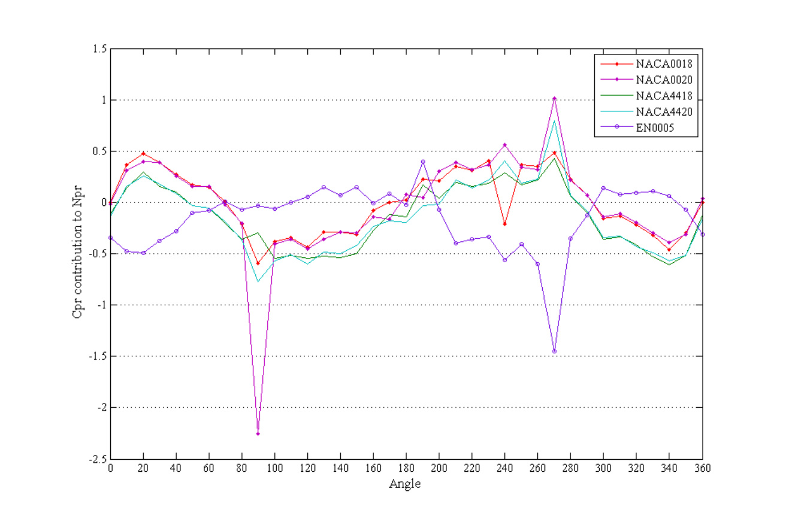
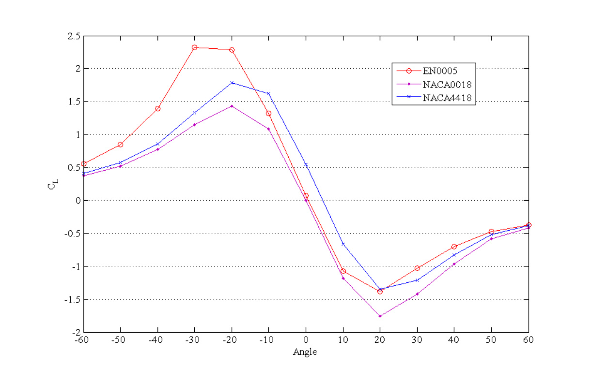
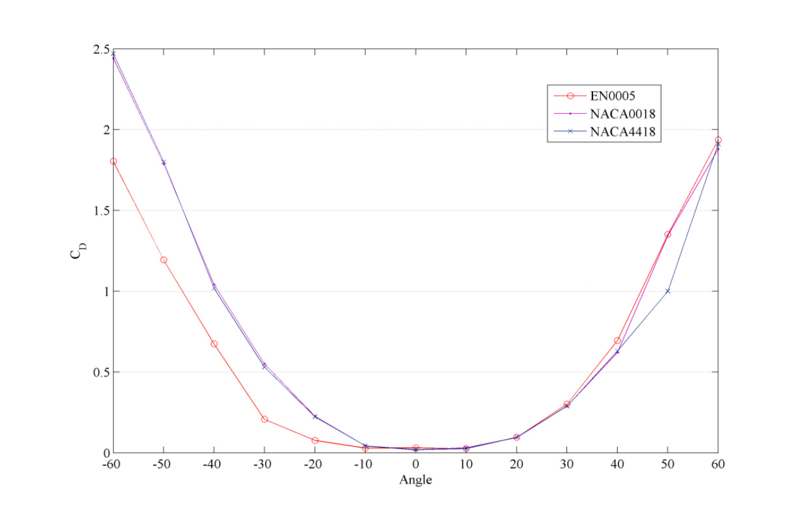
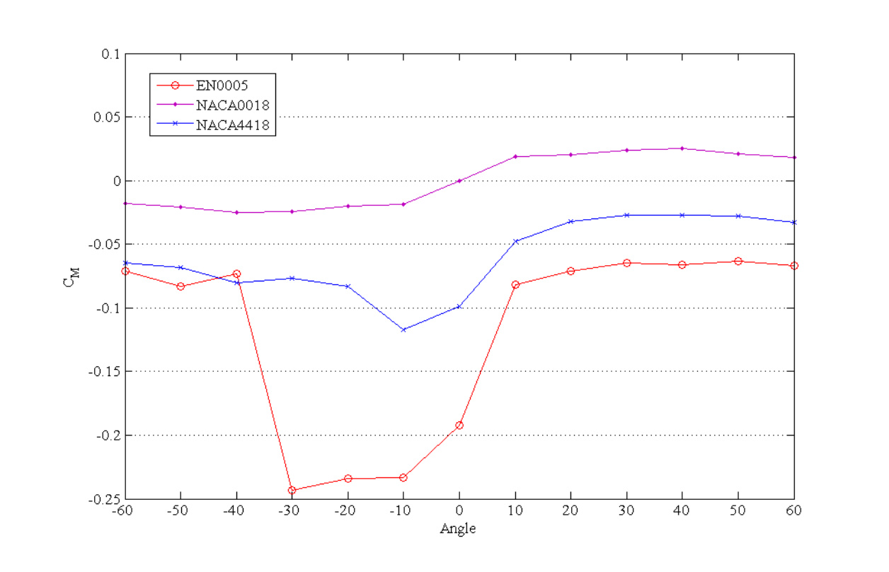

## EN0005 Blade Profile

The EN0005 blade profile is the design parameter changed in `va9` to improve Darrieus VAWT self-start ability without extra components or external electricity feed-in. (source: sources/va9.md)

## Parameter Change

- EN0005 replaces conventional compared profiles with an asymmetric profile designed for self-starting. (source: sources/va9.md)
- Its upper surface is described as a high-lift surface with slight orientation in the desired movement direction. (source: sources/va9.md)
- The nose is lower relative to the chord line and has a tip formation in front to increase wind-flow split. (source: sources/va9.md)
- The first 20% of the lower surface length is a high-lift surface. (source: sources/va9.md)
- The remaining lower surface finishes in a cup form that increases drag when the blade is stopped in the downstream zone. (source: sources/va9.md)
- The source says that drag force decreases to negligible value once turbine rotation starts. (source: sources/va9.md)

## Outcome

- The source compares EN0005 with NACA0018, NACA0020, NACA4418, and NACA4420 using pressure-coefficient contributions to tangential and normal force. (source: sources/va9.md)
- It reports EN0005 has better self-start capability from 0 degrees to 80 degrees and 180 degrees to 310 degrees because it has better contribution to lift force. (source: sources/va9.md)
- It reports EN0005 has drag force contributing to forward movement between 100 degrees and 150 degrees. (source: sources/va9.md)
- It reports EN0005 has lower variation in normal force between 70 degrees and 180 degrees. (source: sources/va9.md)
- Compared with NACA0018 and NACA4418, EN0005 is reported to have better lift coefficient between -60 degrees and -10 degrees, lower drag coefficient over the same range, and a higher moment coefficient peak between -30 degrees and 0 degrees. (source: sources/va9.md)
- The field-test prototype using the design is reported to self-start at 1.25 m/s. (source: sources/va9.md)

## Related

- [[Aerodynamic Design Parameters]]
- [[Darrieus Turbine]]
- [[EN0005 Self-start Darrieus VAWT]]

#parameters
