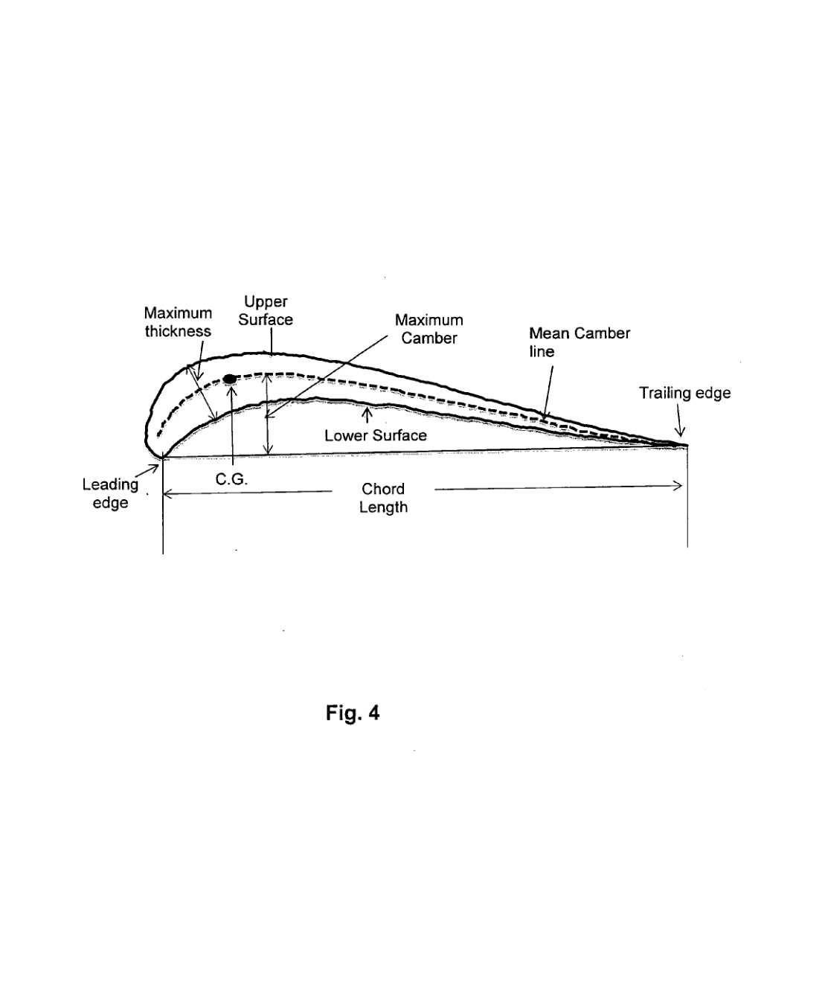

---
Created:
Updated: 2026-07-02
Sources:
- [[HRI2526]]
- [[va8]]
- [[va9]]
- [[vj1]]
- [[vj11]]
- [[vj4]]
- [[vj8]]
Source_count: 7
Tags:
- Parameters
---
## Aerodynamic Design Parameters

These are the main geometry knobs the sources repeatedly treat as design variables.

- Tip Speed Ratio (TSR) is one of the core performance controls. (source: sources/HRI2526.md, sources/vj1.md)
- Blade pitch angle is a major tuning variable. (source: sources/vj8.md)
- Relative airfoil thickness affects performance and should be checked alongside pitch. (source: sources/vj8.md)
- Rotor spacing matters in contra-rotating arrangements. (source: sources/vj8.md)
- Included angle is another tuning variable in the contra-rotating study. (source: sources/vj8.md)
- Blade number, camber line, and blade inclination are key architectural choices for small VAWTs. (source: sources/vj4.md)
- Solidity changes the balance between efficiency and starting behavior. (source: sources/vj1.md, sources/HRI2526.md)
- Swept area, Reynolds number, and starting torque remain basic sizing parameters. (source: sources/HRI2526.md, sources/vj6.md)
- The VAWT review gives Savonius TSR around 0.6-1.2, Darrieus TSR around 2.5-5.0, and emphasizes that the optimum shifts with solidity. (source: sources/vj11.md)
- It treats blade profile, pitch angle, blade count, and chord Reynolds number as the main coupled design knobs. (source: sources/vj11.md)
- It notes that low-solidity rotors push peak Cp to higher TSR, while high-solidity rotors self-start better but suffer more blade-wake interaction. (source: sources/vj11.md)
- The va8 patent treats asymmetrical blade profile geometry as a startup-torque design knob, specifying upper/lower surface path difference of 20% of chord, chord-line-to-bottom-surface path difference of 3% of chord, and maximum-thickness-to-chord ratio of 11.5%. (source: sources/va8.md)
- The same patent fixes the angle between blade chord line and horizontal beam at 25 degrees, and its wind tunnel observations show maximum lift coefficient near a 25-degree angle of attack for the tested profile. (source: sources/va8.md)
- The va9 paper treats blade-profile shape as a self-start design knob: the EN0005 upper surface is high-lift, the first 20% of the lower surface is high-lift, and the remaining lower surface ends in a cup form that increases stopped-position drag in the downstream zone. (source: sources/va9.md)
- The same paper compares EN0005 with NACA0018, NACA0020, NACA4418, and NACA4420 using pressure-coefficient contributions to tangential and normal force. (source: sources/va9.md)
- It reports EN0005 has better lift coefficient between -60 and -10 degrees, lower drag coefficient in that same interval, and a higher moment-coefficient peak between -30 and 0 degrees than the compared profiles. (source: sources/va9.md)

Original caption: Figure 4: Cross sectional view showing the blade having the asymmetrical airfoil profile. [[va8|Source]]

Original caption: Figure 5: Relation between lift coefficient and angle of attack. [[va8|Source]]

Original caption: Fig. 7. Cpr contribution to Tpr. [[va9|Source]]

Original caption: Fig. 9. Lift coefficient. [[va9|Source]]

Related:
- [[Wind Turbine Parameters]]
- [[Rules of Thumb]]
- [[Wind Tunnel Testing]]
- [[Double-Multiple Streamtube Model]]
- [[va9 EN0005 Blade Profile]]
