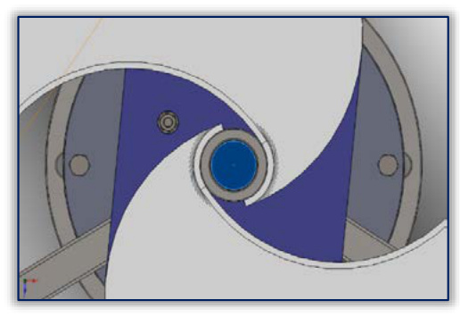

## Savonius Shaft Removal

This parameter change removes the shaft from inside the Savonius rotor in the hybrid Savonius-Darrieus turbine studied in `vj2`. (source: sources/vj2.md)

## Parameter Change

- In the original configuration, the shaft diameter is 38 mm in the Savonius region and occupies about 66% of the 58 mm overlap space between the Savonius blades. (source: sources/vj2.md)
- The source treats that shaft as a possible obstruction to internal circulation from one Savonius blade to the other. (source: sources/vj2.md)
- The changed configuration removes that shaft from the inside of the Savonius rotor. (source: sources/vj2.md)

## Outcome

- The CFD comparison reports that shaft removal improves airflow through the blade gap. (source: sources/vj2.md)
- The optimized no-shaft configuration reports an average torque increase of 10.5% relative to the original design at 7 m/s. (source: sources/vj2.md)
- Torque gains are positive at all reported attack angles from 0 degrees to 120 degrees, with increases ranging from 3.35% to 19.51%. (source: sources/vj2.md)

## Related

- [[vj2 Savonius-Darrieus Hybrid Wind Turbine]]
- [[Aerodynamic Design Parameters]]
- [[Optimization]]

#parameters
