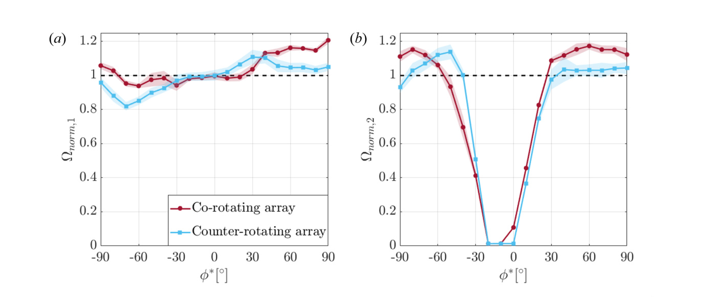

## Array Angle in Paired VAWT Arrays

The study varies adjusted array angle to identify when aerodynamic interaction helps or hurts a turbine pair. (source: sources/va12.md)

## Parameter

- The downstream turbine was positioned between about -90 degrees and 90 degrees relative to the freestream. (source: sources/va12.md)
- Performance data showed three angle regimes: a wake-loss regime, a broad enhancement regime, and a regime where downstream enhancement can coexist with upstream loss. (source: sources/va12.md)

Original caption: Figure 4. Normalized performance of (a) Turbine 1 and (b) Turbine 2 versus adjusted array angle (phi*) for a turbine spacing of s = 1.25 D. Error bands represent plus or minus one standard deviation from the mean measurement. [[va12|Source]]

## Outcome

- In the co-rotating case, both turbines operated at or above isolated performance across a broad positive-angle band. (source: sources/va12.md)
- In the wake regime, the downstream rotor could be strongly degraded or even arrested when positioned in the upstream wake. (source: sources/va12.md)
- The study's most robust array configuration produced about a 14% average array-performance gain across a substantial wind-direction range. (source: sources/va12.md)

## Related

- [[H-rotor Wake Aerodynamics]]
- [[va12 Turbine Spacing in Paired VAWT Arrays]]
- [[va12 Relative Rotational Orientation in Paired VAWT Arrays]]

#parameters
