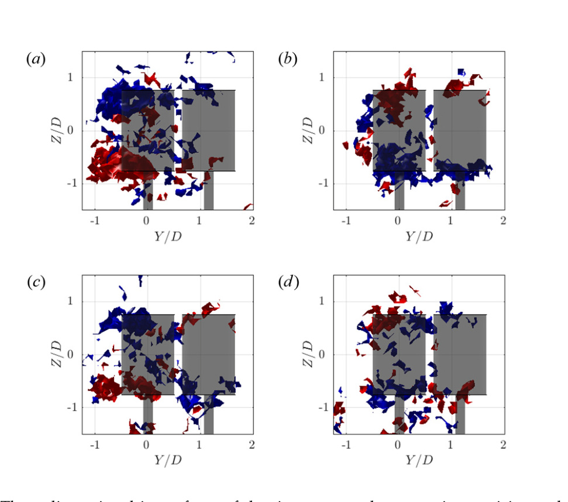

## Relative Rotational Orientation in Paired VAWT Arrays

The study compares co-rotating and counter-rotating pair orientations, including doublet and reverse-doublet cases, to identify which wake interactions improve performance and replenishment. (source: sources/va12.md)

## Parameter

- The paper compares clockwise and counter-clockwise co-rotating pairs plus reverse-doublet and doublet counter-rotating arrangements. (source: sources/va12.md)
- The detailed wake study focuses on a representative case at 1.5 D spacing and 50 degrees array angle. (source: sources/va12.md)

Original caption: Figure 12. Three-dimensional isosurfaces of the time-averaged streamwise vorticity at the value omega_x = +/-Uo/D around: (a) clockwise co-rotating; (b) counter-clockwise co-rotating; (c) reverse doublet; and (d) doublet arrays. The arrays have a turbine spacing of s = 1.5 D and are at an array angle of phi = 50 degrees. Positive vorticity is red and negative vorticity is blue. The transparent cylinders represent the maximum extent of the rotor and the turbine tower. [[va12|Source]]

## Outcome

- Co-rotating configurations produced the most robust broad performance enhancement across a useful wind-direction band. (source: sources/va12.md)
- Reverse-doublet and doublet cases changed the sign of mean vertical transport into or out of the wake, showing that orientation controls how streamwise vortices replenish momentum. (source: sources/va12.md)
- The source therefore treats rotational orientation as a first-order array-design parameter rather than a minor layout detail. (source: sources/va12.md)

## Related

- [[H-rotor Wake Aerodynamics]]
- [[va12 Array Angle in Paired VAWT Arrays]]
- [[va12 Turbine Spacing in Paired VAWT Arrays]]

#parameters
